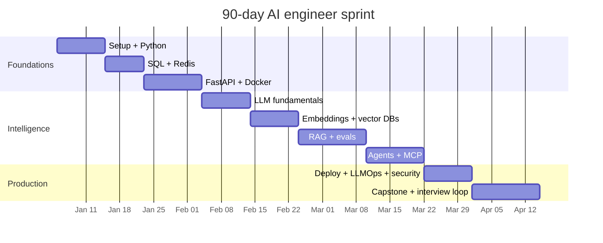

# 90-day plan — internship sprint

**Who:** you can already ship a small FastAPI app, or you can study 20–25 hours/week.

**Goal:** intern / junior AI engineer interviews with a live RAG service and one agent project.

This is compressed. You will skip some "nice to have" vector databases and one cloud provider. You will not skip evals, Docker, or security.

Dates above are relative. Shift them to your start date.

---

## Week-by-week

### Weeks 1–2 — Setup and Python (Phases 0–1)

**Hours:** 40–50 total

- Finish Phase 0 in the first 3 days. No custom rice on your Linux install. Boring is a feature.
- Phase 1: typing, async, pydantic, retries.
- Mini-project: async crawler or API client with backoff.

**Ship:** GitHub repo `ai-eng-lab` with a README and a passing test.

### Weeks 3–4 — Data and APIs (Phases 2–3)

- Postgres schema for `users`, `documents`, `chats`, `messages`
- Redis rate limiter
- FastAPI: JWT, one streaming endpoint

**Ship:** `POST /v1/chat/stream` that fake-streams tokens (you will plug a model in week 5).

### Week 5 — Docker (Phase 4)

- Multi-stage image
- Compose: api + postgres + redis
- Healthchecks

**Ship:** a teammate can run your stack with one command.

### Weeks 6–7 — LLM fundamentals (Phase 5)

- Tokens, context, temperature
- Structured output
- One tool call
- Local Ollama **and** one hosted API so you know both

**Ship:** a CLI that classifies support tickets into a Pydantic model.

### Weeks 8–9 — Embeddings and vector stores (Phases 6–7)

- Chunking experiments (you must break a table of contents on purpose)
- Chroma locally
- pgvector in the Postgres you already run
- Skim Qdrant docs; you do not need every vendor

**Ship:** search over this course's Markdown files.

### Weeks 10–11 — RAG (Phase 8)

This is the heart of the sprint.

- Naive RAG
- Hybrid + rerank
- Parent retrieval
- Ragas or DeepEval on 25 questions

**Ship:** [PDF Chat](./PROJECTS/01-pdf-chat/) deployed later in week 13.

Do **not** implement GraphRAG in this sprint unless the rest is green.

### Weeks 12–13 — Agents and MCP (Phases 9–10)

- Write a tool loop with no framework first
- Then LangGraph for the same job
- One MCP server (filesystem or git)

**Ship:** [SQL Agent](./PROJECTS/04-sql-agent/) with a read-only DB role.

### Weeks 14–15 — Production (Phases 11–13)

- Deploy PDF Chat
- GitHub Actions: lint, test, eval smoke
- Langfuse or equivalent traces
- Prompt-injection tests
- Rate limit + cost cap

**Ship:** HTTPS URL + a 1-page threat model.

### Weeks 16–18 — Capstone and interviews (Phase 14)

Pick **Enterprise RAG** unless you already have a strong RAG demo, in which case pick the agent capstone.

In parallel:

- [RESUME_GUIDE.md](./RESUME_GUIDE.md)
- Daily 45-minute interview drill
- 10 tailored applications per week starting week 16

**Ship:** design doc, live demo, eval table, resume bullet.

---

## What we deliberately drop in 90 days

- Fine-tuning / LoRA (know the words; do not spend a week)
- Kubernetes beyond "what a Pod is"
- Training a model
- Every agent framework
- Every cloud
- GraphRAG deep dive

You can add them in the 180-day plan or after you have an offer.

---

## Daily minimum (non-negotiable)

1. 25 minutes of code, not YouTube
2. 10 minutes of interview questions
3. One sentence in the progress tracker

If you miss the daily minimum four days in a row, switch to the 180-day plan. That is discipline, not failure.
