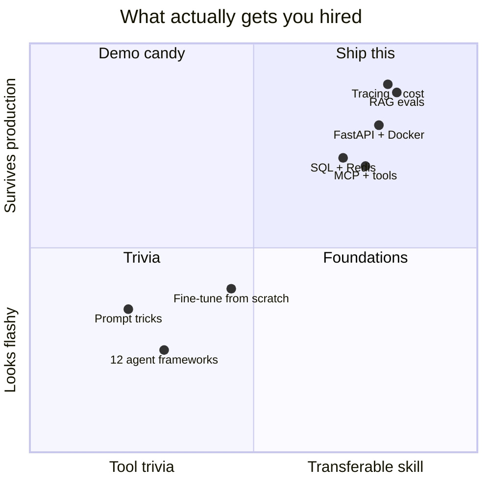

# AI engineer skills

This is the skill matrix a hiring manager is quietly scoring you on.

It is not "knows LangChain."

---

## Levels we use in this course

| Level | Meaning |
| --- | --- |
| L0 | Cannot explain it |
| L1 | Can explain with an analogy |
| L2 | Can implement a tutorial version |
| L3 | Can ship it with tests, logs, and failure modes |
| L4 | Can design it on a whiteboard and defend tradeoffs |

Junior offers start appearing around **L3 in the bold rows** below, with L2 everywhere else.

---

## Skill matrix

### A. Software engineering (non-negotiable)

| Skill | Target | Where |
| --- | --- | --- |
| **Python 3.11+, typing, packaging** | L3 | Phase 1 |
| Git, PRs, code review hygiene | L3 | Phase 0 |
| **FastAPI (or equivalent) + auth** | L3 | Phase 3 |
| SQL + Postgres | L3 | Phase 2 |
| Redis (cache / limits / queues) | L2–L3 | Phase 2 |
| **Docker + Compose** | L3 | Phase 4 |
| CI (GitHub Actions) | L2–L3 | Phase 11 |
| Testing (pytest) | L3 | all phases |
| Kubernetes | L1 | Phase 11 |
| Cloud (one provider) | L2 | Phase 11 |

If this block is weak, no amount of prompt engineering will save the interview.

### B. LLM application engineering

| Skill | Target | Where |
| --- | --- | --- |
| Tokens, context, pricing | L3 | Phase 5 |
| Prompt design that is versioned | L3 | Phase 5 |
| Tool / function calling | L3 | Phase 5, 9 |
| Structured output + validation | L3 | Phase 5 |
| Streaming and cancellation | L3 | Phase 3, 5 |
| Local vs hosted models | L2 | Phase 5 |

### C. Retrieval

| Skill | Target | Where |
| --- | --- | --- |
| Embeddings and similarity | L3 | Phase 6 |
| Chunking and loaders | L3 | Phase 6 |
| **One vector DB you can operate** | L3 | Phase 7 |
| Hybrid search + rerank | L3 | Phase 8 |
| RAG evaluation | L3 | Phase 8, 12 |
| Advanced RAG patterns | L2 | Phase 8 |

### D. Agents and protocols

| Skill | Target | Where |
| --- | --- | --- |
| When *not* to use an agent | L3 | Phase 9 |
| Tool loop, memory, stopping | L3 | Phase 9 |
| LangGraph (or equivalent graph) | L2–L3 | Phase 9 |
| MCP server + client | L2 | Phase 10 |
| Multi-agent | L2 | Phase 9 |

### E. Production and safety

| Skill | Target | Where |
| --- | --- | --- |
| Tracing / observability | L3 | Phase 12 |
| Evals in CI | L2–L3 | Phase 12 |
| Caching, rate limits, fallbacks | L3 | Phase 12 |
| Prompt injection | L3 | Phase 13 |
| Secrets, RBAC, PII | L2–L3 | Phase 13 |
| Cost control | L3 | Phase 12 |

---

## What internships actually test

In order of frequency (anecdotal, 2024–2026 job posts and take-homes):

1. Python + REST
2. "Build a chatbot over these PDFs"
3. Explain embeddings vs fine-tuning
4. Debug a hallucinated answer
5. Dockerize it
6. "How would you evaluate this?"
7. Basic SQL
8. A take-home with a 4–8 hour cap

They rarely test:

- Your ability to name 9 agent frameworks
- Deriving attention math on a whiteboard (research orgs excepted)
- Kubernetes operators

---

## Self-score (do this on day 1 and day 90)

Copy this table into `NOTES/skills.md`. Score 0–4.

| Skill | Day 1 | Day 90 | Day 180 |
| --- | --- | --- | --- |
| Typed Python |  |  |  |
| FastAPI |  |  |  |
| Postgres |  |  |  |
| Docker |  |  |  |
| LLM APIs |  |  |  |
| RAG |  |  |  |
| Agents |  |  |  |
| Evals |  |  |  |
| Security |  |  |  |
| System design talk |  |  |  |

If RAG is 4 and Docker is 1, you are a demo, not an engineer. Fix Docker.
