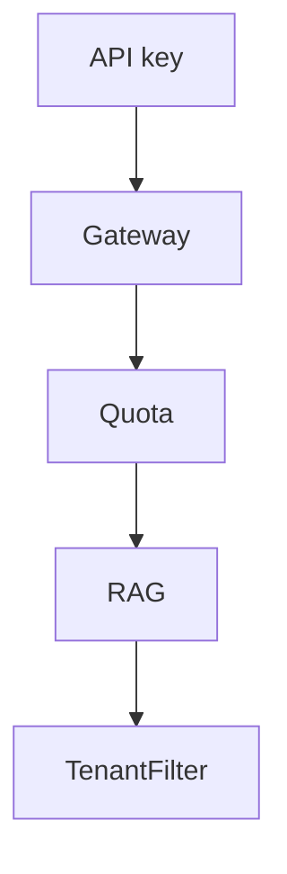

# AI SaaS capstone

## User

Other developers (or fake customers) who get an API key, a quota, and a RAG endpoint over **their** uploaded docs.

## Constraints

- `tenant_id` on every row, vector, and cache key
- API keys hashed at rest
- Quotas (Redis)
- Isolation tests
- Stripe-shaped billing **stub** (you do not need real money)

## Architecture

## The interview story

"I treated tenancy as a correctness bug, not a CSS theme."
