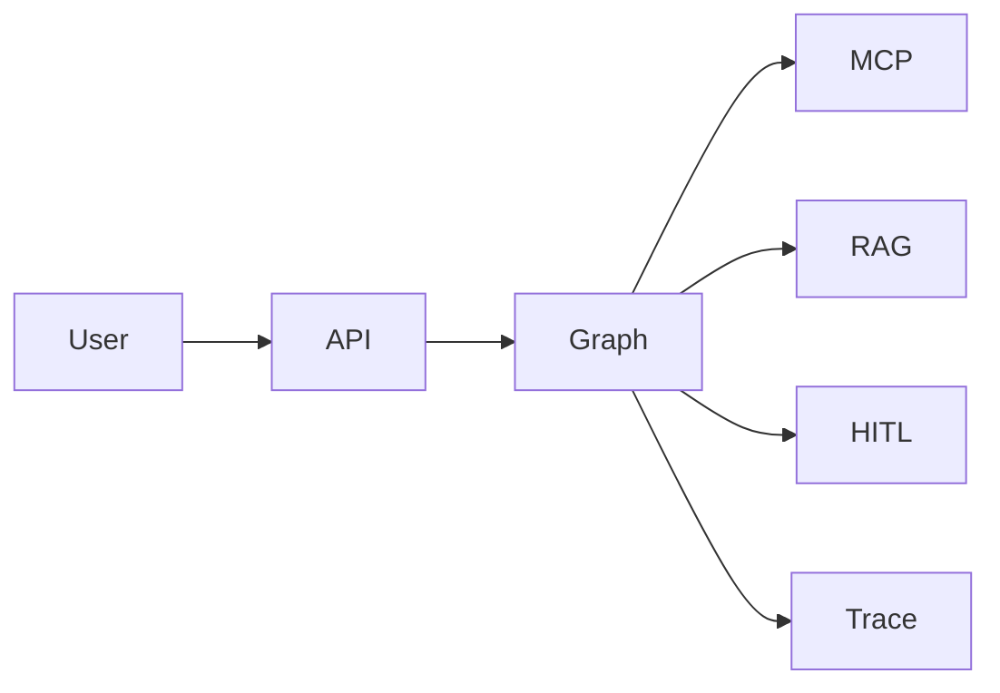

# Enterprise agent capstone

## User

A teammate who wants "look up the order, check the policy, draft a reply" — not a free-roaming intern with bash.

## Constraints

- Allow-listed tools
- MCP server for at least one tool family
- HITL for any write
- max_steps
- Traces
- Adversarial prompt file

## Architecture

## Non-goals

Browser control. Shell. Multi-crew theater.
