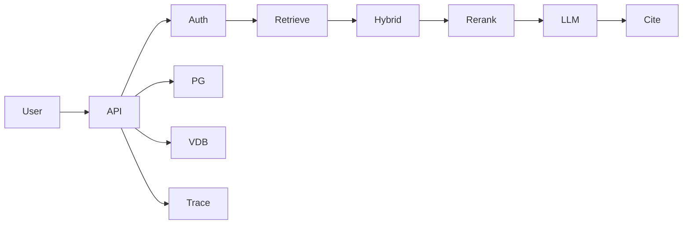

# Enterprise RAG capstone

## User

An internal employee asks questions over company docs (use a fake company corpus you create — never real employer data).

## Constraints

- Multi-tenant **or** RBAC by department
- Citations
- Abstain
- p95 under 5s on CPU + hosted LLM (be honest if slower)
- Eval ≥ 25 questions

## Architecture (starting point)

## Deliverables

- `docs/design.md`
- `eval/results.md` with numbers
- `THREAT_MODEL.md`
- Deployed URL or recorded demo + compose
- Resume bullet

## Non-goals

GraphRAG unless your questions are global-summary and the rest is green.
