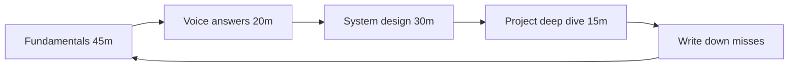

# Interview prep

AI engineer interviews are software interviews with extra failure modes.

They will test:

1. Python and APIs
2. Data / SQL
3. LLM + RAG design
4. Debugging a bad answer
5. Safety and cost
6. Your projects

They will rarely test whether you memorized a vendor's blog.

---

## The loop (start 4–8 weeks before applications)

Daily minimum: **one** question answered out loud. Silent reading lies.

---

## Round-by-round

### Recruiter screen (20–30 min)

They want: can you talk, can you work in the stack, are you a flight risk.

Prepare:

- 60-second story: background → this course → the project you shipped → the job
- Why AI engineering, not research
- Salary range (know local bands; a number is better than "whatever")
- Work authorization

### Technical screen (45–60 min)

Often: Python, APIs, maybe a small RAG coding exercise.

They watch:

- Do you clarify the question?
- Do you type working code?
- Do you mention evaluation without being prompted?

### System design (45–60 min)

Prompt looks like: "Design a customer support assistant over our help center."

Use [SYSTEM_DESIGN_GUIDE.md](./SYSTEM_DESIGN_GUIDE.md). Always cover retrieval, eval, cost, and abuse.

### Project deep dive

They open your GitHub.

You must be able to say:

- Why this architecture
- What you would delete
- A bug you hit
- A metric
- A security note

If an assistant wrote 80% of it and you cannot defend it, they will know.

### Behavioral

STAR stories. Prepare six:

1. A production bug (even on a personal project)
2. A time you said no to extra scope
3. A disagreement
4. Something you learned from being wrong
5. Working with incomplete requirements
6. Teaching someone

---

## The 30 questions you will actually get

Full banks live in each phase `Interview.md` and in [INTERVIEW/](./INTERVIEW/). These 30 cover 80% of junior loops.

### LLMs

1. What is a token? Why does it matter for cost and limits?
2. What does temperature do? When do you set it to 0?
3. Context window vs "the model remembers our chat."
4. Embeddings vs fine-tuning vs RAG — when each?
5. What is structured output and why not `json.loads` on hope?

### RAG

6. Draw naive RAG.
7. Why did my RAG say something not in the docs?
8. How do you chunk a PDF with tables?
9. Hybrid search vs dense-only.
10. How do you evaluate RAG without a PhD?
11. Metadata filters and multi-tenancy.
12. When is RAG the wrong tool?

### Agents

13. What is a tool call loop?
14. When is an agent worse than a chain?
15. How do you stop infinite tool use?
16. How do you keep a SQL agent from deleting data?
17. What is MCP in one minute?

### Production

18. How do you stream tokens from FastAPI?
19. How do you cache LLM calls safely?
20. Fallback when the provider is down.
21. What do you trace?
22. Rate limiting by user vs by token budget.
23. Prompt injection: example + mitigation.
24. Where do secrets live?
25. How do you estimate monthly cost?

### Engineering

26. Why Docker here?
27. Postgres vs a vector DB vs both.
28. Idempotency of a chat POST.
29. How do you version prompts?
30. Tell me about a time the model was confidently wrong. What did you change?

Write answers in `NOTES/interview-answers.md`. Then throw the notes away and say them again.

---

## Whiteboard skeleton for RAG (memorize this)

1. Clarify: users, corpus size, languages, latency budget, compliance
2. Ingest: load → clean → chunk → embed → store + metadata
3. Query: rewrite? embed? hybrid? filter? rerank? k=?
4. Generate: prompt template, citations, structured output
5. Evaluate: gold set, faithfulness, online feedback
6. Operate: cache, traces, limits, fallbacks, cost
7. Secure: injection, tenancy, PII, tool allow-lists
8. Iterate: what you would measure first week after launch

If you jump to "we'll use LangGraph and Pinecone" in sentence one, you failed the design.

---

## Coding interview tips specific to this field

- Validate model output with Pydantic. Always.
- Timeouts on every network call.
- Never log raw prompts if they may contain PII.
- Prefer 40 clear lines over a clever one-liner.
- If you use a framework, say what it is doing underneath.

---

## Red flags interviewers notice

- Cannot explain embeddings without the word "magic"
- No eval story
- "I'd just give the model the whole database"
- No timeout, retry, or fallback
- Treating LangChain as the architecture
- Cannot estimate tokens or cost within an order of magnitude
- Getting angry at the model instead of measuring it

---

## Green flags

- You ask about the corpus and the latency budget first
- You mention failure modes unprompted
- You have a tiny gold set and a number
- You know when a cron job beats an agent
- You can delete a component and still explain the system

---

## Week-of-interview plan

| Day | Focus |
| --- | --- |
| T-7 | Re-read your capstone README. Fix rot. |
| T-5 | 10 RAG questions + one full design |
| T-3 | Re-run your demo. Record a 3-min backup video. |
| T-1 | Sleep. Skim cheatsheets only. |
| T-0 | Water, a blank page, and "clarify first" |

Good luck. You prepared like an engineer.
