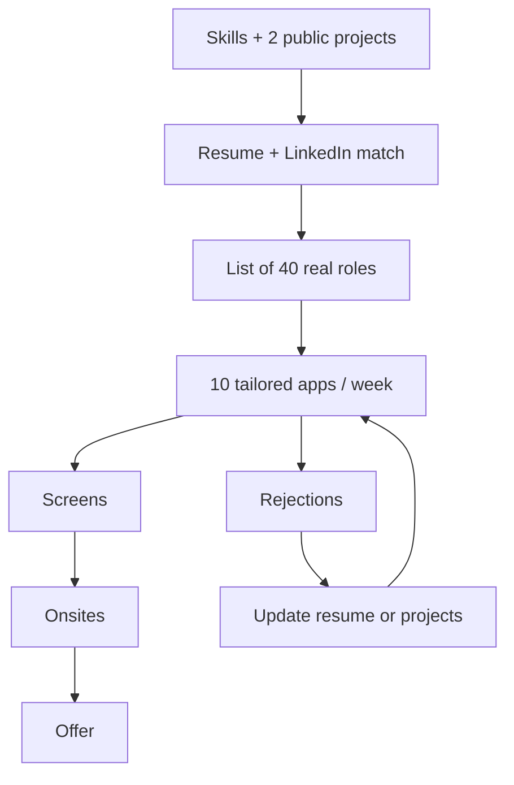

# Job search guide

A good search is a funnel you operate, not a mood.



---

## Titles to search

AI job titles are messy. Apply anyway if the *work* matches.

- AI Engineer
- LLM Engineer
- Machine Learning Engineer (applied, not research)
- Applied Scientist (some companies)
- Software Engineer, AI / ML
- Backend Engineer (if the team owns AI features)
- Forward Deployed Engineer (if you like customers)

Ignore: "Prompt Engineer" as a whole career unless you know what you are doing. Most of those jobs became AI engineer jobs.

---

## What internships want (2026)

- Python
- One shipped LLM feature
- Ability to learn the company's stack
- Communication
- Often: SQL, Git, a bit of Docker

They do not want a paper at NeurIPS. They want someone who will not set money on fire with unbounded GPT-4o loops.

---

## Weekly operating system

| Task | Volume |
| --- | --- |
| Tailored applications | 8–12 |
| Warm conversations | 3 |
| Interview practice | 5 hours |
| Project improvement | 3 hours |
| Tracking in a spreadsheet | 30 min |

A tailored application:

1. Read the posting
2. Mirror 3 real skills you have
3. One sentence in the first resume bullet that matches their domain if honest
4. A short note (not "Dear Sir/Madam I am passionate")

---

## Outreach that is not cringe

```
Hi {name} — I shipped a RAG service over {X} with {metric}.
I saw {team} is hiring {role}. I have a 90-second demo: {link}.
If useful, happy to send a resume. If not, good luck with the search.
```

Four lines. No novel. No "pick your brain."

---

## Tracking spreadsheet columns

- Company
- Role
- URL
- Date applied
- Source (job board / referral)
- Status
- Recruiter
- Next action
- Notes (stack, visa, pay)

If it is only in your head, you will double-apply and ghost people.

---

## Take-homes

Rules:

- Timebox to what they asked (often 4 hours). Write what you would do next.
- README first.
- Tests or a tiny eval.
- Do not fine-tune anything unless they asked.
- Do not paste their data into a public model if the email said confidential.

A clean FastAPI + Docker + honest limitations beats a notebook with 14 libraries.

---

## Offers

Compare:

- Cash
- Level
- Team (do they have evals? or only demos?)
- GPU / API budget reality
- Mentorship
- Visa
- On-call

Ask: "How do you decide a prompt change is good?" If they say "we just look at it," you know the maturity of the team.

---

## Rejection

Everyone collects them. Log the reason if they give one.

If you fail system design, do more [SYSTEM_DESIGN](./SYSTEM_DESIGN/). If you fail coding, do Phase 1–3 again. If you fail "tell me about a project," your README is the bug.

Do not apply to 400 roles on Sunday night to feel productive. Operate the funnel.
