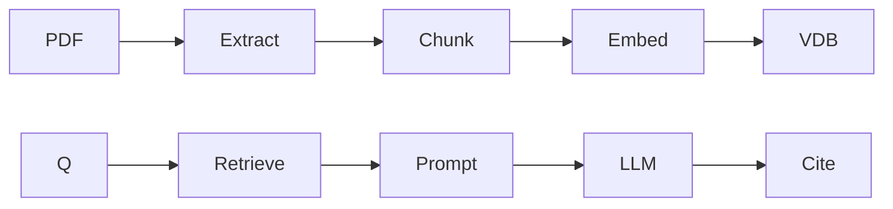

# PDF Chat

**Phase:** 8+  
**Time:** 3–7 days  
**Stack:** FastAPI, your vector store from Phase 7, one LLM, Docker

## Problem

A user uploads a PDF and asks questions. Answers must cite pages. If the PDF does not contain the answer, the system says it does not know.

## Architecture

## Skeleton

See `app.py` in this folder. Replace `fake_retrieve` and `fake_generate` with Phase 6–8 code.

## Must

- [ ] Ingest PDF (pypdf is enough for text PDFs)
- [ ] Query endpoint
- [ ] Citations are subset of retrieved chunks
- [ ] 25-question eval JSONL
- [ ] `docker compose up`
- [ ] Abstain path

## Should

- Hybrid or rerank
- Streaming
- Auth

## Won't this week

GraphRAG, multi-user billing, OCR of scans (unless you need it)

## Eval

`eval/questions.jsonl` — freeze it before prompt tuning.

Report: recall@5, faithfulness (even if you grade 15 by hand).

## Resume bullet (fill numbers)

> Built a Dockerized PDF Q&A API with retrieval + citations; … on a 25-question set; p95 …
