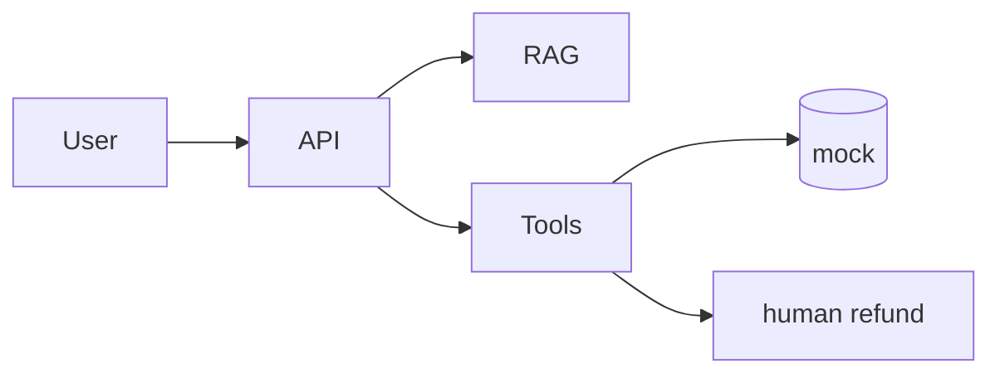

# Customer Support AI

**Phases:** 8–13  
**Time:** 1–2 weeks

A support bot over a help center that can also **look up an order** (mocked) and **must not refund** without a human.

## Architecture

## Must

- RAG over markdown policies
- `get_order` tool
- `refund` tool requires role=admin or HITL flag
- Injection tests
- Tenant_id on retrieval
- Eval: 15 policy questions + 5 tool questions

## Resume angle

Guardrails and HITL. Not "we used agents."
