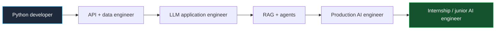
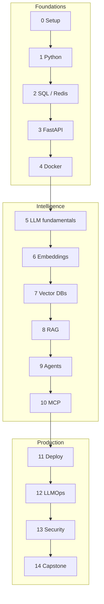

# AI Engineer Roadmap

<p align="center">
  <strong>The free AI engineering bootcamp that treats you like a junior engineer on a real team.</strong><br/>
  Python in. Production LLM systems out. Internship and junior AI engineer ready.
</p>

<p align="center">
  
  
  
  
  
  
</p>

<p align="center">
  <a href="./ROADMAP.md">Roadmap</a> ·
  <a href="./COURSE_INDEX.md">Course index</a> ·
  <a href="./WEEKLY_PLAN.md">Weekly plan</a> ·
  <a href="./90_DAY_PLAN.md">90 days</a> ·
  <a href="./180_DAY_PLAN.md">180 days</a> ·
  <a href="./PROGRESS_TRACKER.md">Progress</a> ·
  <a href="./INTERVIEW_PREP.md">Interviews</a> ·
  <a href="./RESOURCES.md">Resources</a>
</p>

---

## Who this is for

You already know Python.

You can write a class. You have used NumPy and Pandas. You can hit a REST API. You can commit to Git.

You are **not** ready to ship an AI product yet.

This course takes that gap seriously.

By the end you will be able to:

- Design and ship Retrieval-Augmented Generation (RAG) systems that do not hallucinate on every other question
- Build tool-using agents with memory, planning, and evaluation
- Expose models behind FastAPI with auth, streaming, and rate limits
- Store and search embeddings in real vector databases
- Speak MCP — the protocol that lets models use tools and data safely
- Deploy with Docker, CI/CD, and a cloud you can actually afford
- Add tracing, evals, caching, fallbacks, and cost controls
- Defend against prompt injection, secret leaks, and PII accidents
- Talk about tradeoffs in interviews the way a staff engineer would

This is **AI engineering**, not "how to chat with ChatGPT."



---

## Who this is not for

- Absolute beginners who have never written Python (learn Python first, then come back)
- People who only want prompt tricks
- People looking for a certificate to print
- People who want us to train a foundation model from scratch on a laptop

If you want to *use* models to build products that survive production, you are in the right place.

---

## How the course is taught

Every concept is taught the same way a senior engineer mentors a junior:

1. **What** it is, in plain English
2. **Why** it exists
3. A **real-world analogy**
4. A **picture** (Mermaid diagrams everywhere)
5. Beginner → intermediate → advanced → **production**
6. **Code** with comments, output, dry run, complexity, and alternatives
7. **When not to use it**
8. Interview questions, common mistakes, debugging, assignments

We never assume prior knowledge of a term.
If we say "embedding," we explain embedding first.

| Style | What you get |
| --- | --- |
| Story | Why a team invented this |
| Analogy | The kitchen / library / warehouse version |
| Visualization | Flowcharts, sequence diagrams, architecture |
| Code | Runnable Python, not screenshots |
| Interview | What a hiring manager actually asks |
| Production | Cost, latency, failure modes, security |

---

## The 15 phases

| Phase | Folder | You will be able to | Time | Difficulty |
| ---: | --- | --- | ---: | --- |
| 0 | [Developer setup](./phases/00-developer-setup/) | Linux, Git, uv, Docker, a clean terminal | 2–4 days | Easy |
| 1 | [Python refresh](./phases/01-python-refresh/) | Async, typing, generators, decorators, context managers | 5–7 days | Easy |
| 2 | [SQL and data stores](./phases/02-sql-databases/) | Postgres, Redis, schemas that survive production | 7–10 days | Medium |
| 3 | [FastAPI](./phases/03-fastapi/) | REST, JWT, OAuth, streaming, WebSockets | 7–10 days | Medium |
| 4 | [Docker](./phases/04-docker/) | Images, Compose, volumes, networking | 5–7 days | Medium |
| 5 | [LLM fundamentals](./phases/05-llm-fundamentals/) | Tokens, context, temperature, tools, structured output | 10–14 days | Medium |
| 6 | [Embeddings and search](./phases/06-embeddings-search/) | Chunking, loaders, semantic search | 7–10 days | Medium |
| 7 | [Vector databases](./phases/07-vector-databases/) | Chroma, Qdrant, pgvector, Pinecone, Milvus, Weaviate | 7–10 days | Medium |
| 8 | [RAG](./phases/08-rag/) | Hybrid search, rerank, GraphRAG, CRAG, evals | 14–21 days | Hard |
| 9 | [Agents](./phases/09-agents/) | LangGraph, tool calling, memory, multi-agent | 14–21 days | Hard |
| 10 | [MCP](./phases/10-mcp/) | Servers, clients, tools, resources, auth | 7–10 days | Hard |
| 11 | [Deployment](./phases/11-deployment/) | Render, Railway, Fly, AWS, Azure, GCP, Actions | 10–14 days | Hard |
| 12 | [Production AI / LLMOps](./phases/12-production-ai/) | Tracing, evals, cache, routing, fallbacks | 10–14 days | Hard |
| 13 | [Security](./phases/13-security/) | Injection, RBAC, PII, guardrails, secrets | 7–10 days | Hard |
| 14 | [Capstone](./phases/14-capstone/) | Enterprise RAG, agent, or AI SaaS in production | 21–30 days | Capstone |

Full map: [ROADMAP.md](./ROADMAP.md) · clickable index: [COURSE_INDEX.md](./COURSE_INDEX.md)



---

## Start in 15 minutes

```bash
git clone https://github.com/muhammadanas20/muhammadanas20.git
cd muhammadanas20/AI-Engineer-Roadmap

# Python 3.11+
python -m venv .venv
source .venv/bin/activate          # Windows: .venv\Scripts\activate
pip install -r requirements.txt

cp .env.example .env               # add keys only if you use hosted models
```

Then open [phases/00-developer-setup/README.md](./phases/00-developer-setup/README.md).

You can complete **Phases 0–8** with local models (Ollama) and local stores (Postgres, Redis, Chroma). Paid APIs are optional until you want production quality.

---

## Choose a pace

| Plan | Hours / week | Finish | Link |
| --- | ---: | --- | --- |
| Internship sprint | 20–25 | 90 days | [90_DAY_PLAN.md](./90_DAY_PLAN.md) |
| Job-ready deep path | 10–15 | 180 days | [180_DAY_PLAN.md](./180_DAY_PLAN.md) |
| Custom week by week | you decide | you decide | [WEEKLY_PLAN.md](./WEEKLY_PLAN.md) |

Track yourself with [PROGRESS_TRACKER.md](./PROGRESS_TRACKER.md) and [CHECKLIST.md](./CHECKLIST.md).

---

## What a phase contains

Every phase folder is a complete mini-course:

| File | Purpose |
| --- | --- |
| `README.md` | Objectives, time, prerequisites, navigation |
| `Theory.md` | Full lesson: what / why / how / when / when not |
| `Examples.md` | Fully commented code, dry runs, complexity |
| `Practice.md` | Guided drills |
| `Exercises.md` | Beginner / medium / hard |
| `Assignments.md` | Graded-style take-homes |
| `Quiz.md` | Check you actually learned it |
| `Flashcards.md` | Spaced repetition |
| `Interview.md` | Questions, answers, senior discussion, whiteboard |
| `Cheatsheet.md` | One-pager for later |
| `MiniProject.md` | Something you can put on GitHub this week |
| `Resources.md` | Docs, papers, blogs |
| `FAQ.md` | The questions juniors actually ask |
| `Debugging.md` | Broken code and how to read the stack |
| `CommonMistakes.md` | What we see in code review |
| `ProductionTips.md` | Cost, latency, reliability |
| `Challenge.md` | Stretch work |
| `Solutions.md` | Spoilers. Try first. |

---

## Projects you will ship

Not tutorials. Portfolio pieces.

| Project | Skills | Phase |
| --- | --- | ---: |
| [PDF Chat](./PROJECTS/01-pdf-chat/) | loaders, chunking, RAG | 8 |
| [Resume Analyzer](./PROJECTS/02-resume-analyzer/) | structured output, evals | 5–8 |
| [Customer Support AI](./PROJECTS/03-customer-support-ai/) | RAG + tools + guardrails | 8–13 |
| [SQL Agent](./PROJECTS/04-sql-agent/) | tool calling, least privilege | 9 |
| [Research Assistant](./PROJECTS/05-research-assistant/) | multi-step agents | 9 |
| [Code Assistant](./PROJECTS/06-code-assistant/) | repo RAG + MCP | 10 |
| [Knowledge Base](./PROJECTS/07-knowledge-base/) | hybrid search, rerank | 8 |
| [Multi-agent system](./PROJECTS/08-multi-agent-system/) | LangGraph, handoffs | 9 |
| [Enterprise RAG capstone](./CAPSTONE/enterprise-rag/) | full production path | 14 |
| [Enterprise agent capstone](./CAPSTONE/enterprise-agent/) | MCP, auth, tracing | 14 |
| [AI SaaS capstone](./CAPSTONE/ai-saas/) | billing-shaped architecture | 14 |

Starter kits live in [TEMPLATES/](./TEMPLATES/).

---

## Career tracks (this is a job course)

| Guide | Use it when |
| --- | --- |
| [AI_ENGINEER_SKILLS.md](./AI_ENGINEER_SKILLS.md) | You want the skill matrix hiring managers use |
| [RESUME_GUIDE.md](./RESUME_GUIDE.md) | You need bullets that pass ATS and humans |
| [INTERVIEW_PREP.md](./INTERVIEW_PREP.md) | You have 2–6 weeks until onsite |
| [SYSTEM_DESIGN_GUIDE.md](./SYSTEM_DESIGN_GUIDE.md) | "Design ChatGPT over our docs" |
| [JOB_SEARCH_GUIDE.md](./JOB_SEARCH_GUIDE.md) | Applications, outreach, take-homes |
| [OPEN_SOURCE_GUIDE.md](./OPEN_SOURCE_GUIDE.md) | Proof of work without a company logo |

Interview drills also live per-phase in `Interview.md` and in [INTERVIEW/](./INTERVIEW/).

---

## Repository map

```text
AI-Engineer-Roadmap/
├── README.md                 ← you are here
├── ROADMAP.md
├── COURSE_INDEX.md
├── PROGRESS_TRACKER.md
├── WEEKLY_PLAN.md
├── 90_DAY_PLAN.md
├── 180_DAY_PLAN.md
├── RESOURCES.md
├── CHECKLIST.md
├── phases/                   ← the course
├── PROJECTS/                 ← portfolio
├── CAPSTONE/
├── TEMPLATES/                ← copy these into new repos
├── EXAMPLES/                 ← small runnable snippets
├── CHEATSHEETS/
├── FLASHCARDS/
├── QUIZZES/
├── INTERVIEW/
├── SYSTEM_DESIGN/
├── DEPLOYMENT/
├── PROMPTS/
├── TOOLS/
├── ASSIGNMENTS/
├── SOLUTIONS/
└── NOTES/
```

---

## Cost of learning (honest)

| Item | Need it? | Typical cost |
| --- | --- | --- |
| This repo | yes | $0 |
| Python, VS Code, Git, Docker, Ollama | yes | $0 |
| Postgres + Redis locally | yes | $0 |
| OpenAI / Anthropic / Groq keys | optional | a few dollars of API calls if you practice a lot |
| Cloud deploy (Render / Railway / Fly) | Phase 11 | free tiers exist; expect $0–20 |
| Managed vector DB | optional | skip until Phase 7 cloud labs |

We default to **local and free**. Paid APIs are introduced as a production choice, not a gate.

---

## Learning rules (read these once)

1. **Type the code.** Do not only read it.
2. **Explain it out loud** as if a teammate is watching.
3. **Break it on purpose.** Then fix it using `Debugging.md`.
4. **Do the interview questions the same week**, not "later."
5. **Ship a mini-project every phase.** Private tutorials do not get you hired.
6. **Measure.** Latency, tokens, cost, and eval scores beat vibes.
7. **Never commit `.env`.**

---

## Principles we will repeat until they stick

- An LLM is a **component**, not an application.
- Retrieval quality beats prompt cleverness.
- If you cannot evaluate it, you cannot improve it.
- The happy path is 20% of production. Timeouts, retries, and fallbacks are the job.
- Security is not a phase you sprinkle at the end. Start in Phase 3 and never stop.
- Simple systems that you understand beat fashionable graphs you cannot debug.

---

## Contributing and license

This course is MIT licensed and built to be forked, translated, and extended.

See [CONTRIBUTING.md](./CONTRIBUTING.md) and [CODE_OF_CONDUCT.md](./CODE_OF_CONDUCT.md).

If a tool renamed itself, a model family changed, or a code sample bit-rotted, open an issue. AI engineering docs that do not update are how juniors learn last year's stack.

---

## A note from the instructor chair

You do not need a research PhD to become an AI engineer.

You need the habits of a software engineer, the taste of someone who has watched models fail in production, and enough theory to choose the right tool.

We will give you all three.

Start here → **[Phase 0 · Developer setup](./phases/00-developer-setup/)**

If you already have a clean environment, skip to **[Phase 1 · Python refresh](./phases/01-python-refresh/)** and be honest on the quiz.

<p align="center"><sub>Built as a free, expandable, production-first AI engineering curriculum. Not affiliated with any model vendor.</sub></p>
