# Roadmap

This is the single map of the course.

Read it once. Pin it. Come back when you feel lost.

If a box is not checked in [PROGRESS_TRACKER.md](./PROGRESS_TRACKER.md), you are not "done with that phase."

```mermaid
flowchart TB
  subgraph P0 [Phase 0 · Setup]
    A1[Linux / WSL / macOS]
    A2[VS Code]
    A3[Git]
    A4[Python + uv]
    A5[Docker Desktop]
  end

  subgraph P1 [Phase 1 · Python]
    B1[Typing]
    B2[Async]
    B3[Generators]
    B4[Decorators]
    B5[Context managers]
  end

  subgraph P2 [Phase 2 · Data]
    C1[SQL]
    C2[Postgres]
    C3[Redis]
    C4[Schema design]
  end

  subgraph P3 [Phase 3 · APIs]
    D1[FastAPI]
    D2[JWT / OAuth]
    D3[Streaming]
    D4[WebSockets]
  end

  subgraph P4 [Phase 4 · Containers]
    E1[Images]
    E2[Compose]
    E3[Networks]
    E4[Volumes]
  end

  subgraph P5 [Phase 5 · LLMs]
    F1[Tokens]
    F2[Embeddings intro]
    F3[Prompting]
    F4[Tools / structured output]
  end

  subgraph P6to8 [Phase 6–8 · Retrieval]
    G1[Chunking]
    G2[Vector DBs]
    G3[RAG patterns]
    G4[Evaluation]
  end

  subgraph P9to10 [Phase 9–10 · Agents]
    H1[Tool calling]
    H2[LangGraph]
    H3[Memory]
    H4[MCP]
  end

  subgraph P11to14 [Phase 11–14 · Production]
    I1[Deploy]
    I2[LLMOps]
    I3[Security]
    I4[Capstone]
  end

  P0 --> P1 --> P2 --> P3 --> P4 --> P5 --> P6to8 --> P9to10 --> P11to14
```

---

## Outcomes by checkpoint

| After phase | You can honestly write on a resume |
| ---: | --- |
| 0–1 | Comfortable Python 3.11 tooling, typed async scripts |
| 2–4 | FastAPI + Postgres + Redis + Docker Compose service |
| 5 | LLM feature with structured output and streaming |
| 6–8 | Production-shaped RAG with evals |
| 9–10 | Tool-using agent + MCP server |
| 11–13 | Deployed, observed, and hardened AI service |
| 14 | One flagship project a hiring manager can clone |

---

## Phase 0 — Developer setup

**Goal:** a boring, reliable machine.

- Linux, macOS, or Windows + WSL2
- VS Code (or Cursor) with the Python + Docker extensions
- Git: branches, PRs, `.gitignore`, signing optional
- Python 3.11 or 3.12, `venv` and `uv`
- Docker Desktop (or Engine + Compose)
- Terminal fluency: pipes, env vars, exit codes

**Exit ticket:** you can clone this repo, create a venv, run a FastAPI hello-world in Docker, and push a branch.

[Open Phase 0](./phases/00-developer-setup/)

---

## Phase 1 — Python refresh

**Goal:** the Python that AI services actually use.

Not "how to write a for loop." This:

- Type hints and `pydantic` models
- `async` / `await`, event loops, when *not* to go async
- Generators and streaming iterators
- Decorators for retries, timing, auth
- Context managers for clients, files, tracing spans

**Exit ticket:** a typed async HTTP client with retries and a context-managed connection.

[Open Phase 1](./phases/01-python-refresh/)

---

## Phase 2 — SQL, Postgres, Redis

**Goal:** stop putting everything in a JSON file.

- Relational modeling for users, documents, chats, traces
- Postgres: indexes, JSONB, `EXPLAIN`, migrations
- Redis: cache, rate limits, job queues, session store
- When SQL vs when a vector DB vs when object storage

**Exit ticket:** schema + migrations for a chat app, with Redis rate limiting.

[Open Phase 2](./phases/02-sql-databases/)

---

## Phase 3 — FastAPI

**Goal:** models live behind an API, not a notebook.

- REST design, status codes, pagination
- Dependency injection
- JWT and OAuth2
- Server-sent events and token streaming
- WebSockets for multi-turn chat
- Background tasks vs a real queue

**Exit ticket:** authenticated streaming chat endpoint with request IDs.

[Open Phase 3](./phases/03-fastapi/)

---

## Phase 4 — Docker

**Goal:** "works on my machine" is no longer an acceptable sentence.

- Images, layers, `.dockerignore`
- Multi-stage builds
- Compose: app + Postgres + Redis
- Volumes and networks
- Healthchecks, non-root users, small images

**Exit ticket:** `docker compose up` runs the Phase 3 API with a database.

[Open Phase 4](./phases/04-docker/)

---

## Phase 5 — LLM fundamentals

**Goal:** you can reason about a model as an engineer, not a magician.

- Transformers in pictures (not from-scratch math)
- Tokens, context windows, tokenization surprises
- Temperature, top-p, seed, stop sequences
- Prompt engineering that survives production
- Function / tool calling
- Structured outputs (JSON schema)
- Streaming and cancellation

**Exit ticket:** a client that streams, validates JSON with Pydantic, and calls a tool.

[Open Phase 5](./phases/05-llm-fundamentals/)

---

## Phase 6 — Embeddings and search

**Goal:** text becomes geometry you can search.

- What an embedding is (and is not)
- Similarity metrics
- Chunking strategies and why naive 500-char slices fail
- Document loaders
- Semantic vs keyword vs hybrid

**Exit ticket:** search a folder of Markdown files with embeddings you can explain.

[Open Phase 6](./phases/06-embeddings-search/)

---

## Phase 7 — Vector databases

**Goal:** pick a store on purpose.

- Chroma (local, great for learning)
- pgvector (you already have Postgres)
- Qdrant (production-friendly OSS)
- Pinecone, Weaviate, Milvus (when and why)
- Metadata filters, hybrid search, payload indexes
- Backup, tenancy, and cost

**Exit ticket:** same dataset in two stores, with a written tradeoff memo.

[Open Phase 7](./phases/07-vector-databases/)

---

## Phase 8 — RAG

**Goal:** ground the model in *your* data.

- Naive RAG
- Hybrid search + reranking
- Parent document / small-to-big retrieval
- Agentic RAG
- GraphRAG
- Self-RAG and Corrective RAG
- Evaluation: faithfulness, relevancy, context precision (Ragas, DeepEval)

**Exit ticket:** a RAG service with eval scores, not vibes.

[Open Phase 8](./phases/08-rag/) · [PDF Chat project](./PROJECTS/01-pdf-chat/)

---

## Phase 9 — Agents

**Goal:** multi-step work with tools, not a single prompt.

- When an agent is the wrong idea
- Tool calling loops
- Memory (short-term, long-term, episodic)
- Planning and reflection
- LangGraph
- PydanticAI, CrewAI, OpenAI Agents SDK — compared honestly
- Multi-agent handoffs

**Exit ticket:** an agent that queries SQL *safely* and knows when to stop.

[Open Phase 9](./phases/09-agents/) · [SQL Agent project](./PROJECTS/04-sql-agent/)

---

## Phase 10 — MCP

**Goal:** a standard way to give models tools and context.

- Model Context Protocol: why it exists
- Servers, clients, transports
- Tools vs resources vs prompts
- Auth and least privilege
- Building a server over your repo or database

**Exit ticket:** a working MCP server consumed by an agent.

[Open Phase 10](./phases/10-mcp/)

---

## Phase 11 — Deployment

**Goal:** a URL that is not `localhost`.

- Docker in production
- Render, Railway, Fly.io
- AWS / Azure / GCP — the 20% you need
- Nginx as a reverse proxy
- GitHub Actions CI/CD
- Secrets, healthchecks, rollbacks

**Exit ticket:** Git push deploys a versioned API.

[Open Phase 11](./phases/11-deployment/)

---

## Phase 12 — Production AI / LLMOps

**Goal:** operate the system after demo day.

- Tracing (OpenTelemetry, Langfuse, LangSmith)
- Online and offline evaluation
- Promptfoo, DeepEval, Ragas
- Semantic cache
- Rate limiting and budgets
- Fallback models and routing
- Quality vs latency vs cost

**Exit ticket:** a dashboard of traces + an eval gate in CI.

[Open Phase 12](./phases/12-production-ai/)

---

## Phase 13 — Security

**Goal:** assume the user (and the model) will try something weird.

- Prompt injection (direct and indirect)
- Secret handling
- RBAC for tools and documents
- PII redaction
- Guardrails and output filters
- Supply-chain and model-provider risk

**Exit ticket:** your capstone has a threat model.

[Open Phase 13](./phases/13-security/)

---

## Phase 14 — Capstone

Pick one. Finish it. Deploy it. Write the design doc.

| Track | Folder |
| --- | --- |
| Enterprise RAG | [CAPSTONE/enterprise-rag](./CAPSTONE/enterprise-rag/) |
| Enterprise agent | [CAPSTONE/enterprise-agent](./CAPSTONE/enterprise-agent/) |
| AI SaaS | [CAPSTONE/ai-saas](./CAPSTONE/ai-saas/) |

**Exit ticket:** a public repo, a live URL, eval numbers, a 2-page design doc, and a 5-minute talk.

[Open Phase 14](./phases/14-capstone/)

---

## Suggested weekly rhythm

| Day | Focus |
| --- | --- |
| Mon–Tue | Theory + examples (read, type, break) |
| Wed | Exercises + quiz |
| Thu | Interview questions out loud |
| Fri–Sat | Mini-project |
| Sun | Write a short note in `NOTES/` and update the tracker |

Details: [WEEKLY_PLAN.md](./WEEKLY_PLAN.md)

---

## How this roadmap stays honest

Tools will rename themselves. Model names will look silly in 18 months.

The spine of this roadmap will not:

1. Clean engineering environment
2. Sound Python and data stores
3. HTTP services
4. Containers
5. Models as components
6. Retrieval
7. Agency with constraints
8. Protocols
9. Deployment
10. Evaluation and security

If you only remember ten words from this file, remember those.
