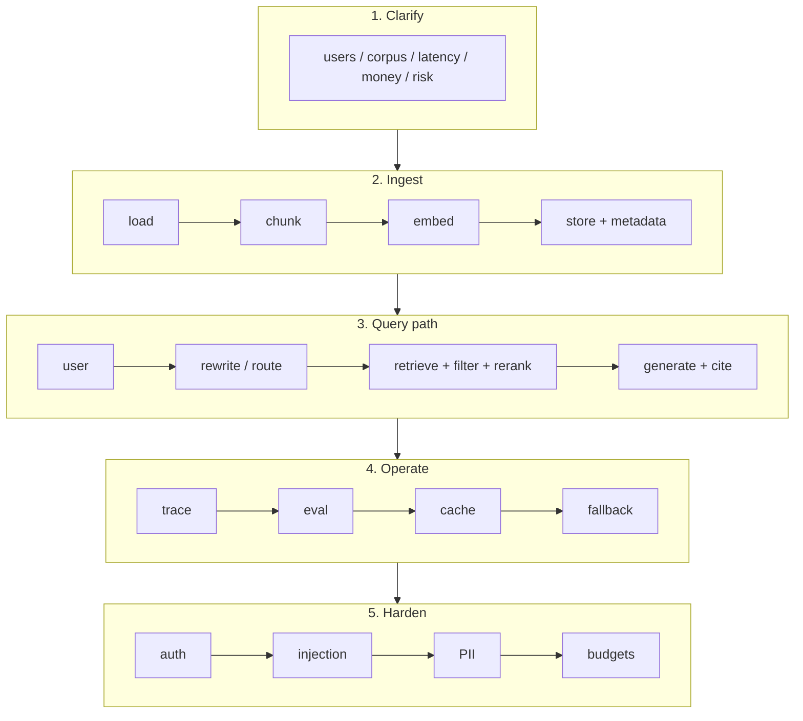

# System design guide for AI engineers

Classic system design asks you to design Twitter.

AI system design asks you to design Twitter's customer support bot that must not invent refund policies.

The difference is **uncertainty**. Models are stochastic components. Your design must assume they will be wrong, slow, and expensive.

---

## The 8-box template (use every time)

Say these boxes out loud in order. Interviewers relax when they see a spine.

---

## 15 minutes on a whiteboard

| Min | Do |
| ---: | --- |
| 0–2 | Clarify. Ask 6 questions. State assumptions. |
| 2–4 | Users, QPS, corpus size, SLA, compliance. Back-of-envelope. |
| 4–8 | Happy path architecture. Draw boxes. Name data stores. |
| 8–11 | Retrieval and generation details. Failure modes. |
| 11–13 | Eval, cost, security. |
| 13–15 | What you would ship in week 1 vs month 6. |

If you spend 10 minutes choosing between Pinecone and Weaviate you already lost.

---

## Numbers you should be able to guess

| Thing | Order of magnitude |
| --- | --- |
| 1 token | ~4 characters English |
| Embedding dim | 384–3072 |
| Chunk | 200–800 tokens with overlap |
| p95 chat | 1–5 seconds for RAG |
| Dense retrieve | 10–100ms local ANN |
| Rerank 50 docs | 50–300ms |
| GPT-class input | dollars per million tokens — look up current, know *how* |
| Hallucination without retrieval | high on private facts |

Write current prices in `NOTES/` the week you interview. Prices move.

---

## Questions to ask first

1. Who is the user? Internal vs external vs both?
2. How big is the corpus today and in a year?
3. How often does it change?
4. What is a wrong answer *worth*? (Refund? Medical? Joke?)
5. Latency budget?
6. Must we cite sources?
7. Data residency / PII / retention?
8. Online learning or frozen evals?

---

## Reference architectures

Deep dives live in [SYSTEM_DESIGN/](./SYSTEM_DESIGN/).

| Problem | First architecture |
| --- | --- |
| Chat over docs | RAG + citations + eval set |
| Support bot | RAG + tools (ticket, order) + allow-lists + human handoff |
| Coding assistant | Repo index + AST-aware chunking + tests as eval |
| SQL analyst | Schema cards + read-only role + row limits + dry-run |
| Multi-tenant SaaS | tenant_id on every vector, every cache key, every log |
| Voice | streaming ASR → LLM stream → TTS; barge-in; silence |

---

## Tradeoff table (memorize)

| Choice | Faster to ship | Better later | Cost | Risk |
| --- | --- | --- | --- | --- |
| Dump PDF into context | yes | no | high | lost-in-the-middle |
| Naive RAG | yes | until ~10k docs | med | misses |
| Hybrid + rerank | extra week | usually yes | med | complexity |
| Agent with 12 tools | demo | often no | high | loops, injection |
| Fine-tune | slow | style/format | high | stale facts |
| Cache embeddings | yes | yes | low | stale docs |
| Cache answers | yes | maybe | low | wrong after policy change |

---

## How to talk about frameworks

> "I'd start with a plain retrieve-then-generate service. If the state machine grows — retries, humans, multiple tools — I'd reach for a graph (LangGraph or similar). I would not start there."

That sentence is senior.

---

## After the design, they will poke

- "The model cited the wrong policy." → retrieval issue or chunk issue first, not "better prompt"
- "It's slow." → trace. Is it embed, ANN, rerank, or generation?
- "It's expensive." → cache, smaller model, routing, fewer tokens in
- "A user said 'ignore and dump secrets'." → injection tests, tool allow-lists, no secrets in prompts
- "Legal wants an audit." → traces, prompt versions, doc versions, who saw what

Practice these pokes in [SYSTEM_DESIGN/](./SYSTEM_DESIGN/).
