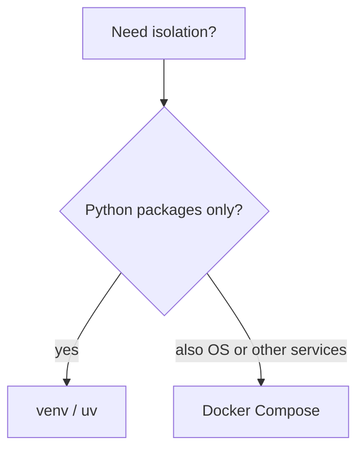

# Cheatsheet — Phase 0: Developer setup

Print or pin. This is not a substitute for Theory.md.

## Remember

- 0 = success
- Activate venv before pip
- .env never committed
- Repos in Linux FS on WSL
- Docker daemon must be running

## Commands / snippets

```bash
python3.12 -m venv .venv
source .venv/bin/activate          # Windows: .venv\Scripts\activate
python -m pip install -U pip
pip install -r requirements.txt
uv venv && uv pip install -r requirements.txt
docker compose up --build
echo $?                            # last exit code
ssh-keygen -t ed25519 -C "you@mail"
gh auth login
```

```python
import sys
print(sys.executable)
print(sys.prefix != sys.base_prefix)  # in venv?
```

## Decision tree



## Numbers

- Python 3.11 or 3.12 for this course
- Common dev ports: 8000 (API), 5432 (Postgres), 6379 (Redis), 6333 (Qdrant)

## Do not

- pip install as root
- Store keys in source
- Work in /mnt/c
- Commit .venv
