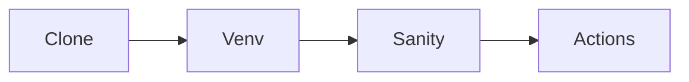

# Mini-project — Phase 0: Developer setup

**Name:** ai-eng-lab bootstrap  
**Time box:** Half a day  
**Difficulty:** Easy

## Why this project

You need a home for every later mini-project. Build it once, properly.

## User story

As a future intern, I can clone my lab repo on a new laptop and be running in 15 minutes.

## Requirements

Must:

- Public GitHub repo with MIT license
- README with OS notes, Python version, venv, Docker
- .env.example and .gitignore
- code/sanity.py that fails if not in a venv
- GitHub Actions running sanity.py on ubuntu-latest

Should:

- Makefile or justfile
- ruff config
- VS Code settings example

Won't (this week):

- Kubernetes
- A custom Linux distro
- Zsh ricing

## Architecture



## Suggested layout

```text
ai-eng-lab/
  README.md
  .env.example
  .gitignore
  requirements.txt
  code/sanity.py
  .github/workflows/ci.yml
```

## Rubric

- Clone works
- CI green
- No secrets
- README under 200 lines

## Stretch

Add a devcontainer.

When it works, write the README as if a hiring manager will open it on their phone. Then add a resume bullet using [RESUME_GUIDE.md](../../RESUME_GUIDE.md).
