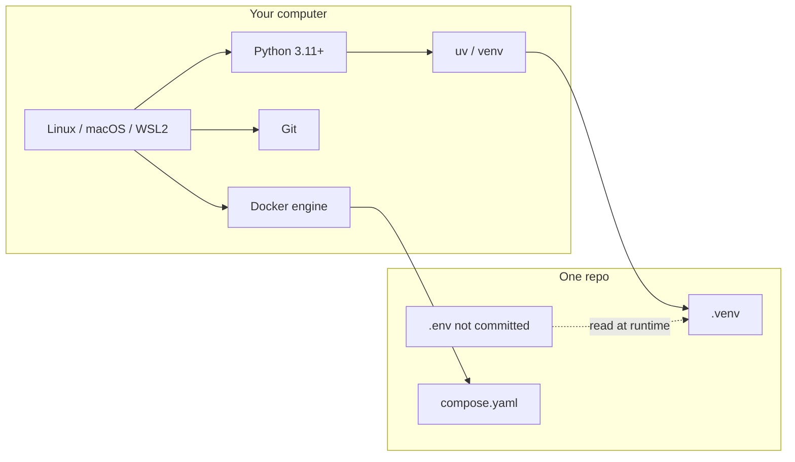
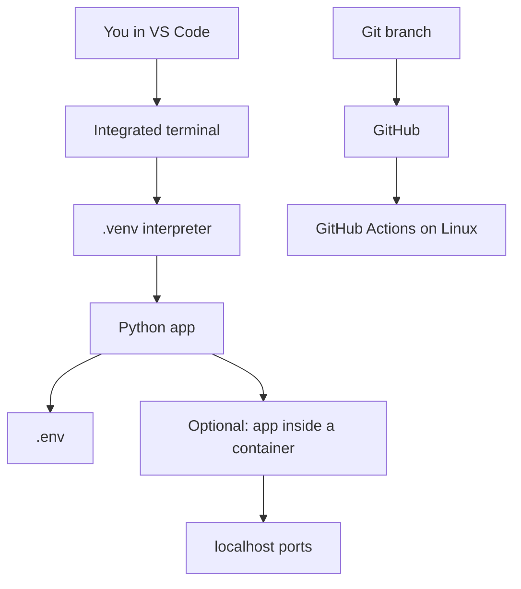

# Theory — Phase 0: Developer setup

> Read this before any code. If a word is new, we define it before we use it.

## Table of contents

1. [Introduction](#1-introduction)
2. [Why this exists](#2-why-this-exists)
3. [Real-world analogy](#3-real-world-analogy)
4. [Visual diagram](#4-visual-diagram)
5. [Architecture diagram](#5-architecture-diagram)
6. [Beginner explanation](#6-beginner-explanation)
7. [Intermediate explanation](#7-intermediate-explanation)
8. [Advanced explanation](#8-advanced-explanation)
9. [Production explanation](#9-production-explanation)
10. [Code examples](#10-code-examples)
11. [Beginner exercises](#11-beginner-exercises)
12. [Medium exercises](#12-medium-exercises)
13. [Hard exercises](#13-hard-exercises)
14. [Project](#14-project)
15. [Interview questions](#15-interview-questions)
16. [Flashcards](#16-flashcards)
17. [Quiz](#17-quiz)
18. [Common mistakes](#18-common-mistakes)
19. [Debugging examples](#19-debugging-examples)
20. [Best practices](#20-best-practices)
21. [Industry standards](#21-industry-standards)
22. [Performance tips](#22-performance-tips)
23. [Security considerations](#23-security-considerations)
24. [References](#24-references)
25. [Further reading](#25-further-reading)

---

## 1. Introduction

You cannot learn AI engineering on a machine that fights you.

Phase 0 is not "install some apps." It is the contract between you and every later phase:

- Python versions do not collide.
- Dependencies of project A cannot break project B.
- Docker behaves the same on your laptop and in CI.
- Secrets never sit in Git.
- You can explain what a process, a port, and an environment variable are.

If this feels too basic, take the quiz anyway. Many juniors who "know Python" cannot activate a venv inside WSL.

**In one sentence:** Make the computer boring so the models can be interesting.

## 2. Why this exists

Every production outage story that starts with "it worked on my machine" is a Phase 0 failure.

AI projects make this worse:

- Native wheels (NumPy, tokenizers, `psycopg`) care about OS and CPU.
- Docker images that "kind of work" on Apple Silicon surprise you on Linux CI.
- A leaked OpenAI key in a public repo can cost real money in an afternoon.

Companies hire people who can onboard onto a repo in 30 minutes. That skill is this phase.

If this phase did not exist, you would spend Phase 8 debugging CUDA on Windows instead of retrieval quality.

## 3. Real-world analogy

Think of a professional kitchen.

The chef does not keep spices in a coat pocket. There is a station, labeled containers, a fire extinguisher, and a rule: do not store raw chicken next to dessert.

Your machine is the kitchen.

- **venv / uv** = labeled containers (this soup does not share a pot with that sauce).
- **Git** = recipes with versions.
- **Docker** = a lunch box that tastes the same on the train.
- **`.env`** = the safe. Not the recipe card.
- **WSL** (on Windows) = building the kitchen on the same floor plan as the restaurant (Linux).

Keep this picture in your head when the jargon starts.

## 4. Visual diagram



## 5. Architecture diagram



Notice CI runs **Linux**. If you only ever run on Windows without WSL, you will discover bugs at the worst time.

## 6. Beginner explanation

**Terminal.** A program that sends text commands to the operating system. You type `ls` (or `dir` on old Windows) and it lists files. The number it returns is the **exit code**: `0` means success, anything else means failure. Pipelines (`|`) send the output of one command into the next.

**Path.** Where a file lives. `~/work/repo` is a folder. Spaces in paths will hurt you; avoid them.

**Process and port.** When you run an API it becomes a process listening on a port (Uvicorn likes `8000`). Only one process can bind a port. "Address already in use" means something else got there first.

**Environment variable.** A name-value pair visible to a process, like `OPENAI_API_KEY`. Apps read these so secrets are not hard-coded.

**Python version.** `python --version` must be 3.11 or 3.12 for this course. 3.10 will mostly work. 2.7 is a museum.

**Virtual environment.** A folder (`.venv`) with its own `python` and `site-packages`. Activate it so `which python` points inside the project.

**uv.** A fast modern tool that can create venvs and install packages. Optional but recommended. `pip` is fine.

**Git.** A history of your files. `commit` is a snapshot. `branch` is a line of work. GitHub is a host for those snapshots.

**Docker.** A way to run a lightweight, isolated Linux environment defined by a `Dockerfile`. Compose runs several containers together (app + database).

## 7. Intermediate explanation

**WSL2.** Windows Subsystem for Linux runs a real Linux kernel next to Windows. Put your repos *inside* the Linux filesystem (`~/`), not `/mnt/c/...`, or Git and file-watchers will be slow and weird.

**Line endings.** Windows likes `CRLF`. Linux likes `LF`. Git can convert them and cause fake diffs. Set `core.autocrlf` appropriately or use EditorConfig (`end_of_line = lf`).

**pyproject.toml vs requirements.txt.** This course ships `requirements.txt` for simplicity. Production teams often use `pyproject.toml` + lock files (`uv.lock`, `poetry.lock`). A lock file pins exact versions so Tuesday's install matches Monday's.

**Multi-interpreter VS Code.** Always pick the interpreter from `.venv`. The bottom-right of VS Code lies if you do not look.

**Docker vs venv.** Use a venv for daily coding. Use Docker when you need Postgres, Redis, or a deploy-shaped environment. Do not Dockerize `print("hello")` on day one just to feel senior.

**PATH.** The list of folders the shell searches for programs. If `docker` is "not found," it is not installed *or* not on PATH.

## 8. Advanced explanation

**Reproducible toolchains.** `uv python install 3.12` pins an interpreter. Nix and `asdf` exist; you do not need them yet. You *do* need to write the Python version in README.

**Devcontainers.** `.devcontainer/` lets VS Code open the repo inside Docker. Great for teams. Learn after you can write a Dockerfile by hand, or you will not be able to debug the container.

**Signing commits.** GPG or SSH signing proves a commit came from you. Optional here. Some companies require it.

**Credential helpers.** Never embed a GitHub password. Use SSH keys or `gh auth login`.

**File watchers and inotify** on large `node_modules` or `.venv` can melt laptops. Exclude them.

**Apple Silicon.** Docker images must support `linux/arm64` or you emulate (`platform: linux/amd64`) and go slow. Prefer official multi-arch images.

## 9. Production explanation

On a team, "setup" is **onboarding time**. A good repo has:

- README with three commands to run
- `.env.example` with every key named
- `compose.yaml` for dependencies
- A known Python version
- CI that installs the same way
- Pre-commit or a formatter so style is not a debate

You will be judged in week one on whether you can clone and run, not on whether you know GraphRAG.

**When you join a company:** read their onboarding doc. Do not invent a parallel toolchain. Match theirs.

**When to use:** Always. Every project. Every laptop. Every CI runner.

**When not to use:** Do not spend a week ricing zsh themes before Phase 1. Do not install Kubernetes because a Twitter thread said so. Do not dual-boot five distros.

## 10. Code examples

Full walkthroughs with dry runs live in [Examples.md](./Examples.md) and [`code/`](./code/).

Preview:

```python
"""Tiny sanity check you will run in every new environment."""
import platform
import sys
from pathlib import Path

print("python", sys.version)
print("executable", sys.executable)
print("platform", platform.platform())
print("in_venv", sys.prefix != sys.base_prefix)
print("cwd", Path.cwd())

```

What to notice:

- `sys.executable` must point at `.venv` after activation.
- `in_venv` should print `True`. If not, you installed packages onto your system Python. That is how machines rot.

## 11. Beginner exercises

Print Python version, confirm venv, create a Git repo, write a `.gitignore` that excludes `.venv` and `.env`.

Details: [Exercises.md](./Exercises.md)

## 12. Medium exercises

Write a `compose.yaml` that runs `nginx:alpine` and serves a static `index.html` on port 8080.

## 13. Hard exercises

Create a GitHub Actions workflow that runs on Ubuntu, sets up Python 3.12, installs requirements, and executes `python code/sanity.py`.

## 14. Project

A personal `dotfiles-lite` plus an `ai-eng-lab` repo with README, venv instructions, and a passing Actions workflow. See MiniProject.md.

Spec: [MiniProject.md](./MiniProject.md)

## 15. Interview questions

What is a virtual environment? Why not install globally? What does Docker add that venv does not? How do you keep secrets out of Git?

The full bank with expected answers, common mistakes, senior discussion, and whiteboard prompts: [Interview.md](./Interview.md)

## 16. Flashcards

Use [Flashcards.md](./Flashcards.md). Say the answer out loud before you flip.

Sample:

**Q:** Exit code of a successful command?
**A:** 0.

## 17. Quiz

Take [Quiz.md](./Quiz.md) cold. Passing bar: 80%.

## 18. Common mistakes

Installing packages without activating the venv. Committing `.env`. Developing on `/mnt/c` inside WSL. Using Python 3.9 because it was already there.

More: [CommonMistakes.md](./CommonMistakes.md)

## 19. Debugging examples

`python` on Windows pointing at the Store stub. Docker daemon not running. Port 8000 taken. Git refusing to commit because user.name is unset.

Playgrounds: [Debugging.md](./Debugging.md)

## 20. Best practices

- One Python per project, isolated.
- `LF` line endings.
- `.env.example` committed, `.env` never.
- README says the exact Python version.
- Format with `ruff` so you stop arguing about quotes.

## 21. Industry standards

Teams use: VS Code or JetBrains, GitHub/GitLab, a lock file, Docker for services, a secrets manager (1Password, Doppler, AWS SM) — not a spreadsheet of keys.

`uv` is rapidly becoming the default installer in 2025–2026 Python shops. Know `pip` too.

## 22. Performance tips

Put code on the native filesystem (not `/mnt/c`). Exclude `.venv` from antivirus and from VS Code file watchers. Use `uv` if `pip install` is the slow part of your day.

## 23. Security considerations

Never commit secrets. Rotate a key if it leaked even for a minute. Do not paste keys into ChatGPT. SSH keys need passphrases. Disk encryption on laptops is not optional if you have customer data later.

## 24. References

- [Python venv docs](https://docs.python.org/3/library/venv.html)
- [uv](https://docs.astral.sh/uv/)
- [Git book, chapters 1–3](https://git-scm.com/book/en/v2)
- [Docker Get Started](https://docs.docker.com/get-started/)
- [WSL docs](https://learn.microsoft.com/windows/wsl/)

## 25. Further reading

- [100 Days of Docker](https://github.com/DARKANGEL689/100-Days-Of-Docker) if you want extra drills after Phase 4
- [free-programming-books](https://github.com/EbookFoundation/free-programming-books) for your language

---

Next: type the code in [Examples.md](./Examples.md). Reading is not the skill. Running it is.
