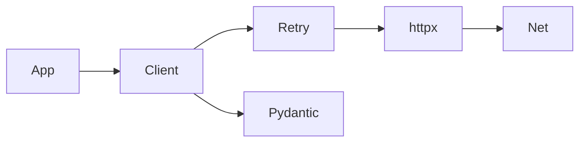

# Mini-project — Phase 1: Python refresh

**Name:** httpx-mini client  
**Time box:** Half a day to one day  
**Difficulty:** Easy-medium

## Why this project

You will wrap OpenAI/Anthropic/Ollama the same way.

## User story

As a developer, I can GET/POST JSON with retries and parse into pydantic models.

## Requirements

Must:

- Typed public API
- Timeouts
- Retries with jitter
- Tests with respx or httpx MockTransport
- README

Should:

- Async and sync versions
- Stream lines

Won't (this week):

- Full OpenAI clone
- A web UI

## Architecture



## Suggested layout

```text
src/minihttp/client.py
tests/test_client.py
```

## Rubric

- pyright clean
- a test that fails closed on timeout
- no sleeps > 50ms in tests (mock time)

## Stretch

OpenTelemetry span around each request (preview of Phase 12).

When it works, write the README as if a hiring manager will open it on their phone. Then add a resume bullet using [RESUME_GUIDE.md](../../RESUME_GUIDE.md).
