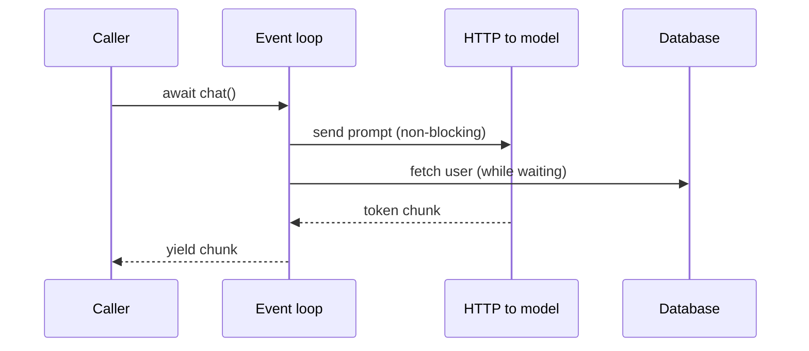
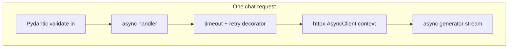

# Theory — Phase 1: Python refresh

> Read this before any code. If a word is new, we define it before we use it.

## Table of contents

1. [Introduction](#1-introduction)
2. [Why this exists](#2-why-this-exists)
3. [Real-world analogy](#3-real-world-analogy)
4. [Visual diagram](#4-visual-diagram)
5. [Architecture diagram](#5-architecture-diagram)
6. [Beginner explanation](#6-beginner-explanation)
7. [Intermediate explanation](#7-intermediate-explanation)
8. [Advanced explanation](#8-advanced-explanation)
9. [Production explanation](#9-production-explanation)
10. [Code examples](#10-code-examples)
11. [Beginner exercises](#11-beginner-exercises)
12. [Medium exercises](#12-medium-exercises)
13. [Hard exercises](#13-hard-exercises)
14. [Project](#14-project)
15. [Interview questions](#15-interview-questions)
16. [Flashcards](#16-flashcards)
17. [Quiz](#17-quiz)
18. [Common mistakes](#18-common-mistakes)
19. [Debugging examples](#19-debugging-examples)
20. [Best practices](#20-best-practices)
21. [Industry standards](#21-industry-standards)
22. [Performance tips](#22-performance-tips)
23. [Security considerations](#23-security-considerations)
24. [References](#24-references)
25. [Further reading](#25-further-reading)

---

## 1. Introduction

AI engineering is mostly **waiting on networks**: model APIs, databases, vector stores, browsers.

The Python that matters is therefore:

- **Types** so a model's JSON cannot silently become the wrong shape
- **Async** so one process can wait on many sockets
- **Generators** so you can stream tokens without building a giant string
- **Decorators** so retries and tracing are not copy-pasted
- **Context managers** so HTTP sessions and file handles close even when the model throws

This is not a beginner Python course. It is the subset that shows up in every production LLM service.

**In one sentence:** Typed async Python is the language of AI backends.

## 2. Why this exists

Without types, `response['choices'][0]['message']['content']` explodes at 2am.

Without async, your FastAPI server handles one streaming chat at a time.

Without generators, you buffer a 4,000-token answer before sending a byte.

Without retries and timeouts, a 15-second model blip becomes a hung worker.

These are not style points. They are the difference between a notebook and a service.

If this phase did not exist, you would paste `time.sleep` in request handlers and parse LLM JSON with hope.

## 3. Real-world analogy

A restaurant.

- **Types / Pydantic** = the ticket the kitchen accepts. If "table 4 wants pasta" is missing a table number, you reject it *before* cooking.
- **Async** = one waiter taking drink orders from many tables while the espresso machine works. The waiter is not faster at pouring. They just do not freeze the whole room while the machine hisses.
- **Generators** = plating bite by bite instead of cooking the entire banquet before serving.
- **Decorators** = a standard "check allergy card" step wrapped around any dish.
- **Context managers** = unlocking the pantry and *always* locking it, even if the sauce catches fire.

Keep this picture in your head when the jargon starts.

## 4. Visual diagram



## 5. Architecture diagram



## 6. Beginner explanation

**Type hints** are notes about what a value should be. `def f(x: int) -> str` means x is an int and f returns a string. Python does not enforce this at runtime unless you use a tool (mypy, pyright) or pydantic.

**Pydantic** is a library that *does* enforce shapes at runtime. Perfect for LLM JSON.

**`async def`** defines a coroutine. Calling it does not run it. `await` does. You can only `await` inside async functions.

**Event loop** = the scheduler that runs coroutines when their I/O is ready.

**Generator** = a function with `yield`. It pauses and resumes. Great for streams.

**Decorator** = a function that takes a function and returns a wrapped one. `@retry` is a decorator.

**Context manager** = an object that works with `with`. `__enter__` / `__exit__` (or `async with`). Guarantees cleanup.

## 7. Intermediate explanation

**`from __future__ import annotations`** delays evaluation of hints so you can reference types before they exist.

**`TypeAlias`, `TypedDict`, `Protocol`** model shapes without full classes. Protocols are like interfaces.

**`asyncio.gather`** runs several coroutines concurrently. **`TaskGroup`** (3.11+) is the safer structured version.

**CPU-bound work** (embedding a huge file in pure Python) does **not** get faster with async. Use a process pool or a different language/library. Async is for waiting.

**`yield from` and `async for`** compose streams.

**Decorator factories** (`def retry(times): def deco(fn): ...`) take parameters.

**`contextlib.contextmanager`** lets you write a context manager as a generator with one `yield`.

## 8. Advanced explanation

**Backpressure.** If you yield tokens faster than the client reads, you buffer. `asyncio.Queue(maxsize=...)` and Starlette streaming responses matter.

**Cancellation.** When a user closes a tab, you must cancel the model HTTP call or you pay for unused tokens. `try/finally` and `httpx` timeouts.

**Re-entrancy.** A naive decorator that locks a global will deadlock under async.

**Type narrowing.** `assert x is not None` after a check so pyright is happy.

**Pydantic v2** is a different beast from v1 (`model_validate`, `model_dump`). Use v2.

**`slots` / frozen dataclasses** for hot path objects (chunks, spans).

## 9. Production explanation

In production AI services:

- All external calls have **timeouts**.
- Retries are **bounded** and **idempotent** (do not retry a non-idempotent POST without care).
- Streams are **async generators** from the DB to the socket.
- Settings are typed.
- You log **request ids**, not prompts with PII.

A staff engineer reading your code looks for `timeout=` before they look for clever prompts.

**When to use:** Every backend. Every client. Every time you talk to a model or a database.

**When not to use:** Do not make a 20-line script async. Do not type every local variable. Do not retry `POST /charges` blindly.

## 10. Code examples

Full walkthroughs with dry runs live in [Examples.md](./Examples.md) and [`code/`](./code/).

Preview:

```python
import asyncio
from collections.abc import AsyncIterator

async def tokens() -> AsyncIterator[str]:
    for part in ["Hello", " ", "world"]:
        await asyncio.sleep(0.01)  # fake network
        yield part

```

What to notice:

This is the skeleton of LLM streaming. FastAPI will iterate it and send Server-Sent Events.

## 11. Beginner exercises

Annotate a function, write a pydantic model, write a generator that yields lines of a file.

Details: [Exercises.md](./Exercises.md)

## 12. Medium exercises

Retry decorator with exponential backoff + jitter. Async version too.

## 13. Hard exercises

Async client that streams a fake model, can be cancelled, and times out at 2 seconds.

## 14. Project

Typed async HTTP client — MiniProject.md.

Spec: [MiniProject.md](./MiniProject.md)

## 15. Interview questions

When is async useless? What does await do? How does a generator differ from returning a list?

The full bank with expected answers, common mistakes, senior discussion, and whiteboard prompts: [Interview.md](./Interview.md)

## 16. Flashcards

Use [Flashcards.md](./Flashcards.md). Say the answer out loud before you flip.

Sample:

**Q:** Can you `await` in a sync function?
**A:** No. SyntaxError / design error.

## 17. Quiz

Take [Quiz.md](./Quiz.md) cold. Passing bar: 80%.

## 18. Common mistakes

`time.sleep` in async code. Bare `except:`. Retrying without timeout. `json.loads` on LLM output without a schema.

More: [CommonMistakes.md](./CommonMistakes.md)

## 19. Debugging examples

`RuntimeWarning: coroutine was never awaited`. Deadlocks from `time.sleep`. CancelledError swallowed.

Playgrounds: [Debugging.md](./Debugging.md)

## 20. Best practices

- Type public functions.
- Timeout every awaitable I/O.
- Retry only transient errors (429, 502, 503).
- Prefer `async with` for clients.
- Validate all untrusted JSON with pydantic.

## 21. Industry standards

FastAPI + pydantic v2 + httpx + tenacity (or custom retry) is the 2024–2026 default stack for Python AI services.

## 22. Performance tips

Avoid extra copies of big strings. Stream. Do not embed files on the event loop. Use `orjson` if JSON encode is hot (measure first).

## 23. Security considerations

Do not log full prompts. Do not retry requests that might have side effects without idempotency keys. Timeouts are a security control against slowloris-style hangs.

## 24. References

- [PEP 484 / 695 typing](https://peps.python.org/pep-0484/)
- [Pydantic](https://docs.pydantic.dev/)
- [asyncio](https://docs.python.org/3/library/asyncio.html)
- [httpx](https://www.python-httpx.org/)

## 25. Further reading

- *Fluent Python* (Ramalho) chapters on coroutines and decorators
- Any httpx timeout write-up

---

Next: type the code in [Examples.md](./Examples.md). Reading is not the skill. Running it is.
