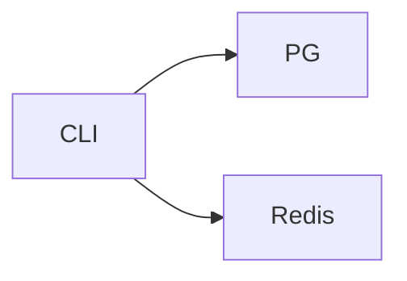

# Mini-project — Phase 2: SQL, Postgres, and Redis

**Name:** chat-ledger  
**Time box:** 1 day  
**Difficulty:** Medium

## Why this project

Every later project will import this schema idea.

## User story

I can persist chats and get 429ed when I spam.

## Requirements

Must:

- compose Postgres+Redis
- schema.sql
- CLI
- rate limit 20/min
- README with EXPLAIN

Should:

- Alembic
- token columns

Won't (this week):

- UI
- embeddings yet

## Architecture



## Suggested layout

```text
compose.yaml schema.sql src/ledger/
```

## Rubric

- FKs
- index used
- limit works
- gitignore .env

## Stretch

Sliding window limiter in Lua.

When it works, write the README as if a hiring manager will open it on their phone. Then add a resume bullet using [RESUME_GUIDE.md](../../RESUME_GUIDE.md).
