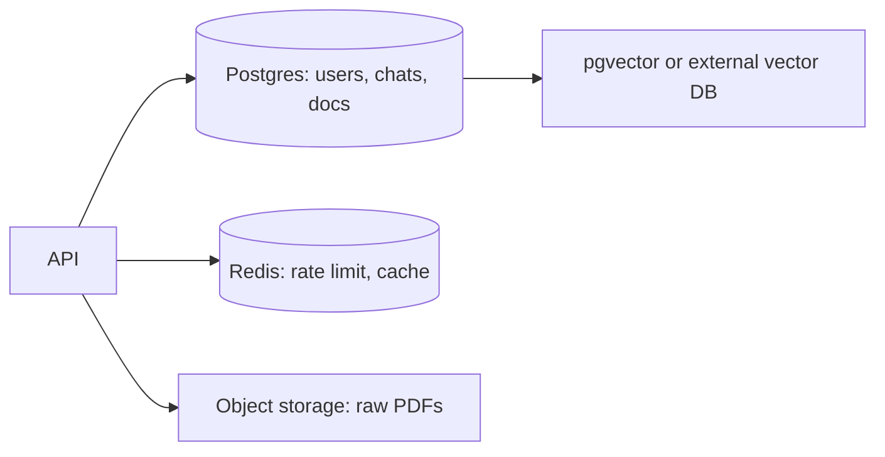
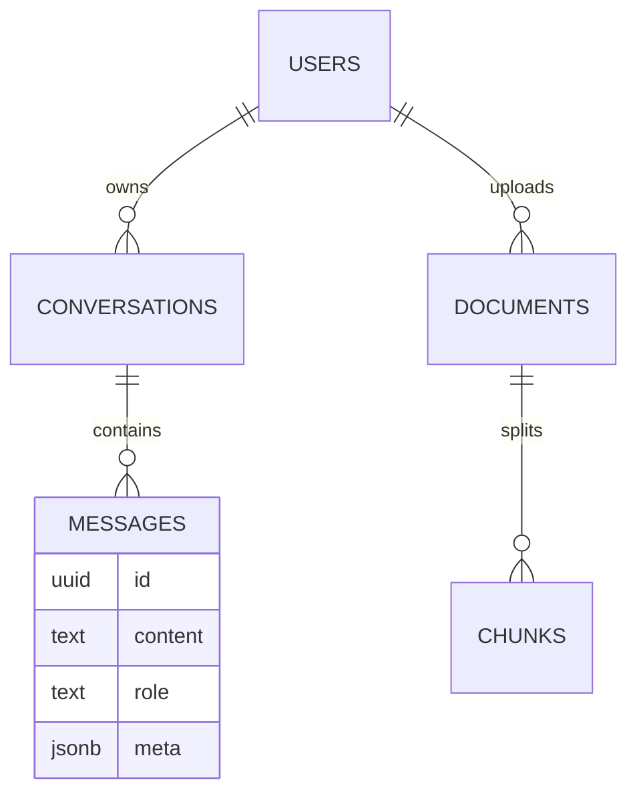

# Theory — Phase 2: SQL, Postgres, and Redis

> Read this before any code. If a word is new, we define it before we use it.

## Table of contents

1. [Introduction](#1-introduction)
2. [Why this exists](#2-why-this-exists)
3. [Real-world analogy](#3-real-world-analogy)
4. [Visual diagram](#4-visual-diagram)
5. [Architecture diagram](#5-architecture-diagram)
6. [Beginner explanation](#6-beginner-explanation)
7. [Intermediate explanation](#7-intermediate-explanation)
8. [Advanced explanation](#8-advanced-explanation)
9. [Production explanation](#9-production-explanation)
10. [Code examples](#10-code-examples)
11. [Beginner exercises](#11-beginner-exercises)
12. [Medium exercises](#12-medium-exercises)
13. [Hard exercises](#13-hard-exercises)
14. [Project](#14-project)
15. [Interview questions](#15-interview-questions)
16. [Flashcards](#16-flashcards)
17. [Quiz](#17-quiz)
18. [Common mistakes](#18-common-mistakes)
19. [Debugging examples](#19-debugging-examples)
20. [Best practices](#20-best-practices)
21. [Industry standards](#21-industry-standards)
22. [Performance tips](#22-performance-tips)
23. [Security considerations](#23-security-considerations)
24. [References](#24-references)
25. [Further reading](#25-further-reading)

---

## 1. Introduction

An AI app that forgets chats on restart is a demo.

Production systems store:

- **Who** the user is (Postgres)
- **What** they uploaded (object storage + a row pointing at it)
- **Which chunks** we embedded (Postgres + vector column or a vector DB)
- **How often** they may call the model (Redis)
- **Traces** of what we sent the model (Postgres or a tracing backend)

This phase is the data spine. Skip it and Phase 8 will rot.

**In one sentence:** Postgres is the source of truth; Redis is the short-term memory and traffic cop.

## 2. Why this exists

LLMs are stateless. Your product is not.

If you store chats in a list in RAM:

- Restart wipes history
- Two servers cannot share state
- You cannot audit what was said
- You cannot bill or rate-limit fairly

SQL exists because relations (user has many chats has many messages) are real. Redis exists because some data is hot and disposable (a 60-second rate-limit counter).

If this phase did not exist, you would ship a chatbot that cannot remember yesterday and cannot stop a runaway bill.

## 3. Real-world analogy

A library.

- **Postgres** = the catalog and the ledgers. Authoritative. Durable. Queryable.
- **Indexes** = the card catalog. Extra space, much faster lookup.
- **JSONB** = a notebook taped to a catalog card for messy extra fields.
- **Redis** = the whiteboard at the front desk: "this visitor has checked out 5 things today." Wiped at close. Fast. Not the catalog.
- **Migrations** = remodeling the library without losing books.

Keep this picture in your head when the jargon starts.

## 4. Visual diagram



## 5. Architecture diagram



## 6. Beginner explanation

**Table** = spreadsheet with a schema. **Row** = one record. **Primary key** = unique id, often UUID.

**Foreign key** = a pointer to another table that the database enforces.

**SQL** = the language: `SELECT`, `INSERT`, `UPDATE`, `DELETE`, `JOIN`.

**Index** = extra data structure (often B-tree) that makes lookups fast and writes a bit slower.

**Postgres** = a powerful open-source relational database. Speaks SQL. Handles JSON, text search, and (with pgvector) embeddings.

**Redis** = in-memory key-value store. Data lives in RAM (and optionally on disk). Operations are microseconds. Keys can expire (`EXPIRE`).

**Migration** = a versioned script that changes schema. Never "just ALTER TABLE on prod by hand" as a habit.

## 7. Intermediate explanation

**Normalization** = don't duplicate user emails on every message; store `user_id`. **Denormalization** = copy a field on purpose for read speed. Both are tools.

**EXPLAIN ANALYZE** shows how Postgres runs a query. `Seq Scan` on a large table is a smell if you expected a lookup.

**JSONB** + GIN indexes: good for metadata (`{"source": "wiki", "lang": "en"}`). Bad as a junk drawer for everything.

**Transactions** (`BEGIN`/`COMMIT`) group writes. Either all succeed or none. Use them when you insert a document AND its chunks.

**Redis patterns for AI:**

- `INCR` + `EXPIRE` = rate limit
- `SET key json EX 3600` = cache embedding or a whole answer
- Lists/streams = cheap queues (or use a real queue later)

**N+1 queries:** looping messages and querying the user each time. Join or prefetch.

## 8. Advanced explanation

**Isolation levels.** Default READ COMMITTED is fine. Serializable is for money. Know that two rate-limit checks in Postgres without Redis can race.

**Connection pooling.** Postgres connections are expensive. Use PgBouncer or SQLAlchemy pool. One connection per asyncio task blindly will melt a small instance.

**Partial indexes.** `CREATE INDEX ... WHERE deleted_at IS NULL`.

**LISTEN/NOTIFY** for cheap fanout. Or Redis pub/sub.

**Cache invalidation.** Hardest problem. Prefer short TTLs and cache keys that include `doc_version`.

**pgvector** vs dedicated vector DB: if your scale is < few million vectors and you already operate Postgres, pgvector is a sane default. We compare in Phase 7.

## 9. Production explanation

Backups, point-in-time recovery, migration expand/contract (add column, backfill, then switch), read replicas, and **never** running `DELETE FROM messages` without WHERE in prod.

For AI apps specifically:

- Store **prompt version** and **model name** on each message
- Store **token counts** for cost
- Soft-delete documents so you can rebuild indexes
- Redis is not your chat history

Multi-tenant: `tenant_id` on every table. Row Level Security if you are serious.

**When to use:** Any state that must survive a restart, any relationship, any audit trail. Redis for counters, locks, hot caches.

**When not to use:** Do not store 200MB PDFs as bytea. Do not store embeddings-only in Redis without a durable copy. Do not use Mongo 'because JSON' if your data is relational.

## 10. Code examples

Full walkthroughs with dry runs live in [Examples.md](./Examples.md) and [`code/`](./code/).

Preview:

```python
# Redis sliding window rate limit (fixed window shown for clarity)
# INCR user:42:llm_calls  +  EXPIRE 60
# if value > 20: reject

```

What to notice:

Fixed window is simple and slightly bursty at boundaries. Sliding window is fairer. Start simple.

## 11. Beginner exercises

Write CREATE TABLE for users and messages. Insert two rows. JOIN them.

Details: [Exercises.md](./Exercises.md)

## 12. Medium exercises

Add an index, prove with EXPLAIN that a query uses it. Write Alembic migration.

## 13. Hard exercises

Implement Redis rate limit + Postgres chat persist in one Python script with transactions.

## 14. Project

Schema + limiter — MiniProject.md.

Spec: [MiniProject.md](./MiniProject.md)

## 15. Interview questions

Index vs full scan. Why Redis for rate limits. How to migrate without downtime.

The full bank with expected answers, common mistakes, senior discussion, and whiteboard prompts: [Interview.md](./Interview.md)

## 16. Flashcards

Use [Flashcards.md](./Flashcards.md). Say the answer out loud before you flip.

Sample:

**Q:** Where do PDFs live?
**A:** Object storage; Postgres stores the URL and metadata.

## 17. Quiz

Take [Quiz.md](./Quiz.md) cold. Passing bar: 80%.

## 18. Common mistakes

No index on `user_id`. Chat history in Redis only. SELECT * in a hot path. Storing API keys in a table in plaintext.

More: [CommonMistakes.md](./CommonMistakes.md)

## 19. Debugging examples

Idle in transaction. Connection pool exhausted. Cache serving stale policy docs.

Playgrounds: [Debugging.md](./Debugging.md)

## 20. Best practices

Migrations in CI. Foreign keys on. UUID PKs or bigints on purpose. TTL on every Redis key. Parameterized queries only.

## 21. Industry standards

Managed Postgres (RDS, Cloud SQL, Neon, Supabase) + ElastiCache/Redis or KeyDB. ORM: SQLAlchemy 2.0 + Alembic.

## 22. Performance tips

Index foreign keys. Limit chat list queries. Don't load full message history if you only need the last 20. Connection pool size ≈ (CPU*2) as a starting heuristic, then measure.

## 23. Security considerations

Parameterized SQL (no f-strings). Least-privilege DB roles (the SQL agent in Phase 9 will be read-only). Encrypt disks. Redis AUTH + not exposed to the internet.

## 24. References

- [Postgres docs](https://www.postgresql.org/docs/)
- [Redis docs](https://redis.io/docs/)
- [SQLAlchemy 2.0](https://docs.sqlalchemy.org/)

## 25. Further reading

- *Designing Data-Intensive Applications* (Kleppmann) ch. 2–3
- Use The Index, Luke

---

Next: type the code in [Examples.md](./Examples.md). Reading is not the skill. Running it is.
