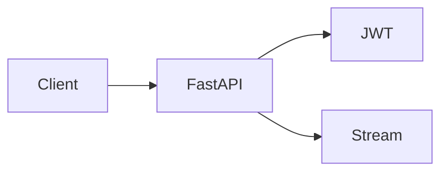

# Mini-project — Phase 3: FastAPI

**Name:** stream-chat-api  
**Time box:** 1–2 days  
**Difficulty:** Medium

## Why this project

This stub becomes the shell of every later project.

## User story

I can log in, hit /v1/chat/stream, see tokens, and get 401 without a token.

## Requirements

Must:

- JWT
- SSE
- request id
- tests
- OpenAPI

Should:

- Redis 429
- healthz

Won't (this week):

- Real model yet (fake tokens ok)
- UI

## Architecture



## Suggested layout

```text
app/main.py app/auth.py app/stream.py tests/
```

## Rubric

- pytest green
- 401/200/stream
- README with curl

## Stretch

Cookie session instead of JWT; write the CSRF note.

When it works, write the README as if a hiring manager will open it on their phone. Then add a resume bullet using [RESUME_GUIDE.md](../../RESUME_GUIDE.md).
