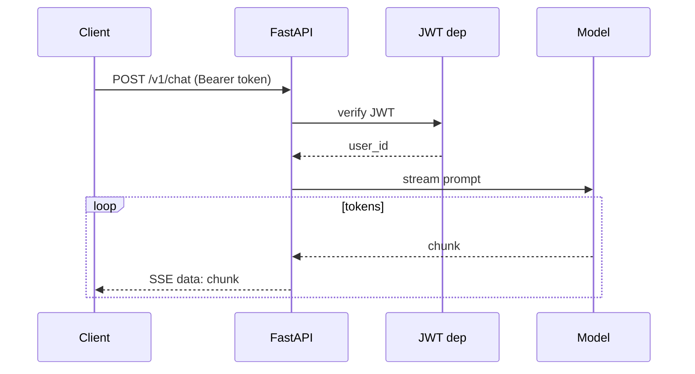
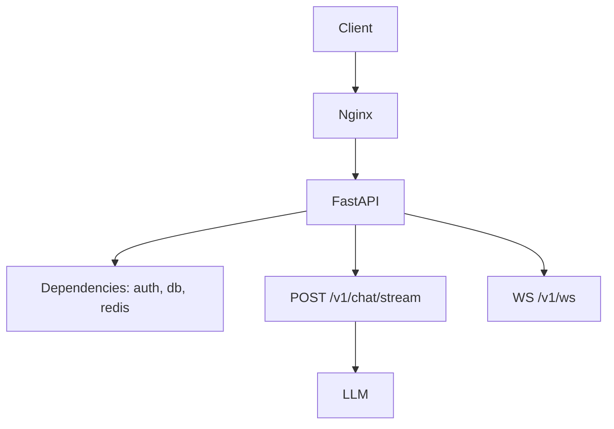

# Theory — Phase 3: FastAPI

> Read this before any code. If a word is new, we define it before we use it.

## Table of contents

1. [Introduction](#1-introduction)
2. [Why this exists](#2-why-this-exists)
3. [Real-world analogy](#3-real-world-analogy)
4. [Visual diagram](#4-visual-diagram)
5. [Architecture diagram](#5-architecture-diagram)
6. [Beginner explanation](#6-beginner-explanation)
7. [Intermediate explanation](#7-intermediate-explanation)
8. [Advanced explanation](#8-advanced-explanation)
9. [Production explanation](#9-production-explanation)
10. [Code examples](#10-code-examples)
11. [Beginner exercises](#11-beginner-exercises)
12. [Medium exercises](#12-medium-exercises)
13. [Hard exercises](#13-hard-exercises)
14. [Project](#14-project)
15. [Interview questions](#15-interview-questions)
16. [Flashcards](#16-flashcards)
17. [Quiz](#17-quiz)
18. [Common mistakes](#18-common-mistakes)
19. [Debugging examples](#19-debugging-examples)
20. [Best practices](#20-best-practices)
21. [Industry standards](#21-industry-standards)
22. [Performance tips](#22-performance-tips)
23. [Security considerations](#23-security-considerations)
24. [References](#24-references)
25. [Further reading](#25-further-reading)

---

## 1. Introduction

A notebook is not a product. A product has a **contract**: HTTP.

FastAPI is a Python framework that:

- Maps URL + method → function
- Validates bodies with pydantic
- Generates OpenAPI docs for free
- Speaks async, so streaming tokens is natural

You will wrap every later RAG and agent in this.

**In one sentence:** FastAPI is the front door of a Python AI service.

## 2. Why this exists

Mobile apps, web apps, and other services will not import your Python file. They will `POST /v1/chat`.

You need:

- Auth so not everyone spends your API budget
- Streaming so the UI can show tokens as they arrive
- Versioned routes so you can change prompts without breaking old clients
- Errors that are JSON, not a stack trace

If this phase did not exist, you would demo in Streamlit forever and fail the take-home that says 'expose an API'.

## 3. Real-world analogy

A restaurant counter.

- **Route** = menu item (`POST /orders`)
- **pydantic model** = order ticket (invalid ticket never reaches the kitchen)
- **Dependency** = the maître d' who checks reservation (auth) before the kitchen
- **JWT** = a signed wristband: we don't look up your name in a filing cabinet every time, we verify the band
- **Streaming / SSE** = dishes coming out one plate at a time
- **WebSocket** = an open table conversation, not one order
- **Status codes** = 200 here's food, 401 you are not on the list, 429 too many orders, 500 kitchen fire

Keep this picture in your head when the jargon starts.

## 4. Visual diagram



## 5. Architecture diagram



## 6. Beginner explanation

**HTTP method:** GET read, POST create/action, PUT replace, PATCH partial, DELETE remove. Chat is usually POST (it has a body and side effects).

**Status codes:** 2xx ok, 4xx your client messed up, 5xx we messed up.

**JSON body** in, JSON out. FastAPI parses into pydantic models.

**Path** `/v1/chats/{id}` vs **query** `?limit=20`.

**Dependency** = a function FastAPI calls before yours. `Depends(get_user)`.

**JWT** = JSON Web Token. Three base64 parts: header, payload, signature. Server signs with a secret. Client sends `Authorization: Bearer <token>`. Server verifies signature and expiry.

**SSE (Server-Sent Events)** = a long GET/POST that sends `data: ...\n\n` chunks. Perfect for token streams.

**WebSocket** = bidirectional persistent connection. Use for multi-user presence or when the client also sends often. For one-way token streams, SSE is simpler.

## 7. Intermediate explanation

**OpenAPI** at `/docs` is not a toy. It is the contract. Keep models honest.

**Lifespan** (`lifespan=` in FastAPI) creates the httpx client and DB pool once.

**BackgroundTasks** are for tiny after-the-response work. They are not Celery. If you need retries, use a queue.

**CORS** is a browser rule. `allow_origins=["*"]` plus credentials is illegal and a footgun. List origins.

**Idempotency.** Clients retry POSTs. For "create chat" use client-generated ids or idempotency keys.

**Pagination.** Cursor-based for messages (`after_id`), not huge offsets.

**Error handlers.** Map `ValidationError` to 422, `PermissionError` to 403. Never leak stack traces to clients.

## 8. Advanced explanation

**StreamingResponse** + async generator. Watch client disconnect.

**Backpressure** from slow clients.

**OAuth2** authorization code flow for "Login with Google"; JWT as the session after that. Don't invent your own crypto.

**API versioning.** `/v1` vs header. Pin prompt versions independently of API versions.

**Rate-limit middleware** using Redis from Phase 2.

**WebSocket auth:** tokens in query strings leak to logs. Prefer first-message auth or subprotocols.

**HTTP/2 and proxies** buffering SSE — `X-Accel-Buffering: no` for Nginx.

## 9. Production explanation

Gunicorn/Uvicorn workers, health `/healthz`, readiness `/readyz` (can we see Postgres?), graceful shutdown (finish streams), request ID middleware (`X-Request-ID`), structured logs.

Never: `uvicorn --reload` in production. Never: debug=True. Never: secrets in query params.

**When to use:** Any time another process must talk to your AI code.

**When not to use:** A one-off script. A training job. Don't FastAPI your data migration.

## 10. Code examples

Full walkthroughs with dry runs live in [Examples.md](./Examples.md) and [`code/`](./code/).

Preview:

```python
from fastapi import FastAPI, Depends
from fastapi.responses import StreamingResponse

app = FastAPI()

@app.post("/v1/chat/stream")
async def chat(user=Depends(get_user)):
    return StreamingResponse(token_gen(), media_type="text/event-stream")

```

What to notice:

Auth is a dependency, not an if-statement copy-pasted 12 times. StreamingResponse wraps an async generator.

## 11. Beginner exercises

CRUD of notes with pydantic. 404 when missing.

Details: [Exercises.md](./Exercises.md)

## 12. Medium exercises

JWT login + protected route. Tests with TestClient.

## 13. Hard exercises

SSE stream of fake tokens; pytest asserts chunks; JWT required.

## 14. Project

Streaming chat API stub — MiniProject.md.

Spec: [MiniProject.md](./MiniProject.md)

## 15. Interview questions

PUT vs PATCH. Why JWT. SSE vs WebSocket. What 429 means.

The full bank with expected answers, common mistakes, senior discussion, and whiteboard prompts: [Interview.md](./Interview.md)

## 16. Flashcards

Use [Flashcards.md](./Flashcards.md). Say the answer out loud before you flip.

Sample:

**Q:** Where should the JWT live?
**A:** Authorization header, not localStorage if you can use httpOnly cookies — know the tradeoff.

## 17. Quiz

Take [Quiz.md](./Quiz.md) cold. Passing bar: 80%.

## 18. Common mistakes

Returning 200 for errors. No timeouts. CORS *. Blocking I/O in async routes.

More: [CommonMistakes.md](./CommonMistakes.md)

## 19. Debugging examples

422 mystery (pydantic). 401 clock skew. SSE that arrives all at once (proxy buffer).

Playgrounds: [Debugging.md](./Debugging.md)

## 20. Best practices

Small routers. Dependencies. Typed models. Request IDs. Healthchecks. Tests.

## 21. Industry standards

FastAPI is the default Python API for AI startups in 2024–2026. Alternatives: Django Ninja, Litestar, Go/Fiber if you leave Python.

## 22. Performance tips

Don't create httpx.Client per request. Stream. Connection pool. Avoid giant JSON logs.

## 23. Security considerations

JWT secret in env. Short expiry + refresh. HTTPS. Rate limit. Do not put PII in JWT payload you cannot rotate.

## 24. References

- [FastAPI](https://fastapi.tiangolo.com/)
- [JWT.io](https://jwt.io/)
- [MDN SSE](https://developer.mozilla.org/en-US/docs/Web/API/Server-sent_events)

## 25. Further reading

OAuth 2.1 IETF drafts; Starlette internals.

---

Next: type the code in [Examples.md](./Examples.md). Reading is not the skill. Running it is.
