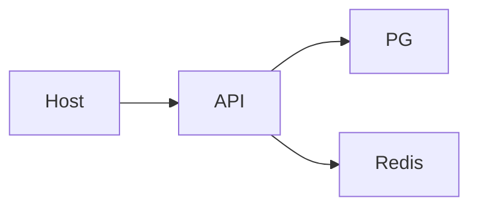

# Mini-project — Phase 4: Docker

**Name:** compose-stack  
**Time box:** 1 day  
**Difficulty:** Medium

## Why this project

Take-homes that cannot docker compose up get skipped.

## User story

A teammate clones and is up in one command.

## Requirements

Must:

- Dockerfile
- compose api+pg+redis
- healthchecks
- .dockerignore
- non-root

Should:

- multi-stage
- dev override compose

Won't (this week):

- Kubernetes

## Architecture



## Suggested layout

```text
Dockerfile compose.yaml .dockerignore
```

## Rubric

- one command
- data persists
- README troubleshooting

## Stretch

Add a Makefile with up/down/logs/psql.

When it works, write the README as if a hiring manager will open it on their phone. Then add a resume bullet using [RESUME_GUIDE.md](../../RESUME_GUIDE.md).
