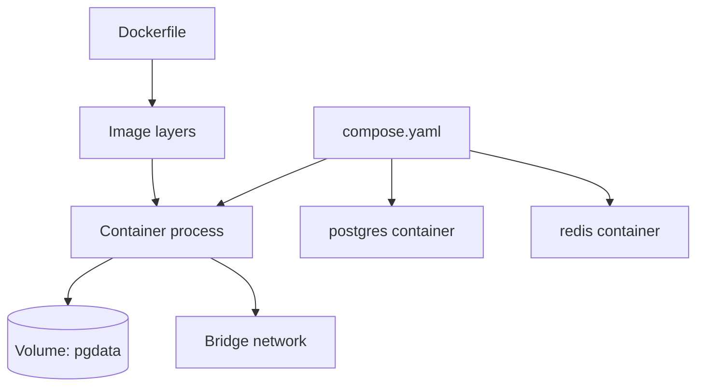
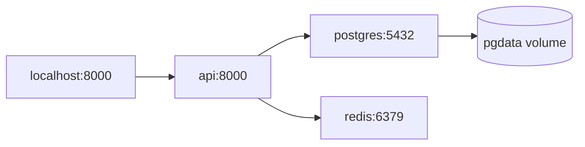

# Theory — Phase 4: Docker

> Read this before any code. If a word is new, we define it before we use it.

## Table of contents

1. [Introduction](#1-introduction)
2. [Why this exists](#2-why-this-exists)
3. [Real-world analogy](#3-real-world-analogy)
4. [Visual diagram](#4-visual-diagram)
5. [Architecture diagram](#5-architecture-diagram)
6. [Beginner explanation](#6-beginner-explanation)
7. [Intermediate explanation](#7-intermediate-explanation)
8. [Advanced explanation](#8-advanced-explanation)
9. [Production explanation](#9-production-explanation)
10. [Code examples](#10-code-examples)
11. [Beginner exercises](#11-beginner-exercises)
12. [Medium exercises](#12-medium-exercises)
13. [Hard exercises](#13-hard-exercises)
14. [Project](#14-project)
15. [Interview questions](#15-interview-questions)
16. [Flashcards](#16-flashcards)
17. [Quiz](#17-quiz)
18. [Common mistakes](#18-common-mistakes)
19. [Debugging examples](#19-debugging-examples)
20. [Best practices](#20-best-practices)
21. [Industry standards](#21-industry-standards)
22. [Performance tips](#22-performance-tips)
23. [Security considerations](#23-security-considerations)
24. [References](#24-references)
25. [Further reading](#25-further-reading)

---

## 1. Introduction

Docker packages an application with the OS bits it needs into an **image**. A running image is a **container**.

You will use it to:

- Run Postgres without installing it on your laptop
- Make CI match production
- Ship the API in Phase 11

Docker is not Kubernetes. Learn boxes before clusters.

**In one sentence:** A container is a process with a boxed-in filesystem and network.

## 2. Why this exists

Python versions, system libraries (`libpq`), and 'it works on Apple Silicon' bugs vanish when everyone runs the same image.

AI stacks add extra pain: tokenizers with native wheels, Postgres, Redis, sometimes a vector DB. Compose is how a junior looks senior on day one of a take-home.

If this phase did not exist, your README would say 'install these 11 things' and nobody would.

## 3. Real-world analogy

Lunch boxes.

- **Image** = a packed lunch recipe frozen in time (immutable).
- **Container** = one lunch box made from that recipe, eaten at a table (running process).
- **Layer** = each instruction (FROM, RUN, COPY) is a slice of the sandwich. Unchanged slices are reused (cache).
- **Volume** = a fridge shelf that survives throwing the box away (database files).
- **Network** = the office kitchen: containers can find each other by name (`postgres:5432`).
- **Compose** = a picnic plan: who brings what, which table, which cooler.

Keep this picture in your head when the jargon starts.

## 4. Visual diagram



## 5. Architecture diagram



## 6. Beginner explanation

**Dockerfile** = recipe. `FROM python:3.12-slim` starts from a small Python image.

**Build** = `docker build -t myapi .` creates an image.

**Run** = `docker run -p 8000:8000 myapi` starts a container. `-p host:container` publishes a port.

**.dockerignore** = like .gitignore for the build context. Always ignore `.venv` and `.git` or your image will be huge and slow.

**Compose** = YAML listing services, networks, volumes. `docker compose up --build`.

**Volume** = named persistent disk. Databases need one or `docker compose down -v` will wipe data.

**Healthcheck** = a command Docker runs to see if the process is actually ready (not just started).

## 7. Intermediate explanation

**Layer caching.** Put `COPY requirements.txt` and `RUN pip install` *before* `COPY . .` so code changes do not reinstall deps.

**Multi-stage builds.** Compile in a fat image, copy artifacts to a slim runtime image.

**User.** Don't run as root. `useradd -m app && USER app`.

**Bind mount vs volume.** Bind (`.:/app`) is for live dev (careful with .venv). Named volume is for data.

**Networks.** Compose creates a network; service names are DNS. The API connects to `postgres` not `localhost`. Inside a container, localhost is *itself*.

**Env files.** `env_file: .env` — still don't commit secrets. Compose can pass them.

## 8. Advanced explanation

**BuildKit cache mounts** for pip.

**Distroless / scratch** images for Go; for Python, slim is enough. Distroless debugging is painful.

**Read-only root filesystem** + tmpfs.

**seccomp, drop capabilities.** Default is already better than a VM full of extras.

**Multi-arch.** `buildx` for amd64+arm64.

**Init.** `init: true` so zombies get reaped.

**tmpfs** for sensitive temp files.

## 9. Production explanation

Pin image digests or at least tags (`python:3.12.6-slim` not `:latest`). Scan images (Trivy). Non-root. Resource limits (`mem_limit`). Healthchecks + restart policies. Logs to stdout. Secrets via the platform, not baked in layers (layers keep history — a deleted secret in a later layer is still in the image).

Kubernetes later: a Pod is a wrapper around one or more containers. If you cannot write a Dockerfile you cannot debug a Pod.

**When to use:** Any service with dependencies. Any deploy. Any CI.

**When not to use:** A 10-line script. Don't containerize your text editor. Don't start with K8s.

## 10. Code examples

Full walkthroughs with dry runs live in [Examples.md](./Examples.md) and [`code/`](./code/).

Preview:

```python
# Dockerfile
FROM python:3.12-slim
WORKDIR /app
COPY requirements.txt .
RUN pip install --no-cache-dir -r requirements.txt
COPY . .
USER nobody
CMD ["uvicorn", "app.main:app", "--host", "0.0.0.0", "--port", "8000"]

```

What to notice:

`0.0.0.0` is required — binding 127.0.0.1 inside the container is unreachable from the host. `--no-cache-dir` keeps the image smaller.

## 11. Beginner exercises

Dockerize a hello FastAPI. curl localhost:8000/healthz.

Details: [Exercises.md](./Exercises.md)

## 12. Medium exercises

Compose with Postgres. App waits for healthy PG.

## 13. Hard exercises

Multi-stage slim image under 200MB. Non-root. Trivy scan notes.

## 14. Project

Full stack compose — MiniProject.md.

Spec: [MiniProject.md](./MiniProject.md)

## 15. Interview questions

Image vs container. Why COPY order. localhost inside a container. Volume vs bind.

The full bank with expected answers, common mistakes, senior discussion, and whiteboard prompts: [Interview.md](./Interview.md)

## 16. Flashcards

Use [Flashcards.md](./Flashcards.md). Say the answer out loud before you flip.

Sample:

**Q:** Why 0.0.0.0?
**A:** Listen on all interfaces inside the container so port mapping works.

## 17. Quiz

Take [Quiz.md](./Quiz.md) cold. Passing bar: 80%.

## 18. Common mistakes

COPY . then pip install (broken cache). Running as root. Bind-mounting over /app and hiding installed packages. Using latest.

More: [CommonMistakes.md](./CommonMistakes.md)

## 19. Debugging examples

Cannot connect to postgres@localhost from the API container. Image huge because .venv copied. Permission denied as non-root on a volume.

Playgrounds: [Debugging.md](./Debugging.md)

## 20. Best practices

Pin tags. .dockerignore. Non-root. Healthchecks. One process per container. Logs stdout.

## 21. Industry standards

Compose for dev. Cloud Run / Fly / ECS / K8s for prod. GitHub Actions builds and pushes images.

## 22. Performance tips

Small images pull faster. Layer cache in CI (actions/cache or registry cache). Don't apt-get upgrade blindly.

## 23. Security considerations

No secrets in ENV in the Dockerfile. Scan. Non-root. Don't expose Docker socket to random containers.

## 24. References

- [Docker docs](https://docs.docker.com/)
- [Compose spec](https://docs.docker.com/compose/compose-file/)

## 25. Further reading

[100 Days of Docker](https://github.com/DARKANGEL689/100-Days-Of-Docker)

---

Next: type the code in [Examples.md](./Examples.md). Reading is not the skill. Running it is.
