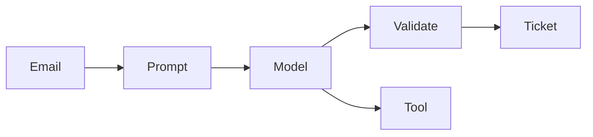

# Mini-project — Phase 5: LLM fundamentals

**Name:** ticket-brain  
**Time box:** 1–2 days  
**Difficulty:** Medium

## Why this project

Structured output + tools is the heart of production LLM features.

## User story

I paste a support email; I get a Ticket object and an optional user lookup.

## Requirements

Must:

- pydantic Ticket
- prompt file
- token log
- one tool
- eval on ≥15 samples

Should:

- FastAPI endpoint
- stream explanation

Won't (this week):

- Full RAG
- Fine-tune

## Architecture



## Suggested layout

```text
prompts/classify_v1.txt src/ticket_brain/ tests/ fixtures/
```

## Rubric

- eval % reported
- parse-fail % reported
- README costs

## Stretch

Compare two models on the same 15 tickets.

When it works, write the README as if a hiring manager will open it on their phone. Then add a resume bullet using [RESUME_GUIDE.md](../../RESUME_GUIDE.md).
