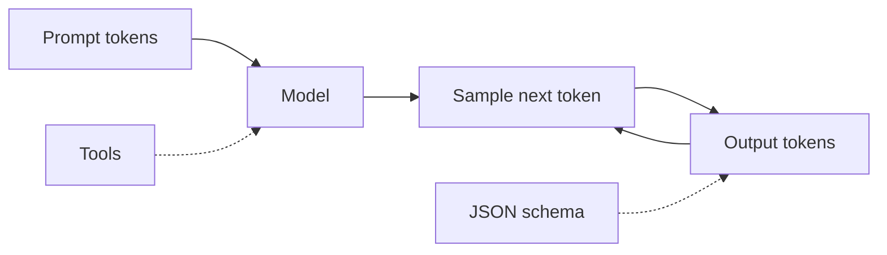
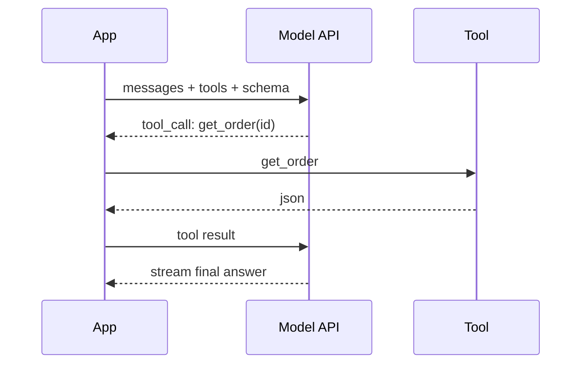

# Theory — Phase 5: LLM fundamentals

> Read this before any code. If a word is new, we define it before we use it.

## Table of contents

1. [Introduction](#1-introduction)
2. [Why this exists](#2-why-this-exists)
3. [Real-world analogy](#3-real-world-analogy)
4. [Visual diagram](#4-visual-diagram)
5. [Architecture diagram](#5-architecture-diagram)
6. [Beginner explanation](#6-beginner-explanation)
7. [Intermediate explanation](#7-intermediate-explanation)
8. [Advanced explanation](#8-advanced-explanation)
9. [Production explanation](#9-production-explanation)
10. [Code examples](#10-code-examples)
11. [Beginner exercises](#11-beginner-exercises)
12. [Medium exercises](#12-medium-exercises)
13. [Hard exercises](#13-hard-exercises)
14. [Project](#14-project)
15. [Interview questions](#15-interview-questions)
16. [Flashcards](#16-flashcards)
17. [Quiz](#17-quiz)
18. [Common mistakes](#18-common-mistakes)
19. [Debugging examples](#19-debugging-examples)
20. [Best practices](#20-best-practices)
21. [Industry standards](#21-industry-standards)
22. [Performance tips](#22-performance-tips)
23. [Security considerations](#23-security-considerations)
24. [References](#24-references)
25. [Further reading](#25-further-reading)

---

## 1. Introduction

A **Large Language Model** predicts the next token given previous tokens.

That one sentence explains:

- Why it can lie (it predicts plausible text, not truth)
- Why long inputs cost money (more tokens in)
- Why it forgets the middle of a huge dump (attention is uneven)
- Why temperature changes personality (sampling)

You do not need to train GPT. You need to **drive** one without crashing the car.

We will use hosted APIs (OpenAI, Anthropic, Groq) **or** local Ollama. The ideas are the same. The HTTP envelopes differ.

**In one sentence:** An LLM is a next-token engine with a finite context window and no built-in truth.

## 2. Why this exists

If you cannot explain tokens, you cannot estimate cost.

If you cannot explain temperature, you will debug 'flaky JSON' for days.

If you cannot do tool calling, you will paste SQL results into prompts by hand.

If you cannot do structured output, your API will crash on `json.loads`.

This phase is the difference between a wrapper script and an AI engineer.

If this phase did not exist, you would treat ChatGPT as a magic box and fail every interview that asks 'what is a token?'

## 3. Real-world analogy

A very well-read intern with no internet and a small desk.

- **Context window** = the size of the desk. If you dump 40 binders, the intern skims badly (lost in the middle).
- **Token** = a word-piece they write. You pay per piece. 'ChatGPT' might be 2–3 pieces, not one.
- **Temperature 0** = they always pick the most obvious next word (good for JSON, classification).
- **Temperature high** = they get creative (good for brainstorming, bad for invoices).
- **System prompt** = the employee handbook on the wall.
- **Tool calling** = they can fill a form to use the company database instead of guessing.
- **Structured output** = they must fill the form, not write an essay.
- **Streaming** = they speak while thinking so you are not staring at a silent intern for 8 seconds.

Keep this picture in your head when the jargon starts.

## 4. Visual diagram



## 5. Architecture diagram



## 6. Beginner explanation

**Transformer** (2017): a neural net that uses **attention** — each token can look at other tokens to decide what matters. Stack many layers. Train on oceans of text. The result is a model that continues text.

**Token:** a chunk of text the model uses. `tiktoken` or the provider's tokenizer counts them. Rule of thumb: English ≈ 4 characters/token. Code and other languages differ.

**Context window:** max tokens of input+output (sometimes input and output have separate caps). Exceed it and the API errors or silently truncates.

**Messages:** `system`, `user`, `assistant`, and later `tool`. Chat models are trained on this schema.

**Temperature:** 0 = greedy / near-deterministic. Higher = more random. **top-p** (nucleus) cuts the tail of the distribution. For extraction, use 0.

**Prompt engineering:** writing the instructions. Production prompts are files with versions, not vibes in a Slack thread.

**Hallucination:** fluent falsehood. The model is not retrieving your docs unless you set that up (Phase 8).

**Embeddings (preview):** vectors that represent meaning. Used for search. Different models than chat, usually.

## 7. Intermediate explanation

**Lost in the middle:** models use the start and end of a long context better than the middle. Dumping a whole PDF is a skill issue.

**Stop sequences:** tell the model to halt at `\n\n` or `}`. Less important with chat APIs, still useful.

**Logprobs:** scores for tokens. Useful for classification confidence. Not always available.

**Few-shot:** show examples in the prompt. Helps format. Costs tokens. Prefer schemas when the API supports them.

**Tool calling:** you declare functions (name, JSON schema). The model may return a structured call instead of prose. You run the function and send back the result. The model never actually 'runs code' unless you do.

**Structured outputs / JSON mode / JSON schema:** the API constrains tokens to valid JSON. Still validate with pydantic. Constraints reduce but do not eliminate wrong *values*.

**Streaming:** tokens arrive as events. UX + cancellation. You cannot hash the full answer until the end.

**Context vs memory:** the window is not long-term memory. You persist chats in Postgres (Phase 2) and retrieve (Phase 8).

## 8. Advanced explanation

**Sampling details:** temperature scales logits; top-p filters; top-k; seed for approximate reproducibility (not a legal guarantee).

**Tokenizer mismatch:** counting with the wrong tokenizer mis-estimates cost and truncation.

**Prompt injection (preview of Phase 13):** untrusted text in the context can override instructions. Treat retrieved docs as data, not as system voice.

**Speculative decoding, MoE, reasoning models:** product names change. The engineering contract stays: tokens in, tokens out, tools, bills.

**Fine-tuning vs RAG vs prompt:** 
- Prompt: style, format, light facts
- RAG: changing or private facts
- Fine-tune: style/format at scale, or a new skill that examples can teach
Do not fine-tune to 'teach the employee handbook' that updates weekly.

**Provider differences:** OpenAI tools, Anthropic tools, Ollama's subset. Wrap behind your own interface.

## 9. Production explanation

Version prompts in git (`prompts/v3_classify.txt`). Log model name, params, token counts, latency. Cap `max_tokens`. Set timeouts. Fallback models (Phase 12). Eval sets (Phase 8/12). Never send secrets in prompts. Budget dashboards.

The happy path is one call. Production is: timeout, 429, malformed JSON, empty tool args, safety refusal, truncated output.

**When to use:** Language tasks: generate, classify, extract, route, tool-orchestrate, summarize with care.

**When not to use:** When you need guaranteed facts without retrieval. When a regex or a SQL query is enough. When the user needs a numeric optimizer. When you cannot afford variance.

## 10. Code examples

Full walkthroughs with dry runs live in [Examples.md](./Examples.md) and [`code/`](./code/).

Preview:

```python
from pydantic import BaseModel

class OrderStatus(BaseModel):
    order_id: str
    status: str
    eta_days: int | None
# Send json schema of OrderStatus to the API.
# Validate the response with OrderStatus.model_validate_json(...)

```

What to notice:

The schema is both the prompt and the validator. Two layers.

## 11. Beginner exercises

Count tokens of a string. Classify tickets at temperature 0.

Details: [Exercises.md](./Exercises.md)

## 12. Medium exercises

Structured extraction of a resume into pydantic. Retry on ValidationError once.

## 13. Hard exercises

Tool loop: model can call get_time or get_weather (mocked). Max 3 hops. Stream the final answer.

## 14. Project

Ticket classifier CLI + one tool — MiniProject.md.

Spec: [MiniProject.md](./MiniProject.md)

## 15. Interview questions

Token? Temperature 0 when? RAG vs fine-tune? How tools work? Why JSON still needs pydantic.

The full bank with expected answers, common mistakes, senior discussion, and whiteboard prompts: [Interview.md](./Interview.md)

## 16. Flashcards

Use [Flashcards.md](./Flashcards.md). Say the answer out loud before you flip.

Sample:

**Q:** Does the model remember last week?
**A:** Only if you send it again (or retrieve it).

## 17. Quiz

Take [Quiz.md](./Quiz.md) cold. Passing bar: 80%.

## 18. Common mistakes

temperature 1.0 for JSON. No max_tokens. Stuffing 200-page PDFs. Trusting JSON mode without validation. Fine-tuning to store facts.

More: [CommonMistakes.md](./CommonMistakes.md)

## 19. Debugging examples

Empty content because the model only returned a tool call. Truncated JSON. Off-by-tokenizer cost.

Playgrounds: [Debugging.md](./Debugging.md)

## 20. Best practices

temp 0 for extraction. Schemas. Versioned prompts. Token logs. Timeouts. Smallest model that meets eval.

## 21. Industry standards

OpenAI, Anthropic, Google, plus OSS via Ollama/vLLM. JSON schema / tool calling is table stakes on job posts.

## 22. Performance tips

Prompt caching where available. Shorter prompts. Cheaper models for routing. Stream. Don't embed with a chat model.

## 23. Security considerations

No secrets in prompts. Treat user text as hostile (injection). Allow-list tools. Cap loops.

## 24. References

- Vaswani et al. 2017 Attention Is All You Need
- OpenAI / Anthropic docs
- [Ollama](https://docs.ollama.com/)
- Liu et al. 2023 Lost in the Middle

## 25. Further reading

Anthropic 'Building effective agents'; OpenAI cookbook; Chip Huyen's LLM blogs.

---

Next: type the code in [Examples.md](./Examples.md). Reading is not the skill. Running it is.
