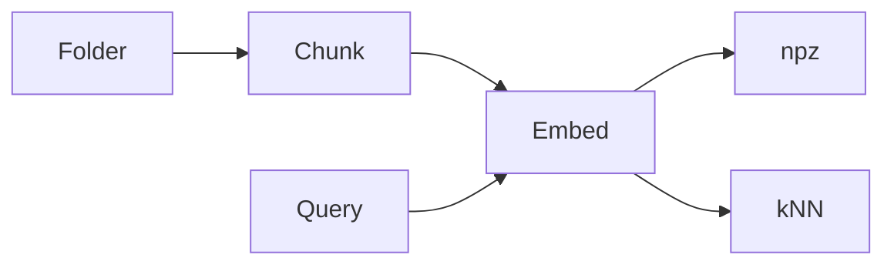

# Mini-project — Phase 6: Embeddings and search

**Name:** md-search  
**Time box:** 1 day  
**Difficulty:** Medium

## Why this project

You will reuse this indexer inside RAG.

## User story

I type a question about my notes and get paths + snippets.

## Requirements

Must:

- index folder
- persist
- query CLI
- metadata
- README with 5 queries

Should:

- hash skip
- token chunker

Won't (this week):

- LLM answers yet

## Architecture



## Suggested layout

```text
src/mdsearch/ index/ cli.py
```

## Rubric

- reproducible
- model name recorded
- no secrets

## Stretch

Watchdog re-index on file change.

When it works, write the README as if a hiring manager will open it on their phone. Then add a resume bullet using [RESUME_GUIDE.md](../../RESUME_GUIDE.md).
