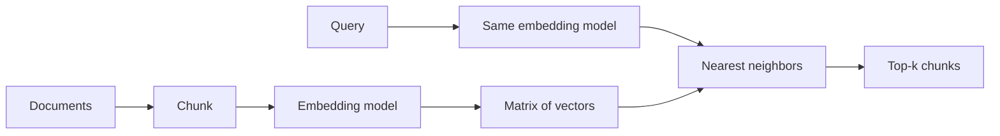
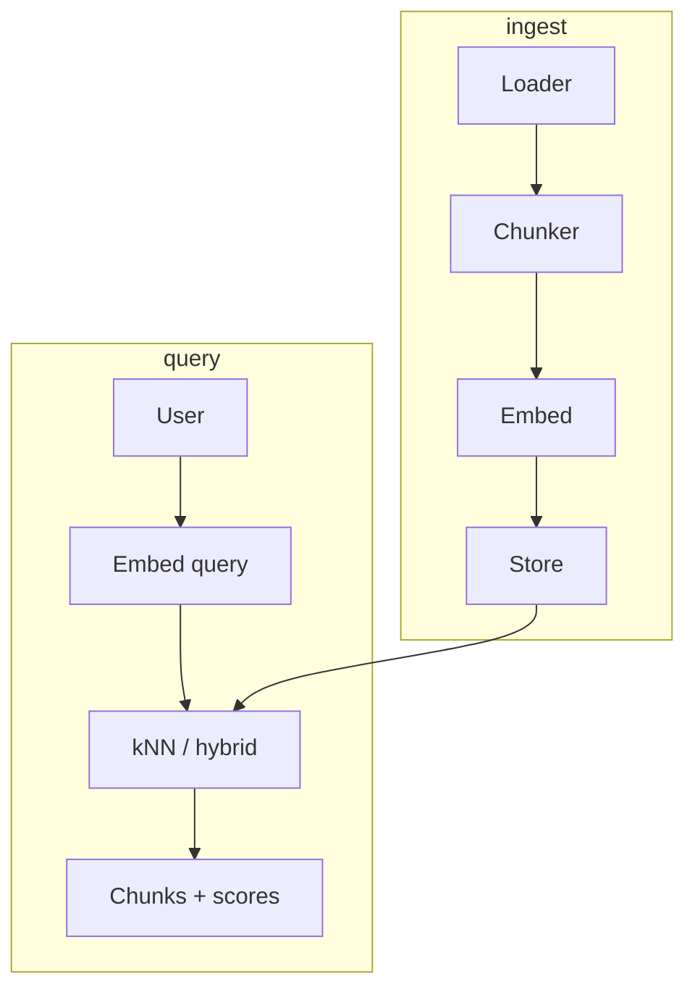

# Theory — Phase 6: Embeddings and search

> Read this before any code. If a word is new, we define it before we use it.

## Table of contents

1. [Introduction](#1-introduction)
2. [Why this exists](#2-why-this-exists)
3. [Real-world analogy](#3-real-world-analogy)
4. [Visual diagram](#4-visual-diagram)
5. [Architecture diagram](#5-architecture-diagram)
6. [Beginner explanation](#6-beginner-explanation)
7. [Intermediate explanation](#7-intermediate-explanation)
8. [Advanced explanation](#8-advanced-explanation)
9. [Production explanation](#9-production-explanation)
10. [Code examples](#10-code-examples)
11. [Beginner exercises](#11-beginner-exercises)
12. [Medium exercises](#12-medium-exercises)
13. [Hard exercises](#13-hard-exercises)
14. [Project](#14-project)
15. [Interview questions](#15-interview-questions)
16. [Flashcards](#16-flashcards)
17. [Quiz](#17-quiz)
18. [Common mistakes](#18-common-mistakes)
19. [Debugging examples](#19-debugging-examples)
20. [Best practices](#20-best-practices)
21. [Industry standards](#21-industry-standards)
22. [Performance tips](#22-performance-tips)
23. [Security considerations](#23-security-considerations)
24. [References](#24-references)
25. [Further reading](#25-further-reading)

---

## 1. Introduction

An **embedding** is a list of numbers (a vector) that represents a piece of text so that *similar meaning* sits nearby in space.

If 'reset password' and 'I forgot my login' land close together, search can find the right article even when the words differ.

This phase is retrieval **without** a fancy database. A numpy matrix is enough to learn. Phase 7 puts the same vectors into real stores.

**In one sentence:** Embeddings turn meaning into coordinates you can search.

## 2. Why this exists

Keyword search fails on paraphrases. LLMs fail on facts they were not given.

Embeddings sit in the middle: cheap, fast, good enough to find the 5 paragraphs the model should read.

If your chunks are garbage, your RAG is garbage. Most 'the model is dumb' tickets are chunking tickets.

If this phase did not exist, you would paste entire PDFs into the prompt or grep exact words and call it AI.

## 3. Real-world analogy

A library that shelves books by *topic vibe*, not alphabet.

- Each chunk is a book with a GPS coordinate (the vector).
- A question is also given a GPS coordinate.
- Search = find the nearest books.
- **Chunking** = tearing chapters into pamphlets. Tear through a table and the pamphlet is nonsense.
- **Overlap** = repeating the last paragraph so sentences that straddled a cut still live together.
- **Keyword search** = the old card catalog. Still better for SKUs, error codes, names.

Keep this picture in your head when the jargon starts.

## 4. Visual diagram



## 5. Architecture diagram



## 6. Beginner explanation

**Vector:** `[0.12, -0.44, ...]` with hundreds or thousands of dimensions.

**Embedding model:** a smaller model than a chat LLM, trained so similar text has similar vectors. Examples: `nomic-embed-text`, `bge-m3`, `text-embedding-3`.

**Similarity:**
- **Cosine** = angle between vectors (most common for text)
- **Dot product** = like cosine if vectors are normalized
- **L2 / Euclidean** = straight-line distance

**Chunk:** a slice of a document you embed as one unit. 200–800 tokens is a common band. Not a law.

**Overlap:** 10–20% repeated between neighbors.

**kNN:** k nearest neighbors — the k closest vectors to the query.

**Loader:** code that turns a file into text (and metadata like path, heading).

## 7. Intermediate explanation

**You must use the same embedding model at query time as at ingest.** Mixing models is a silent failure — scores look numeric and are meaningless.

**Metadata** (source, heading, date, tenant) is not embedded by accident. You store it beside the vector for filters.

**Recursive / structure-aware chunking:** split on headings, then paragraphs, then sentences. Better than `text[i:i+500]`.

**Tables and code:** keep them intact; they die when sliced mid-row.

**Semantic vs keyword:** error code `ECONNRESET` wants keyword. 'why did my upload fail' wants semantic. **Hybrid** (Phase 8) does both.

**ANN vs exact kNN:** exact is fine to 10k–100k vectors in RAM. Then use HNSW etc (Phase 7).

## 8. Advanced explanation

**Matryoshka embeddings:** truncate dimensions for cheaper search with a small quality hit.

**Late chunking / long-context embedders:** embed with more surrounding context.

**ColBERT / multi-vector:** one vector per token, richer matching, heavier.

**Domain drift:** an embedding model trained on web text may be weak on legal citations. Measure.

**Dimensionality:** 384 is fast; 1024–3072 often better. Not linear.

**Normalization:** cosine assumes you understand whether the vendor already L2-normalized.

## 9. Production explanation

Version the embedding model id on every row. If you change models, **re-embed the corpus**. Store `chunk_text`, `hash`, `doc_version`. Rebuild must be a button you have pressed.

Eval: a set of (query, relevant chunk ids). Metric: recall@k, MRR. Do this before you add an LLM — retrieval eval is cheaper and more honest.

**When to use:** Search, clustering, dedup, RAG retrieval, recommendation of similar tickets.

**When not to use:** When exact match is required (IDs, SKUs) — use SQL/keyword. When you have 3 documents — just send them. When legal needs guaranteed phrase match.

## 10. Code examples

Full walkthroughs with dry runs live in [Examples.md](./Examples.md) and [`code/`](./code/).

Preview:

```python
# pseudo
vecs = embed(chunks)           # (N, D)
q = embed([query])[0]          # (D,)
scores = vecs @ q              # if normalized, this is cosine
idx = scores.argmax()

```

What to notice:

Normalized dot product = cosine. One matrix multiply is the whole search engine at small N.

## 11. Beginner exercises

Embed 10 sentences. Print the nearest pair.

Details: [Exercises.md](./Exercises.md)

## 12. Medium exercises

Chunk this course's README by headings. Search 'what is a token?'.

## 13. Hard exercises

Compare 3 chunk sizes on 15 handwritten queries. Report recall@5.

## 14. Project

Folder search CLI — MiniProject.md.

Spec: [MiniProject.md](./MiniProject.md)

## 15. Interview questions

What is an embedding? Why same model? How do you chunk a PDF with tables? Cosine vs L2.

The full bank with expected answers, common mistakes, senior discussion, and whiteboard prompts: [Interview.md](./Interview.md)

## 16. Flashcards

Use [Flashcards.md](./Flashcards.md). Say the answer out loud before you flip.

Sample:

**Q:** Can I embed with model A and query with model B?
**A:** No. The spaces are different.

## 17. Quiz

Take [Quiz.md](./Quiz.md) cold. Passing bar: 80%.

## 18. Common mistakes

Fixed 500-char slices through tables. Forgetting overlap. Embedding the query with a chat model. No metadata.

More: [CommonMistakes.md](./CommonMistakes.md)

## 19. Debugging examples

All scores ~0.1 and random. (Wrong model, or unnormalized mix.)

Playgrounds: [Debugging.md](./Debugging.md)

## 20. Best practices

Structure-aware chunks. Same model. Metadata. Eval set of 25 queries. Version the model id.

## 21. Industry standards

sentence-transformers, OpenAI embeddings, Cohere, Voyage, Nomic. Chunking libraries: unstructured, llama-index node parsers — understand them before importing.

## 22. Performance tips

Batch embed. Approximate NN later. Cache query embeddings. Don't re-embed unchanged hashes.

## 23. Security considerations

Embeddings can leak information (inversion research). Don't embed secrets. Tenant-filter before kNN results leave the box.

## 24. References

- Dense Passage Retrieval (Karpukhin 2020)
- sentence-transformers docs
- Lost in the Middle (why not to skip chunking and dump)

## 25. Further reading

Pinecone/Qdrant learning centers (vendor-aware). Hybrid search intro in Phase 8.

---

Next: type the code in [Examples.md](./Examples.md). Reading is not the skill. Running it is.
