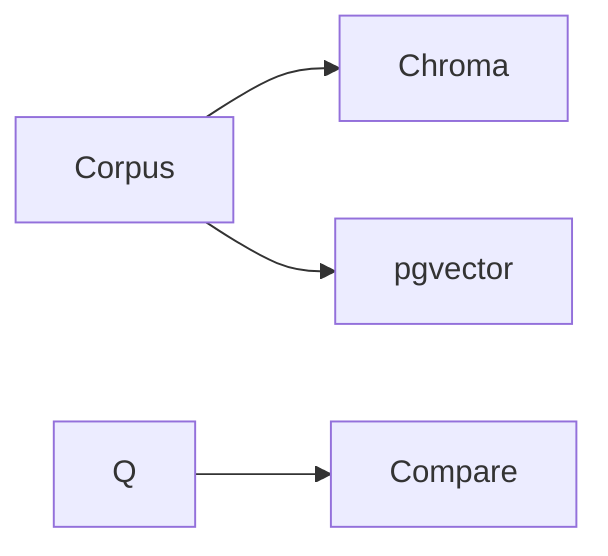

# Mini-project — Phase 7: Vector databases

**Name:** two-store-lab  
**Time box:** 1–2 days  
**Difficulty:** Medium

## Why this project

Hiring managers ask 'why this store?'

## User story

I can defend pgvector vs Chroma with numbers on MY corpus.

## Requirements

Must:

- two stores
- same 10 queries
- TRADEOFFS.md
- compose

Should:

- Qdrant as a third optional

Won't (this week):

- Production HA cluster

## Architecture



## Suggested layout

```text
stores/ chroma/ pg/ TRADEOFFS.md
```

## Rubric

- numbers
- tenancy paragraph
- pick one and why

## Stretch

Cost estimate at 5M chunks.

When it works, write the README as if a hiring manager will open it on their phone. Then add a resume bullet using [RESUME_GUIDE.md](../../RESUME_GUIDE.md).
