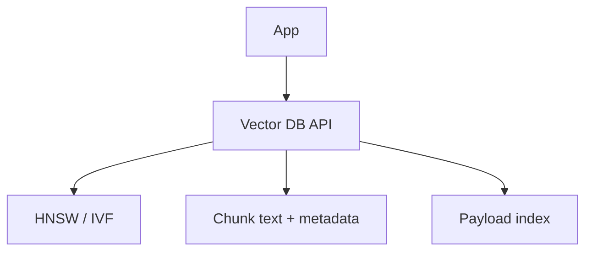
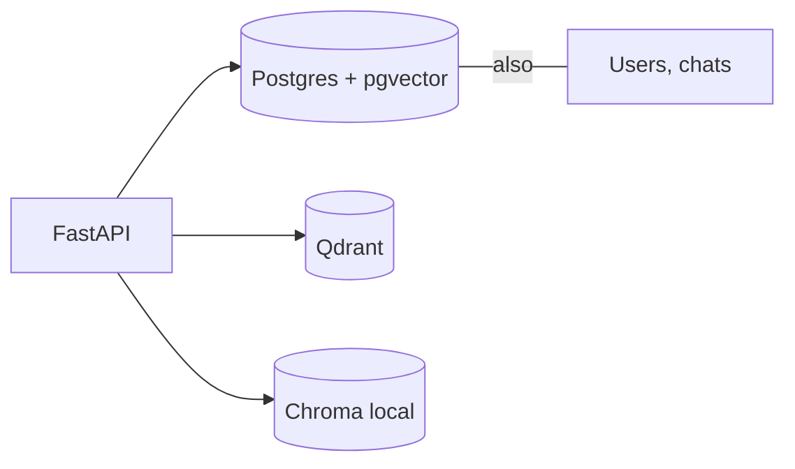

# Theory — Phase 7: Vector databases

> Read this before any code. If a word is new, we define it before we use it.

## Table of contents

1. [Introduction](#1-introduction)
2. [Why this exists](#2-why-this-exists)
3. [Real-world analogy](#3-real-world-analogy)
4. [Visual diagram](#4-visual-diagram)
5. [Architecture diagram](#5-architecture-diagram)
6. [Beginner explanation](#6-beginner-explanation)
7. [Intermediate explanation](#7-intermediate-explanation)
8. [Advanced explanation](#8-advanced-explanation)
9. [Production explanation](#9-production-explanation)
10. [Code examples](#10-code-examples)
11. [Beginner exercises](#11-beginner-exercises)
12. [Medium exercises](#12-medium-exercises)
13. [Hard exercises](#13-hard-exercises)
14. [Project](#14-project)
15. [Interview questions](#15-interview-questions)
16. [Flashcards](#16-flashcards)
17. [Quiz](#17-quiz)
18. [Common mistakes](#18-common-mistakes)
19. [Debugging examples](#19-debugging-examples)
20. [Best practices](#20-best-practices)
21. [Industry standards](#21-industry-standards)
22. [Performance tips](#22-performance-tips)
23. [Security considerations](#23-security-considerations)
24. [References](#24-references)
25. [Further reading](#25-further-reading)

---

## 1. Introduction

A **vector database** stores embeddings plus payload (the chunk text and metadata) and answers: *given this vector, what are the nearest neighbors, optionally filtered by metadata?*

It is not magic. It is an index (often **HNSW** or IVF) plus ops features: persistence, concurrent writes, replicas, filters.

You already did the hard part in Phase 6 (chunking, embedding). This phase is *where the vectors live*.

**In one sentence:** A vector DB is nearest-neighbor search with persistence, filters, and operations.

## 2. Why this exists

Numpy files do not give you:

- Concurrent writers
- Metadata filters at scale (`tenant_id = X AND year >= 2024`)
- Replication
- Incremental upserts
- A network API your API containers can share

At 2,000 chunks, Chroma or pgvector is plenty. At 20 million, you will care about the engine.

If this phase did not exist, you would either keep JSONL forever or pick Pinecone because a tutorial did.

## 3. Real-world analogy

Phase 6 was a pile of GPS coordinates on a paper map.

A vector DB is a **GIS system**:

- **Index (HNSW)** = highways so you do not compare to every house
- **Payload** = the house's address and owner (chunk text, tenant)
- **Filter** = 'only houses in this zip code'
- **Collection / index name** = a map layer
- **Cloud vs self-host** = Google Maps vs printing your own atlas

Keep this picture in your head when the jargon starts.

## 4. Visual diagram



## 5. Architecture diagram



A common production shape: **Postgres for truth**, vectors either in **pgvector** (one system) or **Qdrant** (specialized) with `chunk_id` as the join key.

## 6. Beginner explanation

**Collection / index:** a named bucket of vectors of a fixed dimension.

**Upsert:** insert or replace by id.

**Top-k search:** nearest neighbors.

**Metadata filter:** `where tenant_id = ...` applied with search.

**Chroma:** easy local embedded DB. Great for learning and small apps.

**pgvector:** Postgres extension. You already have Postgres. SQL + vectors together.

**Qdrant:** open source, production-friendly, excellent filters.

**Pinecone:** managed cloud. Fast to start, cost and lock-in to watch.

**Weaviate / Milvus:** capable OSS/cloud; more moving parts.

**Dimension** must match the embedding model. 768 ≠ 1536.

## 7. Intermediate explanation

**HNSW:** graph-based ANN. Parameters `M` and `ef` trade recall vs latency/memory.

**IVF:** clusters first, search some clusters. Different tradeoff.

**Payload indexes:** without them, filters may scan.

**Id strategy:** use your chunk hash or UUID, not '1,2,3' that shift when you re-chunk.

**Hybrid in-engine:** some DBs (Qdrant, Weaviate) can fuse sparse + dense.

**Consistency:** when is a write searchable? Know at-least-eventually vs sync.

**Multi-tenancy:** 
- payload filter `tenant_id` (simple, risk if you forget the filter)
- separate collections per tenant (isolation, ops cost)
- true tenant features if the engine has them

## 8. Advanced explanation

**Quantization** (scalar/product/binary) shrinks RAM at a recall cost.

**Sharding and replication.**

**Disk-based indexes** vs RAM.

**GPU indexes** (Milvus etc.) — rare for junior work.

**Schema evolution:** adding payload fields, rebuilding HNSW.

**CDC from Postgres to Qdrant** if PG is the source of truth.

**SLO:** p95 search < 50ms is a common target; measure with filters on.

## 9. Production explanation

Backups: snapshots of the vector store AND the document store. You must be able to **rebuild from documents** if the index corrupts — that is why you stored raw chunks and model id.

Cost: RAM-heavy. Don't put 10 copies of the same corpus in 10 collections 'for now'.

Never expose the vector DB to the internet. It sits on the private network like Redis.

**When to use:** Shared, persistent, filtered vector search. Multiple app workers.

**When not to use:** 20 documents (send them). Pure SQL lookups. You have not measured that numpy is too slow.

## 10. Code examples

Full walkthroughs with dry runs live in [Examples.md](./Examples.md) and [`code/`](./code/).

Preview:

```python
# Chroma sketch
col.add(ids=ids, embeddings=vecs, documents=texts, metadatas=metas)
hits = col.query(query_embeddings=[q], n_results=5, where={"tenant": "acme"})

```

What to notice:

The API is upsert + query + filter. Every vendor rhymes.

## 11. Beginner exercises

Put 50 chunks in Chroma. Query. Print documents.

Details: [Exercises.md](./Exercises.md)

## 12. Medium exercises

pgvector table + IVFFlat or HNSW index. Same 50 chunks. Compare results.

## 13. Hard exercises

Qdrant in Docker with a payload index on tenant_id. Prove a forgotten filter is a data leak in a test.

## 14. Project

Two-store comparison memo — MiniProject.md.

Spec: [MiniProject.md](./MiniProject.md)

## 15. Interview questions

Why not numpy? HNSW vs exact. pgvector vs Qdrant vs Pinecone. Multi-tenant filters.

The full bank with expected answers, common mistakes, senior discussion, and whiteboard prompts: [Interview.md](./Interview.md)

## 16. Flashcards

Use [Flashcards.md](./Flashcards.md). Say the answer out loud before you flip.

Sample:

**Q:** What must match between embedder and collection?
**A:** Dimension (and the model, conceptually).

## 17. Quiz

Take [Quiz.md](./Quiz.md) cold. Passing bar: 80%.

## 18. Common mistakes

No filter on tenant. Recreating collections every request. Storing vectors without the text. Using cosine in a DB configured for L2.

More: [CommonMistakes.md](./CommonMistakes.md)

## 19. Debugging examples

Empty results after filter (type mismatch string vs int). Dimension error on upsert.

Playgrounds: [Debugging.md](./Debugging.md)

## 20. Best practices

Source of truth is documents. Vectors are a rebuildable index. Filter always. Metric matches embeddings. Private network.

## 21. Industry standards

2025–2026: pgvector for many startups until scale hurts; Qdrant/Weaviate self-host; Pinecone/Turso-like managed when ops budget is zero.

## 22. Performance tips

Warm indexes. Batch upserts. Payload indexes. Don't fetch 1000 neighbors to rerank 5 without need.

## 23. Security considerations

Network policy. Tenant filter tests. Auth on the DB. Don't log full payloads with PII.

## 24. References

- pgvector README
- Qdrant docs
- Chroma docs
- Pinecone learning center (vendor)

## 25. Further reading

HNSW paper (Malkov & Yashunin). Faiss wiki.

---

Next: type the code in [Examples.md](./Examples.md). Reading is not the skill. Running it is.
