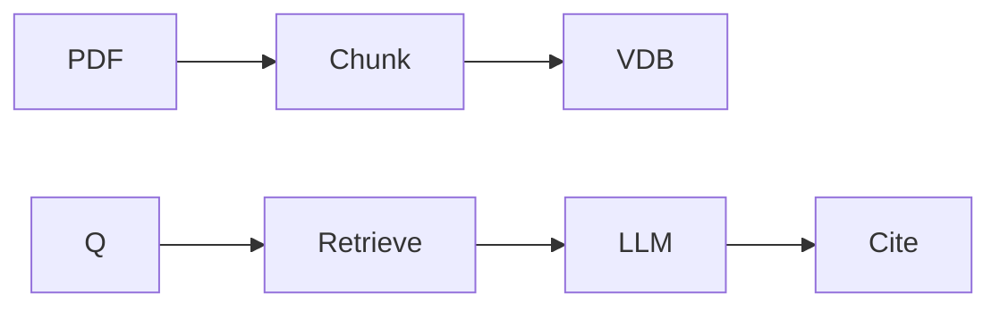

# Mini-project — Phase 8: Retrieval-Augmented Generation (RAG)

**Name:** pdf-chat  
**Time box:** 3–7 days  
**Difficulty:** Hard

## Why this project

The portfolio default. Do it properly.

## User story

I upload a PDF, ask questions, see citations, and you can read my eval table.

## Requirements

Must:

- ingest PDF
- query API
- citations
- 25-q eval
- Docker
- I don't know

Should:

- hybrid or rerank
- FastAPI stream

Won't (this week):

- GraphRAG unless extra time

## Architecture



## Suggested layout

```text
See ../../PROJECTS/01-pdf-chat/
```

## Rubric

- eval numbers
- compose up
- README diagram
- limitations section

## Stretch

Parent retrieval + streaming + traces.

When it works, write the README as if a hiring manager will open it on their phone. Then add a resume bullet using [RESUME_GUIDE.md](../../RESUME_GUIDE.md).
