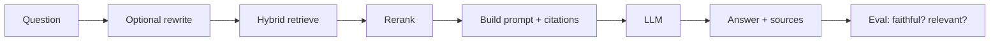
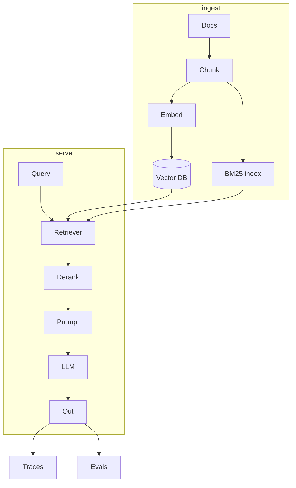

# Theory — Phase 8: Retrieval-Augmented Generation (RAG)

> Read this before any code. If a word is new, we define it before we use it.

## Table of contents

1. [Introduction](#1-introduction)
2. [Why this exists](#2-why-this-exists)
3. [Real-world analogy](#3-real-world-analogy)
4. [Visual diagram](#4-visual-diagram)
5. [Architecture diagram](#5-architecture-diagram)
6. [Beginner explanation](#6-beginner-explanation)
7. [Intermediate explanation](#7-intermediate-explanation)
8. [Advanced explanation](#8-advanced-explanation)
9. [Production explanation](#9-production-explanation)
10. [Code examples](#10-code-examples)
11. [Beginner exercises](#11-beginner-exercises)
12. [Medium exercises](#12-medium-exercises)
13. [Hard exercises](#13-hard-exercises)
14. [Project](#14-project)
15. [Interview questions](#15-interview-questions)
16. [Flashcards](#16-flashcards)
17. [Quiz](#17-quiz)
18. [Common mistakes](#18-common-mistakes)
19. [Debugging examples](#19-debugging-examples)
20. [Best practices](#20-best-practices)
21. [Industry standards](#21-industry-standards)
22. [Performance tips](#22-performance-tips)
23. [Security considerations](#23-security-considerations)
24. [References](#24-references)
25. [Further reading](#25-further-reading)

---

## 1. Introduction

**Retrieval-Augmented Generation** means:

1. Find relevant pieces of *your* data
2. Put them in the prompt
3. Ask the model to answer **using those pieces**
4. Prefer answers that can be cited
5. **Measure** whether the answer is supported

Without step 5 you have a demo.

RAG is the default architecture for 'chat with our docs' because facts change and do not belong in weights.

**In one sentence:** Retrieve first, generate second, evaluate always.

## 2. Why this exists

Fine-tuning cannot keep up with a wiki that changes daily.

A 200k context window is not a retrieval strategy (cost, latency, lost-in-the-middle, security).

Companies hire people who can make RAG **less wrong**, not people who can import LangChain.

If this phase did not exist, you would ship a chatbot that invents refund policies with a smile.

## 3. Real-world analogy

Open-book exam.

- **Naive RAG** = grab 5 nearest pages, write the essay.
- **Hybrid** = also use the index at the back of the book (keywords).
- **Rerank** = a TA skims 50 pages and keeps the best 5.
- **Parent retrieval** = find a paragraph, hand the student the whole section.
- **Agentic RAG** = the student may search twice if the first pages were weak.
- **GraphRAG** = a mind map of who relates to whom, not just pages.
- **Self-RAG** = the student asks 'do I even need the book?' and 'did I cite it honestly?'
- **Corrective RAG** = a grader says 'these pages are off, search again.'
- **Evaluation** = a marking rubric, not 'looks good to me.'

Keep this picture in your head when the jargon starts.

## 4. Visual diagram



## 5. Architecture diagram



## 6. Beginner explanation

**Naive RAG:** embed query → top-k chunks → stuff into prompt → generate.

**Prompt pattern:**

```
You are a helpful assistant.
Use ONLY the sources.
If the sources do not contain the answer, say you don't know.
Cite source ids.

Sources:
[1] ...
[2] ...

Question: ...
```

**Citation:** return chunk ids / URLs. The UI shows them. Hallucinated citations are a bug.

**k:** 3–10 starting point. Too small = miss. Too large = noise + cost.

**This already beats dumping PDFs** for most wikis.

## 7. Intermediate explanation

**Hybrid search:** BM25 (keyword) + dense. Fuse with **RRF** (reciprocal rank fusion) which is simple and strong.

**Reranker:** a cross-encoder that reads (query, chunk) together and scores relevance. Slow per pair, great on 20–50 candidates.

**Query rewrite:** the raw user message may be 'that too' — rewrite using chat history into a standalone search query.

**Parent / small-to-big:** retrieve small chunks (precise), expand to parent section (context for the LLM).

**Metadata filters:** tenant, language, product version — applied *before* the model sees data.

**Faithfulness:** is the answer supported by retrieved text?
**Answer relevancy:** does it address the question?
**Context precision/recall:** did we retrieve the right stuff?

Tools: Ragas, DeepEval, a spreadsheet of 40 questions.

## 8. Advanced explanation

**Agentic RAG:** the model may call `search` multiple times, or `read_parent`. It is an agent with a retrieve tool. Higher latency and cost. Useful when one hop fails.

**GraphRAG:** extract entities/relations, retrieve a subgraph. Helps 'themes across a corpus' and global questions. Heavy pipelines. Overkill for FAQs.

**Self-RAG:** special tokens / a policy for retrieve-on-demand and critique. Paper: Asai et al. 2023. You can approximate with a cheap classifier: 'needs retrieval?'

**Corrective RAG (CRAG):** grade retrieved docs; if poor, web search or retry. Yan et al. 2024.

**HyDE:** generate a hypothetical answer, embed that, search. Helps some corpora, hurts others. Measure.

**Routing:** classify query to a collection (policies vs engineering vs HR).

## 9. Production explanation

Ship naive + hybrid + rerank + evals first. Do not start with GraphRAG.

Production RAG is:

- Versioned ingest
- Frozen eval set (never prompt-engineered against until after freeze)
- Online eval / user thumbs
- Tracing of retrieved ids
- Cost per question
- Fallback: 'I don't know' is a feature
- Freshness: re-index on doc change
- Security: injection in documents (Phase 13)

A staff engineer asks: *what is faithfulness on the holdout set?* If you cannot answer, you are not in production.

**When to use:** Private or changing knowledge. Citations required. Corpus bigger than a prompt.

**When not to use:** Three static paragraphs (just prompt). Tasks with no corpus (pure generation). When a SQL query is the actual answer (maybe an agent, Phase 9). Real-time unknown web facts without a search tool.

## 10. Code examples

Full walkthroughs with dry runs live in [Examples.md](./Examples.md) and [`code/`](./code/).

Preview:

```python
def answer(q: str) -> str:
    hits = retrieve(q, k=20)
    top = rerank(q, hits)[:5]
    return generate(q, top)

```

What to notice:

Three functions. You should be able to unit-test retrieve without generate.

## 11. Beginner exercises

Naive RAG over this course's Markdown. 10 questions.

Details: [Exercises.md](./Exercises.md)

## 12. Medium exercises

Hybrid + rerank. Compare faithfulness vs naive.

## 13. Hard exercises

Implement CRAG-style grading with a small model. Show a case it saves and a case it wastes money.

## 14. Project

PDF Chat — PROJECTS/01-pdf-chat and MiniProject.md.

Spec: [MiniProject.md](./MiniProject.md)

## 15. Interview questions

Draw naive RAG. Why hybrid? How to eval? When GraphRAG? Hallucination despite RAG?

The full bank with expected answers, common mistakes, senior discussion, and whiteboard prompts: [Interview.md](./Interview.md)

## 16. Flashcards

Use [Flashcards.md](./Flashcards.md). Say the answer out loud before you flip.

Sample:

**Q:** RAG still hallucinated. First suspect?
**A:** Retrieval miss or bad chunk, not 'the temperature of the soul'.

## 17. Quiz

Take [Quiz.md](./Quiz.md) cold. Passing bar: 80%.

## 18. Common mistakes

No eval. k=50 into the prompt. No 'I don't know'. Citing documents not actually retrieved. GraphRAG on day one.

More: [CommonMistakes.md](./CommonMistakes.md)

## 19. Debugging examples

Answer sounds right, citation is wrong. Query rewrite destroyed meaning. Reranker scored boilerplate headers high.

Playgrounds: [Debugging.md](./Debugging.md)

## 20. Best practices

Hybrid + rerank + parent expansion + eval harness + I don't know. Simple graph.

## 21. Industry standards

Every serious team has a gold set. Many use Ragas/DeepEval/Promptfoo. LangSmith/Langfuse for traces.

## 22. Performance tips

Cache embeddings and frequent queries (careful with freshness). Stream the answer. Retrieve in parallel (BM25 + dense).

## 23. Security considerations

Treat retrieved text as untrusted. Prompt injection via wiki pages. Tenant filters. Redact PII in traces.

## 24. References

- Lewis et al. 2020 RAG
- Self-RAG 2023
- CRAG 2024
- Ragas docs
- Anthropic / OpenAI RAG cookbooks

## 25. Further reading

Microsoft GraphRAG blog (know the cost). HyDE paper. 'Building RAG with evaluation first' posts by Hamel / Eugene Yan.

---

Next: type the code in [Examples.md](./Examples.md). Reading is not the skill. Running it is.
