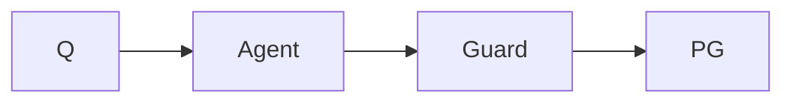

# Mini-project — Phase 9: Agents

**Name:** sql-agent  
**Time box:** 3–5 days  
**Difficulty:** Hard

## Why this project

Interviewers love this because it is easy to do unsafely.

## User story

I ask 'top 5 customers by spend' and get a table, not a dropped database.

## Requirements

Must:

- guard_sql
- read-only
- max steps
- logs
- adversarial tests

Should:

- FastAPI
- LangGraph version compared to loop

Won't (this week):

- write queries in prod

## Architecture



## Suggested layout

```text
../../PROJECTS/04-sql-agent/
```

## Rubric

- 0 DDL
- LIMIT present
- README threat model

## Stretch

EXPLAIN before execute.

When it works, write the README as if a hiring manager will open it on their phone. Then add a resume bullet using [RESUME_GUIDE.md](../../RESUME_GUIDE.md).
