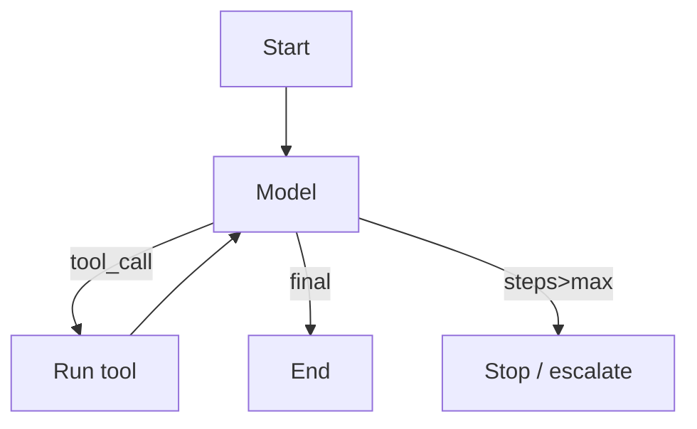
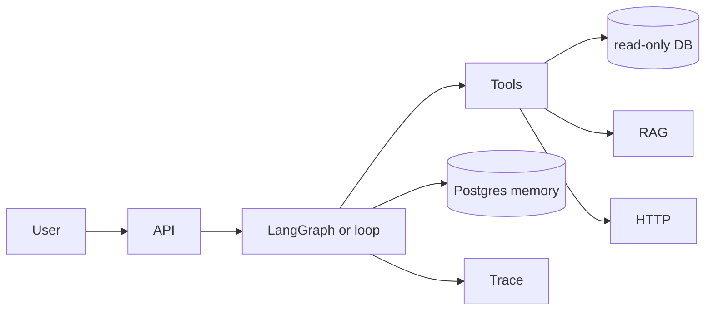

# Theory — Phase 9: Agents

> Read this before any code. If a word is new, we define it before we use it.

## Table of contents

1. [Introduction](#1-introduction)
2. [Why this exists](#2-why-this-exists)
3. [Real-world analogy](#3-real-world-analogy)
4. [Visual diagram](#4-visual-diagram)
5. [Architecture diagram](#5-architecture-diagram)
6. [Beginner explanation](#6-beginner-explanation)
7. [Intermediate explanation](#7-intermediate-explanation)
8. [Advanced explanation](#8-advanced-explanation)
9. [Production explanation](#9-production-explanation)
10. [Code examples](#10-code-examples)
11. [Beginner exercises](#11-beginner-exercises)
12. [Medium exercises](#12-medium-exercises)
13. [Hard exercises](#13-hard-exercises)
14. [Project](#14-project)
15. [Interview questions](#15-interview-questions)
16. [Flashcards](#16-flashcards)
17. [Quiz](#17-quiz)
18. [Common mistakes](#18-common-mistakes)
19. [Debugging examples](#19-debugging-examples)
20. [Best practices](#20-best-practices)
21. [Industry standards](#21-industry-standards)
22. [Performance tips](#22-performance-tips)
23. [Security considerations](#23-security-considerations)
24. [References](#24-references)
25. [Further reading](#25-further-reading)

---

## 1. Introduction

An **agent** is a loop:

```
while not done and steps < max:
    model decides: answer or call tool
    if tool: run it, append result
    if answer: return
```

That is the whole trick.

Frameworks add graphs, memory, multi-agent handoffs, and a lot of magic. You must be able to draw the loop without them.

Most 'agent' demos should have been a RAG chain or a cron job.

**In one sentence:** An agent is a bounded tool loop, not a personality.

## 2. Why this exists

Users want: 'refund order 123 if it is eligible, else explain policy.'

That needs **tools** (get_order, get_policy, create_refund) and **rules** (no refunds after 30 days), not a bigger prompt.

If you cannot bound the loop, you will pay for infinite tool calls. If you cannot restrict tools, the model will try `rm -rf`.

If this phase did not exist, you would wrap ChatGPT around your database and hope.

## 3. Real-world analogy

A junior employee with a phone and a badge.

- **Tools** = apps on the phone (CRM, calendar). The badge says which apps exist.
- **Loop** = they may call two apps then reply.
- **Max steps** = they cannot sit on hold forever on your dime.
- **Allow-list** = the badge does not include 'wire transfer'.
- **Memory** = a notebook (DB), not trying to remember every customer in RAM.
- **Graph (LangGraph)** = a flowchart on the wall: intake → verify → act → done.
- **Multi-agent** = specialists (researcher, writer) passing a folder. Overhead. Sometimes worth it.
- **Reflection** = a second pass: 'did I actually verify eligibility?'

Keep this picture in your head when the jargon starts.

## 4. Visual diagram



## 5. Architecture diagram



## 6. Beginner explanation

**Tool:** a Python function with a JSON schema (name, description, parameters).

**Tool loop:** see intro. You implement `max_steps` (3–8 typical).

**ReAct:** Reason + Act — the model writes a thought then an action. The paper is Yao et al. 2022. Modern tool APIs often skip explicit 'thought' tokens but the idea remains.

**When not to use an agent:**
- One retrieve-then-answer (RAG)
- A deterministic workflow you can code
- You cannot define tools clearly

**Memory types:**
- Short-term: the current transcript (context window)
- Long-term: retrieved notes / user profile in a DB
- Episodic: 'last time this user tried X'

## 7. Intermediate explanation

**LangGraph:** you define a state dict and nodes and edges (including cycles). Best when the flow is a state machine: retry, human approval, branches.

**PydanticAI:** pythonic, type-heavy agents. Pleasant if you already love pydantic.

**CrewAI:** role-playing multi-agent. Great demos. Easy to over-engineer.

**OpenAI Agents SDK:** vendor-shaped. Fine inside their ecosystem. Keep a thin interface.

**Planning:** outline steps first (plan-and-execute). Helps long tasks; can be brittle if the plan is wrong.

**Reflection:** a second model call critiques the first. Cost ×2. Use on high-stakes steps only.

**Human-in-the-loop:** graph interrupts before `create_refund`.

## 8. Advanced explanation

**State reducers** in graphs (how messages append).

**Parallel tool calls.**

**Computer-use / browser agents:** high blast radius. Sandbox.

**Multi-agent protocols:** handoff vs debate vs supervisor. Supervisor is the usual production shape.

**Eval of agents:** trajectory eval (did it call the right tools in order), not just final BLEU. Golden paths + adversarial paths.

**Deterministic cores:** encode refund eligibility in Python; let the model fill slots, not invent policy.

## 9. Production explanation

Allow-list tools. Read-only DB roles. Row limits. Timeouts per tool. Idempotency. Trace every call. Budget per request. Circuit breaker if a tool is down. Never give `shell` in prod.

A SQL agent that runs `EXPLAIN` or a dry-run first is senior. A SQL agent that concatenates user text into SQL is a CVE.

**When to use:** Multi-step, tool-using tasks with unclear path but clear tools and stop conditions.

**When not to use:** Single-hop RAG. ETL. Anything you can write as a 40-line function. Unbounded 'research the internet forever'.

## 10. Code examples

Full walkthroughs with dry runs live in [Examples.md](./Examples.md) and [`code/`](./code/).

Preview:

```python
for _ in range(MAX):
    msg = model(history, tools)
    if msg.tool:
        history.append(run(msg.tool))
    else:
        return msg.text
raise Timeout

```

What to notice:

This loop is the curriculum. Frameworks decorate it.

## 11. Beginner exercises

Two tools: add(a,b) and now(). Loop with max 4.

Details: [Exercises.md](./Exercises.md)

## 12. Medium exercises

LangGraph: node retrieve → node generate, with a retry edge.

## 13. Hard exercises

SQL agent on a toy DB with SELECT-only, LIMIT injected, blocklist DDL.

## 14. Project

SQL Agent — PROJECTS/04-sql-agent.

Spec: [MiniProject.md](./MiniProject.md)

## 15. Interview questions

What is an agent? When not to use one? How to stop loops? How to safe SQL?

The full bank with expected answers, common mistakes, senior discussion, and whiteboard prompts: [Interview.md](./Interview.md)

## 16. Flashcards

Use [Flashcards.md](./Flashcards.md). Say the answer out loud before you flip.

Sample:

**Q:** Does the model execute tools?
**A:** No. Your code does.

## 17. Quiz

Take [Quiz.md](./Quiz.md) cold. Passing bar: 80%.

## 18. Common mistakes

Uncapped loops. Shell tool. Multi-agent for a FAQ. Memory = whole history forever.

More: [CommonMistakes.md](./CommonMistakes.md)

## 19. Debugging examples

Tool args JSON invalid. Infinite search-search-search. Agent ignores tool error and invents.

Playgrounds: [Debugging.md](./Debugging.md)

## 20. Best practices

Loop first, graph if state is real, allow-list, max steps, traces, deterministic policy in code.

## 21. Industry standards

LangGraph is the most common production graph in Python circa 2025–2026. Many teams still use a 40-line loop. Both are valid.

## 22. Performance tips

Parallel tools. Smaller models for routing. Don't reflect every turn.

## 23. Security considerations

Least privilege tools. No secret values in tool results if avoidable. Injection via tool output (Phase 13).

## 24. References

- ReAct 2022
- Anthropic: Building effective agents
- LangGraph docs
- OpenAI agents guide

## 25. Further reading

CrewAI docs (comparison). PydanticAI docs. MCP next phase.

---

Next: type the code in [Examples.md](./Examples.md). Reading is not the skill. Running it is.
