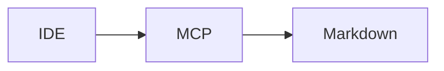

# Mini-project — Phase 10: Model Context Protocol (MCP)

**Name:** course-mcp  
**Time box:** 1–2 days  
**Difficulty:** Hard

## Why this project

Proof you can ship a protocol server, not only a notebook.

## User story

My IDE can search this course via MCP.

## Requirements

Must:

- search tool
- phase README resource
- stderr logging
- client config snippet

Should:

- token auth if HTTP

Won't (this week):

- 30 tools

## Architecture



## Suggested layout

```text
../../TEMPLATES/mcp-server/
```

## Rubric

- client can call
- README security section

## Stretch

Resources for each phase Theory.md.

When it works, write the README as if a hiring manager will open it on their phone. Then add a resume bullet using [RESUME_GUIDE.md](../../RESUME_GUIDE.md).
