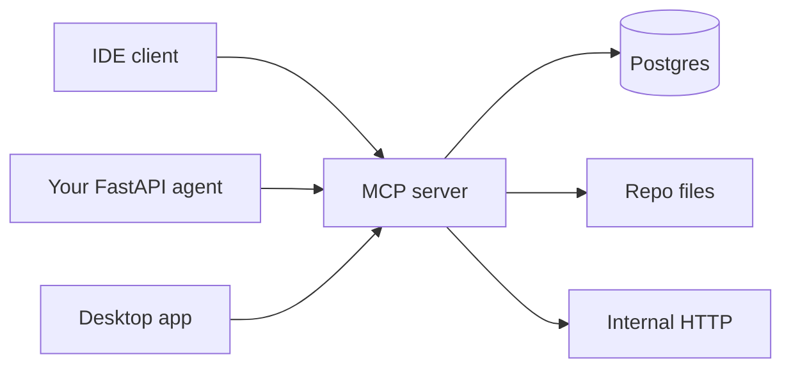
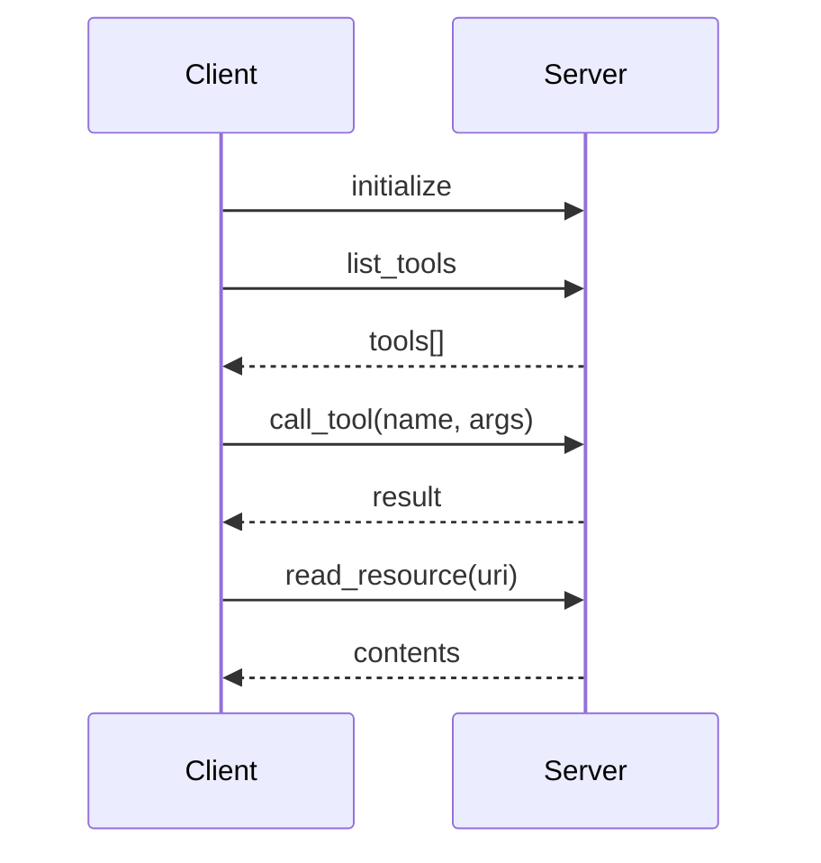

# Theory — Phase 10: Model Context Protocol (MCP)

> Read this before any code. If a word is new, we define it before we use it.

## Table of contents

1. [Introduction](#1-introduction)
2. [Why this exists](#2-why-this-exists)
3. [Real-world analogy](#3-real-world-analogy)
4. [Visual diagram](#4-visual-diagram)
5. [Architecture diagram](#5-architecture-diagram)
6. [Beginner explanation](#6-beginner-explanation)
7. [Intermediate explanation](#7-intermediate-explanation)
8. [Advanced explanation](#8-advanced-explanation)
9. [Production explanation](#9-production-explanation)
10. [Code examples](#10-code-examples)
11. [Beginner exercises](#11-beginner-exercises)
12. [Medium exercises](#12-medium-exercises)
13. [Hard exercises](#13-hard-exercises)
14. [Project](#14-project)
15. [Interview questions](#15-interview-questions)
16. [Flashcards](#16-flashcards)
17. [Quiz](#17-quiz)
18. [Common mistakes](#18-common-mistakes)
19. [Debugging examples](#19-debugging-examples)
20. [Best practices](#20-best-practices)
21. [Industry standards](#21-industry-standards)
22. [Performance tips](#22-performance-tips)
23. [Security considerations](#23-security-considerations)
24. [References](#24-references)
25. [Further reading](#25-further-reading)

---

## 1. Introduction

Every app reinvented 'how the model calls my functions.'

**Model Context Protocol (MCP)** is an open protocol (Anthropic-led, broadly adopted) so that:

- A **server** can expose tools, resources, and prompt templates
- Many **clients** (Claude Desktop, IDEs, your agent) can use them without custom glue each time

Think USB for model tools.

The spec will evolve. The idea — **standardize the plug** — will not.

**In one sentence:** MCP is a USB port for tools, files, and prompts that models can use.

## 2. Why this exists

Without a protocol you write OpenAI tool schemas, then Anthropic tools, then LangChain tools, then a VS Code plugin. Four wrappers. One bug each.

With MCP, you write one server — e.g. 'query our read-only catalog' — and any MCP client can use it.

This is becoming a job-post keyword. You should have built one.

If this phase did not exist, you would keep writing one-off tool wrappers per host.

## 3. Real-world analogy

Power sockets.

- Before: every appliance ships its own generator (custom tool JSON per host).
- After: wall sockets (MCP) and adapters (clients).
- **Tools** = switches you can flip (functions).
- **Resources** = books on the shelf the model can read (files, tickets, schemas) without copying them into every prompt up front.
- **Prompts** = recipe cards the server offers ('explain this table').
- **Auth** = not every stranger can plug into the factory socket.

Keep this picture in your head when the jargon starts.

## 4. Visual diagram



## 5. Architecture diagram



## 6. Beginner explanation

**Server:** a process that speaks MCP. In Python, official SDKs exist (`mcp` package). It declares tools (JSON schema), resources (URIs like `file://` or `postgres://`), and prompts.

**Client:** the host. It discovers tools and forwards model-requested calls to the server.

**Transport:**
- **stdio** — client spawns server as a subprocess, talks over stdin/stdout. Great for local IDE plugins.
- **HTTP / SSE / streamable HTTP** — remote servers.

**Tool vs resource:**
- Tool = verb (search, create_ticket)
- Resource = noun the model can read (schema.sql, ticket 55)

**You still write the Python that talks to Postgres.** MCP is the plug, not the database.

## 7. Intermediate explanation

**JSON-RPC** under the hood. Errors are structured.

**Sampling / roots / elicitation** — advanced parts of the spec; read when you need them.

**Prompts as products:** a server can expose `summarize_pr` with arguments.

**Composition:** an agent may attach many servers (filesystem, github, your company). Least privilege: don't attach filesystem+prod-db to a public agent.

**Versioning:** treat the server like an API. Breaking tool schemas break clients.

## 8. Advanced explanation

**Auth:** local stdio inherits your OS user (already scary — the server can do what you can do). Remote servers need OAuth / tokens / mTLS. Do not ship an unauthenticated HTTP MCP server on the public internet.

**Approval UX:** good clients ask before running a destructive tool.

**Sandboxing:** run servers as a less-privileged user. Containerize.

**The spec moves.** Read modelcontextprotocol.io on the week you implement. This course teaches the shape, not a frozen method list.

## 9. Production explanation

Company MCP servers:

- Live on private networks
- Authenticate
- Expose least tools
- Log every call
- Rate limit
- Have a human-readable catalog

IDE MCP is a productivity win and a data-leak risk (the model may see secrets in `.env` if you mount the whole repo). `.mcpignore` / careful roots.

**When to use:** Reusable tools across hosts. IDE copilots over internal systems. Standardizing company tools.

**When not to use:** A single internal function called from one FastAPI file — just a Python function. Don't MCP-wash it.

## 10. Code examples

Full walkthroughs with dry runs live in [Examples.md](./Examples.md) and [`code/`](./code/).

Preview:

```python
# Sketch — see current SDK for exact decorators
@server.tool()
def search_docs(query: str) -> str:
    """Search the internal wiki."""
    return retrieve(query)

```

What to notice:

A tool is still an allow-listed function. MCP only standardizes discovery and calling.

## 11. Beginner exercises

Filesystem MCP (official example) against this repo. List tools.

Details: [Exercises.md](./Exercises.md)

## 12. Medium exercises

Write a server with one tool `course_search` over Phase 6 index.

## 13. Hard exercises

Add a resource `schema://public` that returns SQL DDL. Auth token for HTTP transport.

## 14. Project

Course MCP server — MiniProject.md.

Spec: [MiniProject.md](./MiniProject.md)

## 15. Interview questions

What problem MCP solves. Tool vs resource. stdio vs HTTP. Auth concern.

The full bank with expected answers, common mistakes, senior discussion, and whiteboard prompts: [Interview.md](./Interview.md)

## 16. Flashcards

Use [Flashcards.md](./Flashcards.md). Say the answer out loud before you flip.

Sample:

**Q:** Is MCP a model?
**A:** No. It is a protocol.

## 17. Quiz

Take [Quiz.md](./Quiz.md) cold. Passing bar: 80%.

## 18. Common mistakes

Exposing the whole filesystem. Unauthenticated HTTP. Duplicating 30 tools that should be one search. Ignoring spec updates.

More: [CommonMistakes.md](./CommonMistakes.md)

## 19. Debugging examples

Client doesn't see tools (initialize handshake). stdio logging broke JSON-RPC (never print to stdout).

Playgrounds: [Debugging.md](./Debugging.md)

## 20. Best practices

Least privilege. Logs. Stdout is the protocol — logs go to stderr. Version schemas. Don't mount .env.

## 21. Industry standards

Claude Desktop, various IDEs, OpenAI-adjacent hosts, internal agent platforms — all growing MCP support. Job posts in 2025–2026 mention it.

## 22. Performance tips

Local stdio is cheap. Remote: same as any RPC. Don't stream 100MB resources into context.

## 23. Security considerations

Auth, sandbox, no secrets in resources, user approval for writes, audit log.

## 24. References

- https://modelcontextprotocol.io
- MCP GitHub org
- Official Python SDK

## 25. Further reading

Your IDE's MCP docs. Security write-ups on MCP prompt injection.

---

Next: type the code in [Examples.md](./Examples.md). Reading is not the skill. Running it is.
