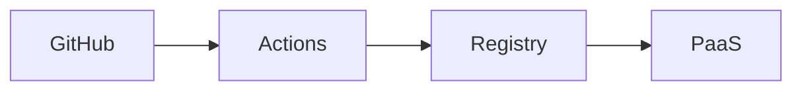

# Mini-project — Phase 11: Deployment

**Name:** ship-pdf-chat  
**Time box:** 2–4 days  
**Difficulty:** Hard

## Why this project

Live URL on the resume.

## User story

A stranger can open the API docs on the internet.

## Requirements

Must:

- HTTPS
- Actions
- secrets on platform
- healthz
- README URL

Should:

- smoke curl in CI

Won't (this week):

- Multi-region active-active

## Architecture



## Suggested layout

```text
../../DEPLOYMENT/
```

## Rubric

- URL works
- no secrets
- rollback paragraph

## Stretch

Custom domain + status badge.

When it works, write the README as if a hiring manager will open it on their phone. Then add a resume bullet using [RESUME_GUIDE.md](../../RESUME_GUIDE.md).
