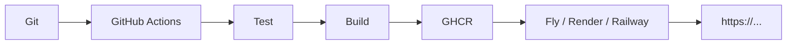
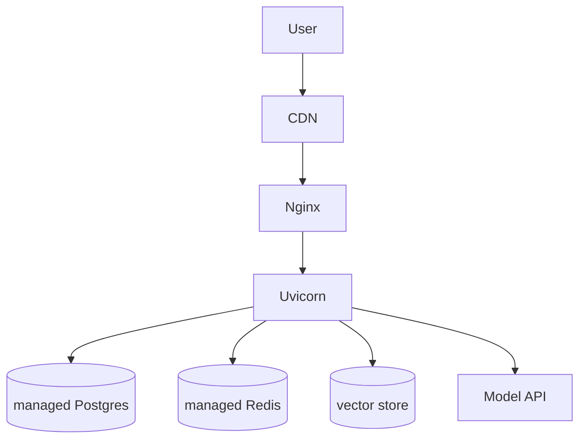

# Theory — Phase 11: Deployment

> Read this before any code. If a word is new, we define it before we use it.

## Table of contents

1. [Introduction](#1-introduction)
2. [Why this exists](#2-why-this-exists)
3. [Real-world analogy](#3-real-world-analogy)
4. [Visual diagram](#4-visual-diagram)
5. [Architecture diagram](#5-architecture-diagram)
6. [Beginner explanation](#6-beginner-explanation)
7. [Intermediate explanation](#7-intermediate-explanation)
8. [Advanced explanation](#8-advanced-explanation)
9. [Production explanation](#9-production-explanation)
10. [Code examples](#10-code-examples)
11. [Beginner exercises](#11-beginner-exercises)
12. [Medium exercises](#12-medium-exercises)
13. [Hard exercises](#13-hard-exercises)
14. [Project](#14-project)
15. [Interview questions](#15-interview-questions)
16. [Flashcards](#16-flashcards)
17. [Quiz](#17-quiz)
18. [Common mistakes](#18-common-mistakes)
19. [Debugging examples](#19-debugging-examples)
20. [Best practices](#20-best-practices)
21. [Industry standards](#21-industry-standards)
22. [Performance tips](#22-performance-tips)
23. [Security considerations](#23-security-considerations)
24. [References](#24-references)
25. [Further reading](#25-further-reading)

---

## 1. Introduction

Deployment is moving a known image to a machine that has a public URL, secrets, logs, and a way back.

You do not need to pass a Kubernetes exam. You need:

- A container
- A host
- Secrets not in Git
- CI
- Healthchecks
- A rollback

PaaS (Fly, Render, Railway) teaches this fastest. Cloud hyperscalers are the same ideas with more knobs.

**In one sentence:** Ship a tagged image, with secrets, health, and a rollback.

## 2. Why this exists

Hiring managers click links. Localhost is not a portfolio.

Also: you will learn that SSE dies behind a buffering proxy, that cold starts wake your bill, and that 'it worked on my laptop' dies in Linux CI — which is the point of Phase 0–4.

If this phase did not exist, your RAG would live as a zip file on Drive.

## 3. Real-world analogy

A restaurant opening.

- **Image** = the frozen menu and kitchen layout
- **Registry** = the warehouse of those frozen kits (Docker Hub / GHCR)
- **PaaS** = renting a food truck (Fly/Render/Railway)
- **AWS/GCP/Azure** = leasing a mall (more control, more mopping)
- **Nginx** = the host at the door (TLS, routing, buffering — careful with SSE)
- **GitHub Actions** = the checklist before service starts
- **Healthcheck** = 'is the kitchen actually cooking?'
- **Rollback** = serving yesterday's menu when tonight's soup is poison
- **Secrets** = the safe, not the chalkboard

Keep this picture in your head when the jargon starts.

## 4. Visual diagram



## 5. Architecture diagram



## 6. Beginner explanation

**Environment:** `APP_ENV=production`. Debug off.

**Proccess:** Uvicorn/Gunicorn behind a proxy. Bind 0.0.0.0.

**Health:** `GET /healthz` returns 200 if process up. `GET /readyz` if DB ping works.

**Secrets:** platform env vars or a secret manager. Same names as `.env.example`.

**PaaS:**
- **Render:** easy web + Postgres
- **Railway:** similar, good DX
- **Fly.io:** close to you, VMs, good for Docker-first

Pick **one**. Deploy fully. Then skim the others.

**GitHub Actions:** YAML in `.github/workflows`. On push: checkout, setup Python, test, build image, push, deploy.

## 7. Intermediate explanation

**Tagging:** `ghcr.io/you/api:sha-abc1234` not `:latest`. Deploy by digest.

**Migrations:** run as a release command *before* new traffic, with expand/contract.

**SSE + proxies:** disable buffering. Timeouts longer than model latency.

**Cold start:** scale-to-zero is cheap and slow. Chat apps often want min 1 instance.

**TLS:** the PaaS terminates TLS. You still want HTTPS-only.

**Nginx (if you run it):** reverse proxy, size limits, `proxy_buffering off` for streams, websocket maps.

**Kubernetes (sketch):** Pod = container(s), Deployment = replicas, Service = DNS, Ingress = HTTP entry. `kind` locally if curious. Not required to finish this course.

## 8. Advanced explanation

**Blue/green and canary.**

**OIDC from Actions to cloud** — no long-lived AWS keys in GitHub.

**Infra as code:** Terraform/Pulumi later. PaaS dashboard is OK for the first deploy.

**Observability hook:** logs to stdout now; Phase 12 adds traces.

**GPU hosts** if you self-host models (RunPod, Modal, Fly GPU). Most juniors should call APIs instead.

## 9. Production explanation

SLOs, status page, on-call (even if it's just you + email). Backup restore test. Dependency on model vendor: timeout and fallback (Phase 12). Cost alerts.

Never: SSH-and-pray as the only deploy. Never: build on your laptop and scp.

**When to use:** When a human besides you must use it. When you want CI to be the source of truth.

**When not to use:** A private experiment. Don't Kubernetes a weekend bot.

## 10. Code examples

Full walkthroughs with dry runs live in [Examples.md](./Examples.md) and [`code/`](./code/).

Preview:

```python
# .github/workflows/deploy.yml sketch
# on: push to main
# jobs: test -> build-push -> deploy

```

What to notice:

Three jobs with needs:. Fail closed. Secrets in GitHub Secrets.

## 11. Beginner exercises

Deploy a static healthz FastAPI to one PaaS.

Details: [Exercises.md](./Exercises.md)

## 12. Medium exercises

Actions: ruff + pytest on PR.

## 13. Hard exercises

Full: tests, image to GHCR, deploy, smoke curl, rollback notes.

## 14. Project

Public URL for PDF chat or chat API.

Spec: [MiniProject.md](./MiniProject.md)

## 15. Interview questions

CI vs CD. Why not latest. Health vs ready. How you rollback. SSE vs Nginx.

The full bank with expected answers, common mistakes, senior discussion, and whiteboard prompts: [Interview.md](./Interview.md)

## 16. Flashcards

Use [Flashcards.md](./Flashcards.md). Say the answer out loud before you flip.

Sample:

**Q:** Where do production secrets live?
**A:** The platform secret store, not Git.

## 17. Quiz

Take [Quiz.md](./Quiz.md) cold. Passing bar: 80%.

## 18. Common mistakes

latest tags. No healthcheck. Migrations in the API process start (racy). Buffering SSE. Committing kubeconfigs.

More: [CommonMistakes.md](./CommonMistakes.md)

## 19. Debugging examples

Works locally, 502 in prod (bind 127.0.0.1). OOM. Secret missing so boot loop.

Playgrounds: [Debugging.md](./Debugging.md)

## 20. Best practices

Tagged images, OIDC, health/ready, smoke after deploy, migrations expand/contract, logs stdout.

## 21. Industry standards

GitHub Actions + a PaaS is a perfectly respectable junior story. Bigger cos: GKE/EKS/AKS + Terraform.

## 22. Performance tips

Min instances for chat. Region near users or near DB. Don't pull 5GB models on each boot.

## 23. Security considerations

Secrets, non-root, HTTPS, least-open firewall, dependency scanning in CI.

## 24. References

- GitHub Actions docs
- Fly/Render/Railway docs
- 12-factor app

## 25. Further reading

Google SRE book (skim). Kubernetes the hard way — later.

---

Next: type the code in [Examples.md](./Examples.md). Reading is not the skill. Running it is.
