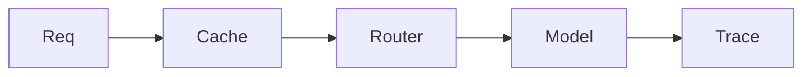

# Mini-project — Phase 12: Production AI / LLMOps

**Name:** ops-layer  
**Time box:** 2–4 days  
**Difficulty:** Hard

## Why this project

This is what separates wrappers from engineers.

## User story

I can show a trace, an eval number, and a cost cap.

## Requirements

Must:

- traces or structured spans
- CI eval
- cache
- fallback
- SLO.md

Should:

- Langfuse or similar

Won't (this week):

- Build your own LangSmith clone

## Architecture



## Suggested layout

```text
../../TEMPLATES/eval-harness/
```

## Rubric

- screenshot/log
- threshold in CI
- tenant-safe cache

## Stretch

Shadow prompt v2.

When it works, write the README as if a hiring manager will open it on their phone. Then add a resume bullet using [RESUME_GUIDE.md](../../RESUME_GUIDE.md).
