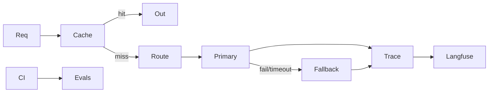
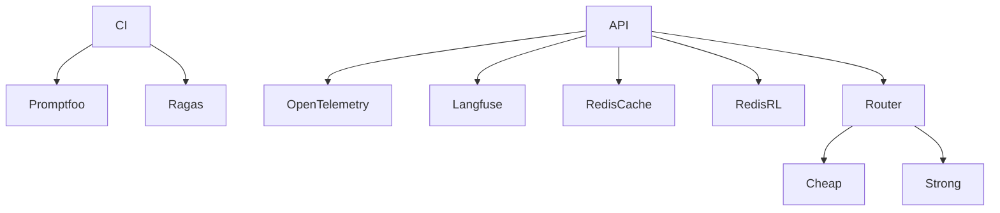

# Theory — Phase 12: Production AI / LLMOps

> Read this before any code. If a word is new, we define it before we use it.

## Table of contents

1. [Introduction](#1-introduction)
2. [Why this exists](#2-why-this-exists)
3. [Real-world analogy](#3-real-world-analogy)
4. [Visual diagram](#4-visual-diagram)
5. [Architecture diagram](#5-architecture-diagram)
6. [Beginner explanation](#6-beginner-explanation)
7. [Intermediate explanation](#7-intermediate-explanation)
8. [Advanced explanation](#8-advanced-explanation)
9. [Production explanation](#9-production-explanation)
10. [Code examples](#10-code-examples)
11. [Beginner exercises](#11-beginner-exercises)
12. [Medium exercises](#12-medium-exercises)
13. [Hard exercises](#13-hard-exercises)
14. [Project](#14-project)
15. [Interview questions](#15-interview-questions)
16. [Flashcards](#16-flashcards)
17. [Quiz](#17-quiz)
18. [Common mistakes](#18-common-mistakes)
19. [Debugging examples](#19-debugging-examples)
20. [Best practices](#20-best-practices)
21. [Industry standards](#21-industry-standards)
22. [Performance tips](#22-performance-tips)
23. [Security considerations](#23-security-considerations)
24. [References](#24-references)
25. [Further reading](#25-further-reading)

---

## 1. Introduction

**LLMOps** is operations for systems that include models.

Classic ops: CPU, RAM, error rate.

LLMOps adds: tokens, cost, faithfulness, latency to first token, tool error rate, cache hit rate, eval score over time.

If you only watch HTTP 500s, your bot can be confidently wrong at 200 OK all week.

**In one sentence:** Operate quality, cost, and latency — not just uptime.

## 2. Why this exists

Models drift (provider updates). Prompts change. Indexes rot. Costs spike on one viral tweet.

Without traces you cannot debug. Without evals you cannot ship. Without budgets you cannot sleep.

If this phase did not exist, you would 'monitor' with print() and a credit card alert from OpenAI.

## 3. Real-world analogy

An airplane cockpit.

- **Traces** = flight recorder (every request's retrieve → generate)
- **Metrics** = altimeter (p95, cost/1k, cache hit)
- **Evals** = inspection checklist before takeoff (CI) and in flight (sampled)
- **Cache** = using the same weather report for 30 seconds
- **Rate limit / budget** = fuel cap
- **Fallback** = second engine
- **Routing** = small plane for short hops, jet for cargo

Keep this picture in your head when the jargon starts.

## 4. Visual diagram



## 5. Architecture diagram



## 6. Beginner explanation

**Trace:** a tree of spans: `http.request` → `retrieve` → `rerank` → `generate`. Each span has timing and attributes (model, token counts, chunk ids).

**Langfuse / LangSmith:** products that store these traces and let you click them. OpenTelemetry is the open standard some of them speak.

**Offline eval:** a JSONL of cases run in CI. Fail the build if faithfulness < threshold.

**Online eval:** sample 1% of prod traffic for a judge or human.

**Cache:**
- Embedding cache (hash of text)
- Exact prompt cache
- Semantic cache (embed the query, reuse answer if very close) — dangerous if freshness/PII matter

**Rate limit:** per user and per tenant. Token budgets better than request counts.

**Fallback:** if primary 429/5xx/timeout, call a second model or return a degraded answer.

**Routing:** classify intent → cheap vs strong model.

## 7. Intermediate explanation

**Promptfoo:** YAML of prompts/tests, compare models. Great for regression.

**DeepEval / Ragas:** RAG-focused metrics. Know their failure modes (LLM-as-judge bias).

**Semantic cache keys** must include tenant, prompt version, doc version.

**Idempotency** of evals: pin model versions. Providers silently update aliases (`gpt-4o` drifts). Pin dates when you can.

**SLOs:** e.g. TTFT p95 < 1.5s, eval faithfulness > 0.8, cost < $X/day.

**Error budgets** for quality, not only downtime.

## 8. Advanced explanation

**Shadow traffic:** new prompt version gets 10% of queries, answers not shown, scores compared.

**Bandits** for routing — overkill until you have volume.

**OpenTelemetry semantic conventions** for gen AI (evolving).

**PII in traces:** redaction. Never store raw prompts in a third party without a DPA if you are a company.

**Eval datasets as code.** Version them. Don't edit gold labels to make graphs pretty.

## 9. Production explanation

A weekly quality review beats a perfect dashboard nobody opens.

Alert on: cost spike, parse-fail rate, fallback rate, eval drop, p95.

When eval drops, check: index freshness, provider model change, prompt diff, retrieval recall.

**When to use:** Any AI feature used by real humans or costing real money.

**When not to use:** A weekend toy with 12 requests total. Don't build a platform before a product. Do still log tokens.

## 10. Code examples

Full walkthroughs with dry runs live in [Examples.md](./Examples.md) and [`code/`](./code/).

Preview:

```python
# fallback sketch
try:
    return await primary.complete(..., timeout=20)
except (TimeoutError, ProviderDown):
    return await backup.complete(...)

```

What to notice:

Fallback is boring `try/except` plus metrics. Not a new religion.

## 11. Beginner exercises

Log tokens and latency to CSV on each call.

Details: [Exercises.md](./Exercises.md)

## 12. Medium exercises

Wrap retrieve+generate in spans (even print-based). Add Redis exact cache.

## 13. Hard exercises

CI eval job that fails under threshold. Fallback test with a fake primary that times out.

## 14. Project

Eval harness template — TEMPLATES/eval-harness.

Spec: [MiniProject.md](./MiniProject.md)

## 15. Interview questions

What do you trace? How eval in CI? Semantic cache risks? How fallback?

The full bank with expected answers, common mistakes, senior discussion, and whiteboard prompts: [Interview.md](./Interview.md)

## 16. Flashcards

Use [Flashcards.md](./Flashcards.md). Say the answer out loud before you flip.

Sample:

**Q:** 200 OK means the answer was right?
**A:** No.

## 17. Quiz

Take [Quiz.md](./Quiz.md) cold. Passing bar: 80%.

## 18. Common mistakes

Tracing PII to a SaaS without thought. Semantic cache across tenants. Alerting only on 500s. Unpinned model aliases in evals.

More: [CommonMistakes.md](./CommonMistakes.md)

## 19. Debugging examples

Cost doubled overnight (loop + no cache). Eval dropped (index empty after migrate).

Playgrounds: [Debugging.md](./Debugging.md)

## 20. Best practices

Pin versions. Trace the path. Eval in CI. Budget. Fallback. Redact.

## 21. Industry standards

Langfuse, LangSmith, Braintrust, Phoenix, Promptfoo, OpenTelemetry. Pick one tracer and one eval tool. Depth > a zoo.

## 22. Performance tips

Cache embeddings first (safe). Then exact answers. Semantic last. Router saves money.

## 23. Security considerations

Redact traces. Tenant in cache keys. Don't cache personalized or permissioned answers globally.

## 24. References

- Langfuse docs
- Promptfoo
- Ragas
- DeepEval
- OpenTelemetry

## 25. Further reading

Hamel Husain evals. Eugene Yan. OpenAI evals cookbook.

---

Next: type the code in [Examples.md](./Examples.md). Reading is not the skill. Running it is.
