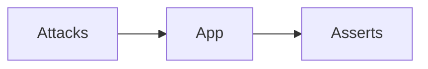

# Mini-project — Phase 13: Security

**Name:** red-team-pack  
**Time box:** 1–2 days  
**Difficulty:** Hard

## Why this project

Security work that shows up in interviews.

## User story

CI fails if a basic injection starts dumping system prompts or crossing tenants.

## Requirements

Must:

- JSONL attacks
- tests
- THREAT_MODEL.md
- RBAC on at least one tool

Should:

- indirect case

Won't (this week):

- A custom foundation model safety lab

## Architecture



## Suggested layout

```text
tests/security/ THREAT_MODEL.md
```

## Rubric

- indirect included
- deny by default

## Stretch

Automated weekly cron.

When it works, write the README as if a hiring manager will open it on their phone. Then add a resume bullet using [RESUME_GUIDE.md](../../RESUME_GUIDE.md).
