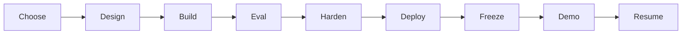
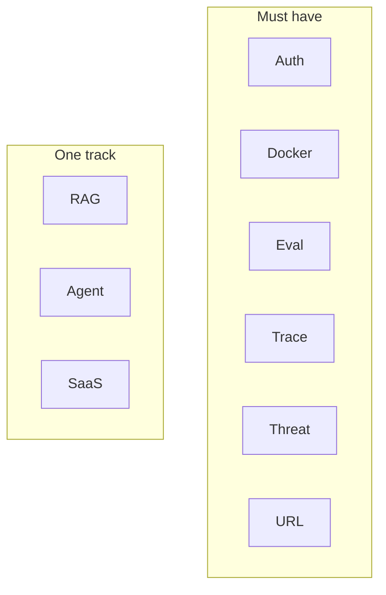

# Theory — Phase 14: Capstone

> Read this before any code. If a word is new, we define it before we use it.

## Table of contents

1. [Introduction](#1-introduction)
2. [Why this exists](#2-why-this-exists)
3. [Real-world analogy](#3-real-world-analogy)
4. [Visual diagram](#4-visual-diagram)
5. [Architecture diagram](#5-architecture-diagram)
6. [Beginner explanation](#6-beginner-explanation)
7. [Intermediate explanation](#7-intermediate-explanation)
8. [Advanced explanation](#8-advanced-explanation)
9. [Production explanation](#9-production-explanation)
10. [Code examples](#10-code-examples)
11. [Beginner exercises](#11-beginner-exercises)
12. [Medium exercises](#12-medium-exercises)
13. [Hard exercises](#13-hard-exercises)
14. [Project](#14-project)
15. [Interview questions](#15-interview-questions)
16. [Flashcards](#16-flashcards)
17. [Quiz](#17-quiz)
18. [Common mistakes](#18-common-mistakes)
19. [Debugging examples](#19-debugging-examples)
20. [Best practices](#20-best-practices)
21. [Industry standards](#21-industry-standards)
22. [Performance tips](#22-performance-tips)
23. [Security considerations](#23-security-considerations)
24. [References](#24-references)
25. [Further reading](#25-further-reading)

---

## 1. Introduction

A capstone is not 'all remaining tutorials.'

It is **one product** with a user, a constraint, and a number.

Three tracks live in `CAPSTONE/`:

1. **Enterprise RAG** — chat over a corpus with tenancy, citations, evals
2. **Enterprise agent** — tools, MCP, HITL, traces
3. **AI SaaS** — multi-tenant, keys, quotas, a billing-shaped architecture (even if money is fake)

Pick the one you can demo in 5 minutes without sweating.

**In one sentence:** One product, done, deployed, measured, explained.

## 2. Why this exists

Interviews are project deep dives. A half-finished zoo of repos loses to one sharp story:

> I built X for Y. The constraint was Z. The number is N. Here is what I'd do next.

That story is this phase.

If this phase did not exist, you would have 14 mini-projects and nothing to point at.

## 3. Real-world analogy

A thesis, not a locker of lab reports.

- **Design doc** = proposal
- **Freeze** = stop adding chapters
- **Evals** = results section
- **Deploy** = published paper
- **Demo** = defense
- **Resume bullet** = citation others will read

Keep this picture in your head when the jargon starts.

## 4. Visual diagram



## 5. Architecture diagram



## 6. Beginner explanation

**Week 1:** design doc, gold set, skeleton compose.

**Week 2–3:** happy path.

**Week 4:** evals, security, deploy.

**Days left:** README, demo script, freeze.

**Definition of done:** [CHECKLIST.md](../../CHECKLIST.md) capstone section.

Do not start a second track.

## 7. Intermediate explanation

**Design doc sections:** problem, users, non-goals, architecture, data, eval, cost, security, rollout, risks.

**Non-goals** are how you finish.

**Demo script:** 5 minutes, timed. Upload → question → citation → a failure ('I don't know') → trace screenshot.

**Load a little:** 20 concurrent requests once. Note p95.

## 8. Advanced explanation

**What you'd do with a team of 4** — a slide interviewers love.

**Unit economics:** cost per 1k questions.

**Feature flags** for prompt versions.

**Multi-region** as a paragraph, not a build.

## 9. Production explanation

Feature freeze 5 days before you call it done. Bugs and docs only. Shipping beats a perfect graph in a private branch.

**When to use:** When you can already demo RAG or an agent locally. Not as a substitute for Phase 8.

**When not to use:** Don't capstone a model training from scratch. Don't rebuild Kubernetes.

## 10. Code examples

Full walkthroughs with dry runs live in [Examples.md](./Examples.md) and [`code/`](./code/).

Preview:

```python
# There is no magic snippet. There is a calendar and a freeze date.
```

What to notice:

See CAPSTONE/*/README.md for track-specific stacks.

## 11. Beginner exercises

Write the design doc. Peer review (or rubber duck).

Details: [Exercises.md](./Exercises.md)

## 12. Medium exercises

Happy path on compose.

## 13. Hard exercises

Eval table + live URL + threat model.

## 14. Project

The capstone itself.

Spec: [MiniProject.md](./MiniProject.md)

## 15. Interview questions

Tell me about the project. What would you delete? What's the number? What broke?

The full bank with expected answers, common mistakes, senior discussion, and whiteboard prompts: [Interview.md](./Interview.md)

## 16. Flashcards

Use [Flashcards.md](./Flashcards.md). Say the answer out loud before you flip.

Sample:

**Q:** How many capstones?
**A:** One. Finished.

## 17. Quiz

Take [Quiz.md](./Quiz.md) cold. Passing bar: 80%.

## 18. Common mistakes

Three tracks at 40%. No eval. No URL. README of setup only. Demo that needs your laptop's 37 env vars.

More: [CommonMistakes.md](./CommonMistakes.md)

## 19. Debugging examples

Scope creep the week of the demo. Provider outage with no recording.

Playgrounds: [Debugging.md](./Debugging.md)

## 20. Best practices

Freeze. Number. URL. Honest limitations. Backup demo video.

## 21. Industry standards

This is how real internships ship: thin slice, measured, behind a URL.

## 22. Performance tips

p95 on the demo path. Don't live-index a 10GB corpus on stage.

## 23. Security considerations

Threat model in the repo. No customer data. Fake corpus if needed.

## 24. References

- SYSTEM_DESIGN_GUIDE.md
- CHECKLIST.md
- RESUME_GUIDE.md

## 25. Further reading

Watch 3 conference talks of people presenting applied LLM work. Steal structure, not slides.

---

Next: type the code in [Examples.md](./Examples.md). Reading is not the skill. Running it is.
