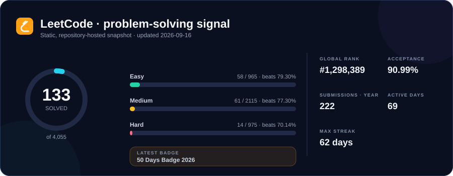
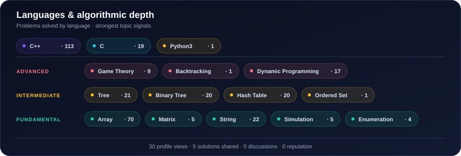

  

##  Hello, world

<table>
  <tr>
    <td width="58%" valign="top">
      

        I’m <strong>Muhammad Anas</strong>, a Computer Science student at FAST NUCES. I work where code, AI, and hard problems meet — learning by building.
      

      <table>
        <tr>
          <td width="42" valign="middle" align="center"></td>
          <td valign="middle"><strong>In the lab</strong> · AI/ML and competitive programming.</td>
        </tr>
        <tr>
          <td width="42" valign="middle" align="center"></td>
          <td valign="middle"><strong>Exploring</strong> · Algorithms, deep learning, and system design.</td>
        </tr>
        <tr>
          <td width="42" valign="middle" align="center"></td>
          <td valign="middle"><strong>Focus</strong> · Useful software, open source, and growth.</td>
        </tr>
      </table>
    </td>
    <td width="42%" align="center" valign="middle">
      
    </td>
  </tr>
</table>

---

##  LeetCode

  

  

  
<strong>Recently accepted</strong>

   
<!-- LEETCODE_RECENT_START -->

<a href="https://leetcode.com/problems/distribute-elements-into-two-arrays-i/"><code>Distribute Elements Into Two Arrays I</code></a>
 &nbsp;·&nbsp; <a href="https://leetcode.com/problems/cinema-seat-allocation/"><code>Cinema Seat Allocation</code></a>
 &nbsp;·&nbsp; <a href="https://leetcode.com/problems/find-the-largest-almost-missing-integer/"><code>Find the Largest Almost Missing Integer</code></a>
 &nbsp;·&nbsp; <a href="https://leetcode.com/problems/stone-game-v/"><code>Stone Game V</code></a>
 &nbsp;·&nbsp; <a href="https://leetcode.com/problems/stone-game-ix/"><code>Stone Game IX</code></a>
 &nbsp;·&nbsp; <a href="https://leetcode.com/problems/longest-palindromic-substring/"><code>Longest Palindromic Substring</code></a>

<!-- LEETCODE_RECENT_END -->

---

##  GitHub

  
  

  
  

---

##  Toolbox

<table>
  <tr>
    <td width="33%" align="center" valign="top">
      <strong>LANGUAGES</strong> 
      
    </td>
    <td width="33%" align="center" valign="top">
      <strong>AI &amp; DATA</strong> 
      
      
      
      
    </td>
    <td width="33%" align="center" valign="top">
      <strong>WEB &amp; WORKFLOW</strong> 
      
      
    </td>
  </tr>
</table>

---

  
  

---

  <strong>Say hello:</strong>
  &nbsp;&nbsp;
  
  &nbsp;&nbsp;
  
  &nbsp;&nbsp;
  
  &nbsp;&nbsp;
  

