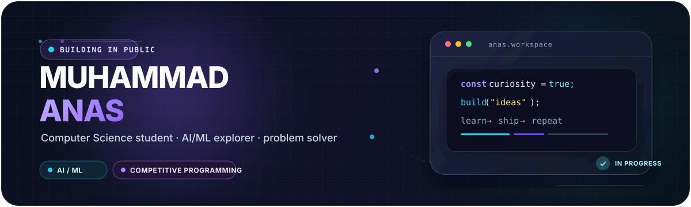
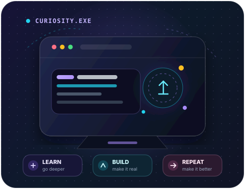
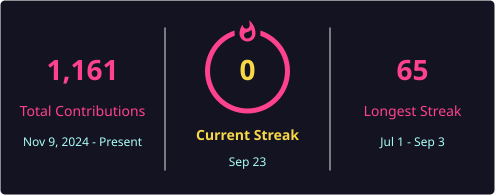

<!--
  Visual direction: a calmer, more personal profile with a violet / cyan system.
-->

  
   
  Computer Science student at FAST NUCES · learning in public · turning curiosity into useful software

##  Hello, world

<table>
  <tr>
    <td width="58%" valign="top">
      

        I’m <strong>Muhammad Anas</strong>, a Computer Science student who enjoys the space where thoughtful code, intelligent systems, and a difficult problem meet. I learn by building, asking better questions, and making the next version sharper than the last.
      

      <table>
        <tr>
          <td width="42" valign="middle" align="center"></td>
          <td valign="middle"><strong>In the lab</strong> · AI/ML experiments and competitive-programming problem solving.</td>
        </tr>
        <tr>
          <td width="42" valign="middle" align="center"></td>
          <td valign="middle"><strong>Exploring deeply</strong> · Advanced algorithms, deep learning, and system design.</td>
        </tr>
        <tr>
          <td width="42" valign="middle" align="center"></td>
          <td valign="middle"><strong>North star</strong> · Build useful work, contribute in the open, and keep growing.</td>
        </tr>
      </table>
    </td>
    <td width="42%" align="center" valign="middle">
      
    </td>
  </tr>
</table>

##  Three directions I explore

<table>
  <tr>
    <td width="33%" align="center" valign="top">
       
      <strong>Intelligent Systems</strong> 
      Machine learning ideas turned into practical tools.
    </td>
    <td width="33%" align="center" valign="top">
       
      <strong>Algorithmic Thinking</strong> 
      Breaking tough problems into clean, efficient steps.
    </td>
    <td width="33%" align="center" valign="top">
       
      <strong>Human-Facing Web</strong> 
      Interfaces that feel fast, responsive, and intuitive.
    </td>
  </tr>
</table>

---

##  Open-source signal

  
  

  
  

---

##  Toolbox

<table>
  <tr>
    <td width="33%" align="center" valign="top">
      <strong>LANGUAGES</strong> 
      
    </td>
    <td width="33%" align="center" valign="top">
      <strong>AI &amp; DATA</strong> 
      
      
      
      
    </td>
    <td width="33%" align="center" valign="top">
      <strong>WEB &amp; WORKFLOW</strong> 
      
      
    </td>
  </tr>
</table>

---

##  Work-in-progress shelf

<table>
  <tr>
    <td width="33%" align="center"><strong>AI / ML experiments</strong> Curiosity, models &amp; data-driven iteration</td>
    <td width="33%" align="center"><strong>Algorithm notebooks</strong> Solutions, patterns &amp; problem solving</td>
    <td width="33%" align="center"><strong>Web moments</strong> Focused, clean interfaces</td>
  </tr>
</table>

---

##  A trail of small wins

  
  

---

  <strong>Say hello:</strong>
  &nbsp;&nbsp;
  
  &nbsp;&nbsp;
  
  &nbsp;&nbsp;
  
  &nbsp;&nbsp;
  

